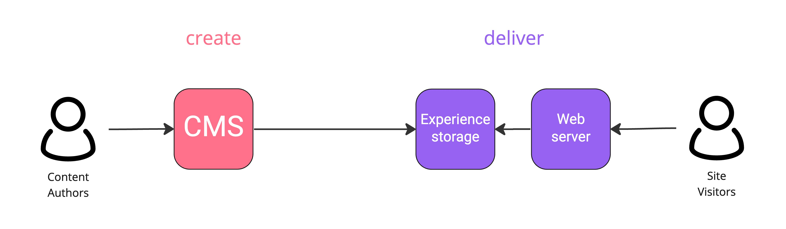
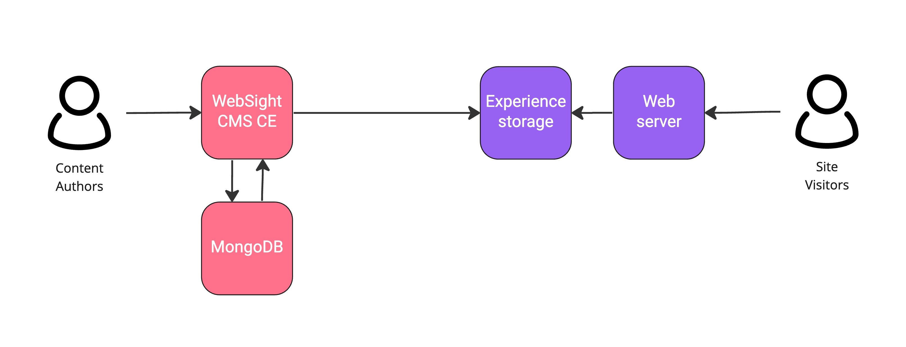
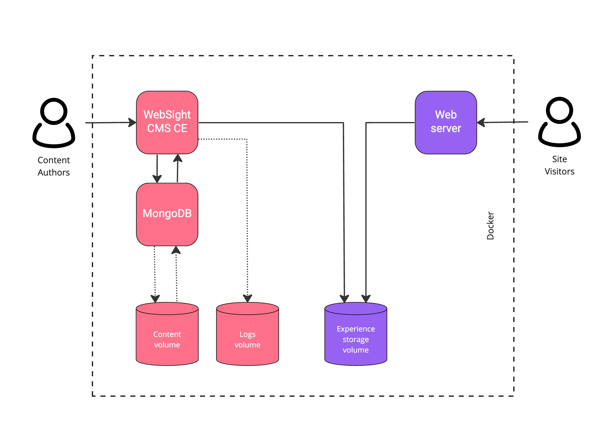

# Architecture
The diagram below represents the WebSight CMS high-level logical architecture. 

**Content authors** use **CMS** to **create** an experience by managing content, assets and pages (layout). Once the experience is ready to go public, authors push (in other words, publish) it to the backend **experience storage**.

On the frontend, the experience is **delivered** to the **site visitors**. They call the **web server**, which pulls static HTML files/assets/JavaScript/ CSS scripts from the backened **experience storage** and serves them immediately.

!!! Info "Note" 
        The experience storage has no access to CMS. That means that if, for example, there is no page in the storage, then site visitors see a `404` message.

The above description is called a *push model* and assumes that the pages are prepared for the user in advance. Note that within this architecture, it is possible to switch off the CMS part, which has no impact on delivering pages.

Our CMS is a `Java`-based `OSGi` application (**WebSight CMS CE**) with a `NoSQL` database (**MongoDB**). WebSight CMS supports content management and the generation of static HTML pages. MongoDB database stores content and assets.

!!! Info "Note"
        Multiple instances of WebSight CMS can connect to MongoDB, which supports online deployments and enables CMS scalability.

## Containers
We use containers to ship WebSight CMS for deployment on multiple environments, from developers' local computers to public clouds. Read our ["Why we decided to ship and develop the OSGi application in containers"](/blog/2022/shipping-and-developing-osgi-application-in-container/) article to understand the benefits of containers in our stack.

Once developers [create a WebSight project using the Maven archetype](../setup/), they produce the following Docker images:

- An `NGINX image` (web server) with addtional project-specific configurations
- A customized `CMS image` with core WebSight CMS and project-specific modules and configurations

## Docker Compose
With more than one container in the platform, we need a tool for defining and running multi-container Docker applications. With Compose, we can use the `Compose YAML` file model to:

- Configure all platform components (`services`)
- Enable communication between them
- Handle data persistance with `volumes`

The following diagram presents all WebSight CMS containers and volumes together.

The diagram above reflects the containers' logical architecture. Docker Compose configuration specifies the following services:

- The `nginx` service (experience delivery)
- The `cms` service (content management and pages generation)
- The `mongo` service (content database)

Services use volumes (external storage) to save durable data outside the container to separate the lifecycle of containers that use it from the data itself. When Docker Compose destroys a container (e.g., on crash or re-deploy), all data from its internal storage is lost. We specify the following volumes:

- The `experience storage` volume is shared by NGINX (read) and WebSight CMS (write) containers
- The `content` volume keeps content and assets
- The `logs` volume keeps all WebSight CMS application logs

## Environments

Working with containers enables consistency and standardization. With Docker, we can use the same tooling to work locally as well as to deploy production environments to the cloud.

For example:

When using Docker Compose, the same command is responsible for creating local and cloud instances (`docker compose up`). 

Read more about [Docker Compose Amazon Elastic Container Service integration](./aws-ecs/).
