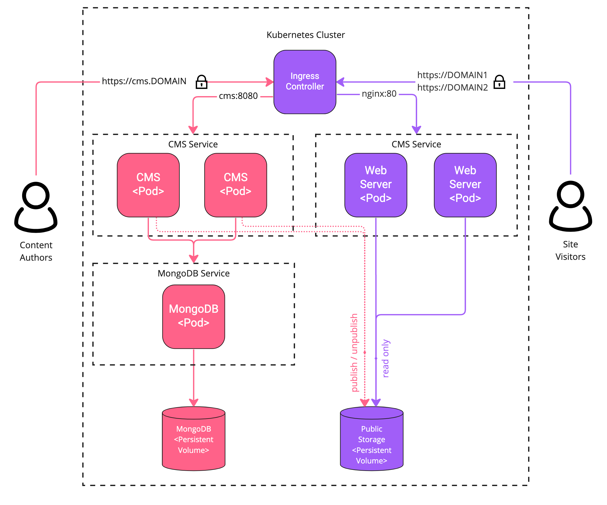

# Kubernetes Architecture
Kubernetes (k8s) makes it easy to automate deployments and management of WebSight CMS components on the most popular public cloud platforms. This document describes the Kubernetes resources that are required to run and scale WebSight Community Edition.

## Kubernetes Resources

Following is how Kubernetes resources map onto WebSight components:

- `Ingress` is a set of rules that define how to route requests from authors and site visitors. The `Ingress Controller` processes these rules and exposes them to the load balancer provided by the cloud platforms. WebSight supports multi-site management, so our Ingress contains rules for authors and site visitors from multiple domains (paths)
- The `CMS` service and pods read/write content to/from MongoDB and create/delete (publish/unpublish) generated HTML pages/images/other assets in Public Storage
- The `MongoDB` service and pod store the content in a persistent volume
- The `Web Server` service and pod read pre-generated HTML pages from Public Storage
- The `Public Storage` persistent volume shares data between the CMS and Web Server pods

The following diagram represents the WebSight k8s architecture:

!!! Info "Limitation"
    WebSight Community Edition uses Public Storage persistent volumes for all published assets (HTML pages, images, and JS / CSS scripts). As a consequence, CMS and Web Server pods need PersistanceVolumeClaims (PVCs) with the [ReadWriteMany access mode](https://kubernetes.io/docs/concepts/storage/persistent-volumes/#access-modes) when more than one node worker in the cluster is configured.
