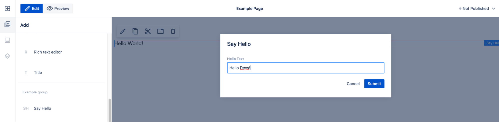

# Component definition

Components are implemented by developers and delivered as resources following defined structure. The resources should be provided in the OSGi bundle. See the project setup documentation for more details.
In this section we will see how component definition resources structure should look.

## Simple component definition example
Let's see how simple component definition looks like.

We see a component named _Say Hello_, providing dialog with 1 text field which can be used in the authoring interface to set the hello text rendered on page in `
` HTML tag. If the property is not set, `Hello World!` text will be used. 

My example application delivers the resource `/apps/example-site/components/hello` which is component definition. It contains just 3 properties:

- sling:resourceType = "ws:Component which is making this resource the component definition
- title = Say Hello which is title of the component visible in authoring UI
- group = Example group which is a group name visible in authoring UI

Example component definition in WebSigh Resource Browser

The component is visible in the WebSight CMS page editor and after adding to the page it renders ‘Hello World!’ text.

Because the Say Hello component was added to the edited page the corresponding node was created in the page content:

The `Hello World!` text is rendered in the view because of the `hello.html` resource defined under component definition resource containing the script used to render the content node. The script renders the helloText property value or `Hello World!`, if property value is empty (which is empty for now, so we see the fallback text).

Example component renderer in WebSight Resource Browser.

Second resource under the component definition is `dialog` resource - dialog definition resource. It contains just `sling:resourceType = wcm/dialogs/dialog` property which defines how the dialog should be displayed (see more details in sections below) and it has sub-node helloText defining text field (`sling:resourceType = wcm/dialogs/textfield`) input with label `Hello Text`.

Example component dialog resources in WebSight Resource Browser.

Because the dialog is defined, the edit action in editor allows to open the dialog as set value of the text field.

The property value is set on the content node of this _Say Hello_ component instance at helloText property (according to `name` property value at the text field node in the dialog definition):

And now the component renderer script will display the property value instead of fallback text:

Let’s see all the options and the details of the component definition.

## Component definition properties

Component definition is a Sling Resource with resource type `ws:Component`. 
Use following resource properties to define the component:

<table>
    <tr>
        <th>Component property</th>
        <th>Required</th>
        <th>Value</th>
        <th>Description</th>
   </tr>
   <tr>
        <td>sling:resourceType</td>
        <td>Yes</td>
        <td>ws:Component</td>
        <td>Defines that this resource is component definition.</td>
    </tr>
    <tr>
        <td>sling:resourceSuperType</td>
        <td>No</td>
        <td>super resource type</td>
        <td>Set this property to make your component extend another component. This way the extended component elements can be reused in the extending components. Example value: "wcm/core/components/page"</td>
    </tr>
    <tr>
        <td>title</td>
        <td>Yes</td>
        <td>string</td>
        <td>Component name visible in UI. Example value: ‘Title’</td>
    </tr>
    <tr>
        <td>group</td>
        <td>Yes</td>
        <td>string</td>
        <td>Component group name - allows to present related components in UI and is used during defining allowedComponents. Use value ‘.hidden’ to make the component definition not visible in the UI. Example value: ‘General’ </td>
    </tr>
    <tr>
        <td>isContainer</td>
        <td>No</td>
        <td>boolean, false by default</td>
        <td>Defines the component as a container. Containers are components dedicated to contain child components which can be added, removed and reordered with use of the authoring interface. If true then allowedComponents property is required too.</td>
    </tr>
    <tr>        
        <td>allowedComponents</td>
        <td>No*</td>
        <td>array of strings, values are absolute component paths and group names. No default value - by default nothing is allowed.</td>
        <td>*required if isContainer=”true”; Array listing allowed child components absolute paths or groups that can be added to the container. Example value: [ "/apps/my-app/components/component1", "/apps/my-app/components/component2", "Content", "Blog" ] </td>
    </tr>
    <tr>
        <td>isLayout</td>
        <td>No</td>
        <td>boolean, false by default</td>
        <td>Defines the component as a layout component.
            Layout components are displayed in a separate section in WebSight CMS pages editor than components which are not layout components.    

            It’s up to component developer to set isLayout=true, but the guideline is to use it for components which are:   
            * used to define page layout  
            * must contain other components to be usable   
            * contains no logic (other than related to layout calculation)   
            * interacts only on page resize (no other “user actions” allowed)   
            * has no visible UI elements (like texts)   

            Examples of Layouts:  
            * 2 columns container  
            * 1 column container  
            * Section with title, image, text and CTA (container including components)    

            Example of components which are not Layouts:  
            * image or title or CTA - has visible UI elements (like texts)  
            * logo cloud (contain very specific CSS logic, should not be used to create generic page layouts)  
            * Accordion - contains logic (other than related to layout calculation)  
            * Image gallery - contains logic (other than related to layout calculation)
        </td>
   </tr>
   <tr>
        <td>instanceResourceType</td>
        <td>No</td>
        <td>resource type which will be set on created component instance </td>
        <td>If this property is not set then the resource type of every created component instance node will be set to value resolved from the component definition resource path. If set, then this property value will be used instead.    

        This allows multiple components definitions which will be resulting with the same resource type used for created component instances. It could be used to deliver components (or layout components) with different initial content.    

        For example:  

        ‘Section’ layout component contains embedded Title component and is a container rendering child components below the Title. If the authoring section with 4 columns needs to be created then the ‘Section’ component needs to be added and then 4 containers need to be added inside and configured to be displayed as columns.   

        If this page layout is commonly used during content authoring then a new layout component could be implemented to simplify the process.  

        ‘Section with 4 columns’ layout component could be added - instanceResourceType property should be set to ‘Section’ component resource type and initial content should provide the same structure as was created manually before (section + 4 configured child containers). This way after dropping ‘Section with 4 columns’ on the page the commonly used content structure would be ready to use immediately.  

        Example value: "my-app/components/section"

   </td>
</table>

## Dialog

Dialog is the form with inputs which allows setting data on component instances in content.
The form layout, fields and behavior are described by resources starting at a resource named ‘dialog’ defined under component definition resource. If the ‘dialog’ resource is not defined, then the edit component properties action is not available in editor.

This is how the dialog definition structure looks and the same dialog displayed in editor:

Component dialog resources structure in Resource Browser tool

Component dialog displayed after edit component action in pages editor

<!-- -->
Read more in the dialogs framework documentation.

## Rendering script

To render components, the rendering script file resource is needed. File resource name should be the same as the component name with .html extension - recommended and supported scripting language in WebSight CMS is the HTL Templating Language.

See the HTL specification [here](https://github.com/adobe/htl-spec/blob/master/SPECIFICATION.md)

If Java support is needed in the HTL, the recommended solution is use of Sling Models and HTL Use-API. See details:

- [_use_ block statement](https://github.com/adobe/htl-spec/blob/master/SPECIFICATION.md#221-use)
- [Use-API](https://github.com/adobe/htl-spec/blob/master/SPECIFICATION.md#4-use-api)
- [Sling Models](https://sling.apache.org/documentation/bundles/models.html)

Component renderer script in WebSight Resource Browser.

## Template

Component template is a resource which is getting copied during creating a new component instance added to a page - in other words, it is the initial content of the component. It is used to set default values or prepare needed content structure. Could be used also to save work during content authoring.
The component template resource is a component definition sub-node with name ‘template’.
The template resource is optional - if not present, a new empty node will be created.

Component template resources structure (view from WebSight Resource Browser tool).

Component instance added to the page content initialized from template (view from WebSight Resource Browser tool).

