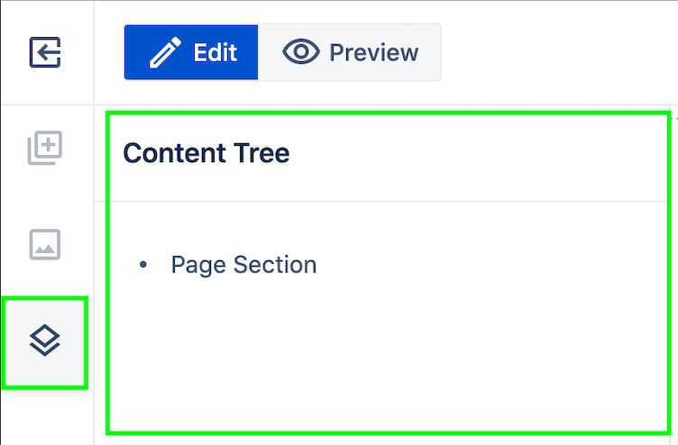

# Components

## Overview

This document describes the components concept and shows the components usage from WebSight CMS authoring interface.

In this documentation we will be referring to:

- WebSight CMS pages editor - UI for authoring pages content
- WebSight Resource Browse - administration tool allowing to see resources (data and application) available on the WebSight CMS instance

Both views can be open from WebSight UI:

Check WebSight project setup documentation to see more details about

- what is WebSight CMS and what it gives you
- implementing applications for WebSight CMS Community Edition
- OSGi, OSGi bundles, Sling Resources, JCR, and more

## What is component

Components are:

- elements rendering parts of content according to implemented functionality
- used to assemble content (like pages)
- available in WebSigh CMS authoring interface
- reusable
- configurable by editing properties on created components instances
- implemented by developers
- shipped in OSGi bundles deployed to WebSight CMS instance

Components can:

- include (embed) other components
- extend other components
- deliver initial content
- define dialog used to edit properties on component instance
- be containers (allow to add child components during authoring)
- define allowed child components (in case of containers)

## Using components

Let’s make the statements about what the component is clear by looking at the authoring interface and content data structure.

WebSight CMS page editor lists all available components which can be used to build pages at a given WebSight instance (depending on OSGi bundles delivering components installed on the instance). Those components can be added to the page by dragging them to the page content view at the center of the screen.

Components definitions listed in WebSight CMS page editor

Page content structure can be checked in the page editor content tree tab. This view presents the components tree under page content.
This example page for now contains just the Page Section component - this is the only component present currently in page content of this example page.

{: style="width:350px"}

Page content tree in editor

The Page Section component is a container, so it allows adding other components via the authoring interface. In the page editor content section it is displayed as a box with plus icon (empty container placeholder).

After drag and drop of Title and Rich Text components the page content tree is updated with new nodes. The nodes visible in the content tree are the instances of components. 
Title and Rich Text components are not containers so other components cannot be added as their child components. During dragging other components from components list the new items can be added just next to those components as other children on the Page Section component.

After adding a component to the page, edit action can be used to edit selected component instance. The dialog which is displayed is a part of component definition. It is defined by the developer implementing a given component with use of set given dialog fields (see more in Dialogs documentation). Properties set via the dialog are saved at edited component instances and used by the component to render the part of content according to the implemented functionality - for example Title component is rendering the `Heading text` field value in HTML `<h>` tag and allows to set `<h>` tag level and styling.

Components are reusable. Another title component can be added to the page and configured with its own data.
After the second title, the Cards List component is added now. This component is a container but implemented to work with specific type of child components - only Card Item components can be added inside (this behavior is part of Cards List component definition).
Cards List component defines initial content added to the page when adding component. The initial content contains 3 child Card Item components (to save work during authoring and present the component in initialized state). 
In the content tree it’s visible that Card Item components are child components of Cards List component.

Assembling and configuration of the page content can be continued this way with the use of available components.