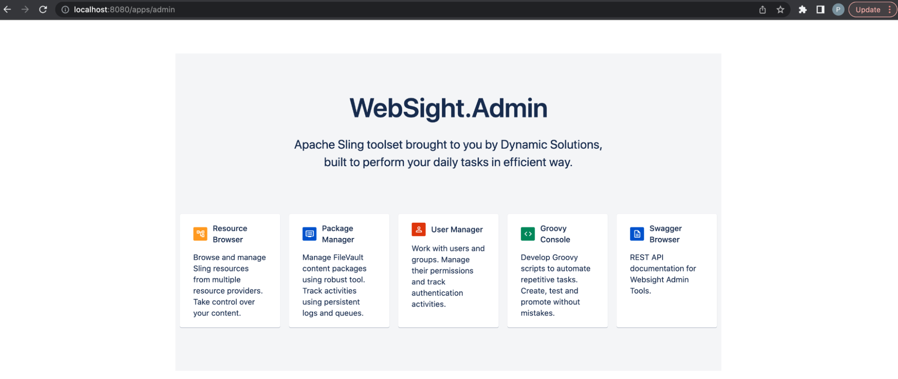
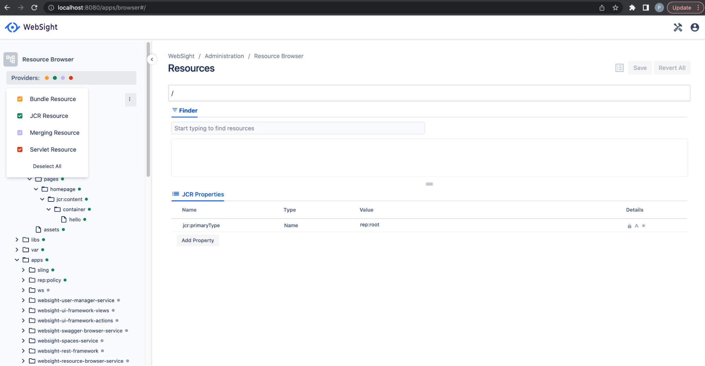
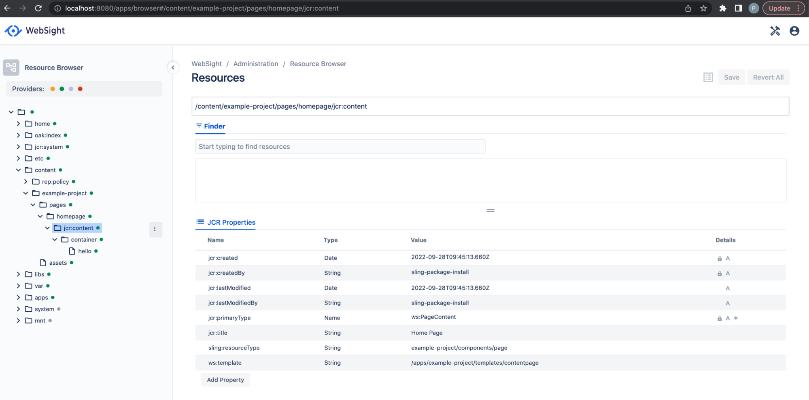
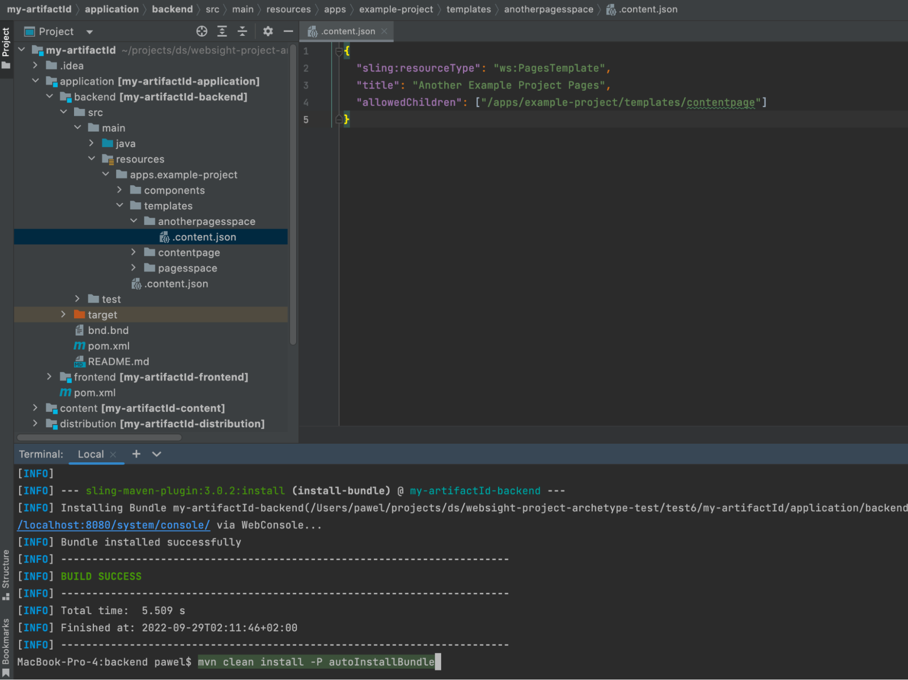
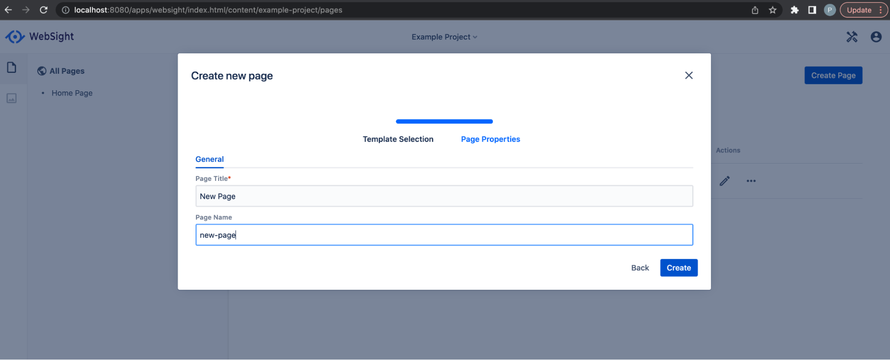
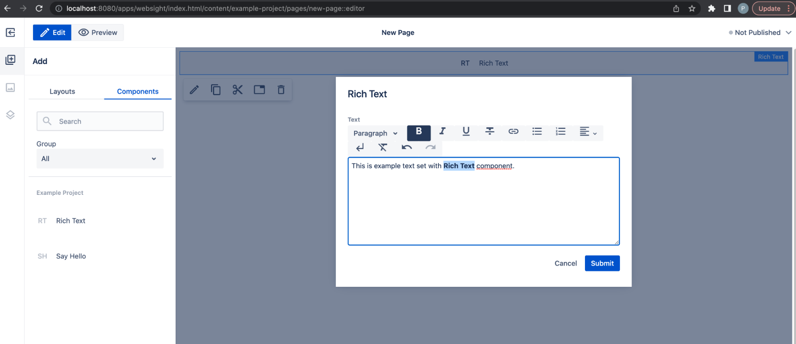
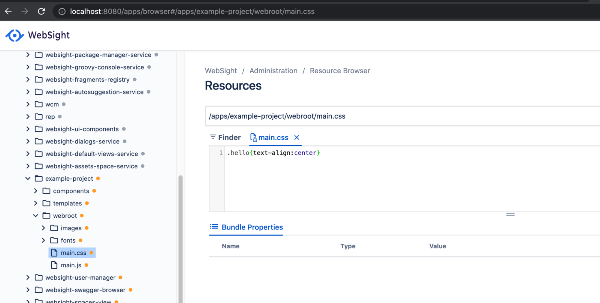

# Creating and developing WebSight CMS project

This document describes the WebSight project’s initial setup, instance overview, and application development. We will generate a new project from Maven archetype, check what it contains and how to develop the application. All the screens and examples will be referring to the project generated during the guide.

## Project setup
In this section, we will set up the project. The generated structure is an example starting point for projects which is recommended and suitable for a typical web application based on WebSight CMS Community edition.

### Generate project

To initialize the project Maven archetype will be used. To continue you should have Maven installed. Check your Maven version. 

``` script
mvn --version
Apache Maven 3.8.5 (3599d3414f046de2324203b78ddcf9b5e4388aa0)
...
```

System requirements: Java 17, Mave 3.8.5 +

Open the command line at an empty folder and generate a project.

Use _groupId_, _artifactId_, and version params to declare Maven artifacts for your project.
Use _projectName_, _projectId_ and package to define your project name used in UI, id used for technical needs (application resources paths, Docker images names) and root package for Java code.

Replace `<PUT ARCHETYPE VERSION HERE>` with archetype version you want to use, for example: `-DarchetypeVersion=1.0`

You can check the latest version [here](https://search.maven.org/search?q=a:websight-cms-ce-project-archetype).

``` script
mvn archetype:generate                                     \
  -DarchetypeGroupId=pl.ds.websight                        \
  -DarchetypeArtifactId=websight-cms-ce-project-archetype  \
  -DarchetypeVersion=<PUT ARCHETYPE VERSION HERE>          \
  -DgroupId=my.groupId                                     \
  -DartifactId=my-artifactId                               \
  -Dversion=1.0.0-SNAPSHOT                                 \
  -DprojectName="Example Project"                          \
  -DprojectId=example-project                              \
  -Dpackage=com.example.project
```

Following structure should be created:
```
.
└── my-artifactId
    ├── README.md
    ├── application
    ├── content
    ├── distribution
    ├── environment
    ├── pom.xml
    └── tests
```

### Project structure
The generated project structure is an example starting point for projects which is recommended and suitable for a typical web application based on WebSight CMS Community edition.

Overview of the modules:

- `application` - components related code and scripts
    - `backend` - contains application elements (components, templates, etc.) and Java code
    - `frontend` - contains application frontend
- `content` - contains sample content created with use of application
- `distribution` - builds a distribution of the project - instance feature model and docker images for runtime components
- `environment` - contains scripts and files used but build environment
    - `local` - starts local environment
- `tests` - responsible for the automatic distribution validation
    - `content` - contains content used for end to end tests
    - `end-to-end` - end-to-end tests validating distribution

#### Distribution and environment

Important information is that the project also contains the server. Distribution module is responsible for building the Docker images delivering platform runtime. 
Delivering a new version of an application is done by delivering new images of the runtime environment which will include the application. 
During development it is possible to deploy application modules to running instances without rebuilding the Docker images. 
Distribution module delivers Docker images with:

- CMS - image with WebSight CMS with your application installed
- Nginx - HTTP server serving published content

Additionally raw MongoDB image is used - MongoDB is used as a data store for content like pages or assets created on CMS (but not for your application which is installed on the CMS instance as OSGi bundles - more details in chapter about developing application).

Everything is combined by environment which is using Docker Compose to combine all the containers into one runtime environment. See environment/local module for details.

This illustration shows the runtime environment and roles:


#### Application

Application is delivered as OSGi bundles and installed on WebSight CMS instance image during building the project.
Generated project contains 2 application modules

- `backend` - contains application elements (components, templates, etc.) and Java code
- `frontend` - webpack project containing application frontend

The Test module is used for end-to-end validation of the distribution, and especially your application. Test ‘content’ module contains content assembled with use of the application for easier validation of all cases of the delivered functionality.

‘Content’ module delivers content assembled with use of the application installed to WebSight CMS instance as starting point for the content structure.

### Build and Run the instance

To build the project use Maven command:

``` script
mvn clean install
```

Add e2e profile to execute end-to-end tests:

``` script
mvn clean install -P e2e
``` 

You should see successful end-to-end test execution in the log:


Execution should end with successful build:


To run the instance Docker is needed. 
Check Docker installation by running in command line

``` script
docker --version
Docker version 20.10.14
```

If you need you can download the Docker Desktop [here](https://www.docker.com/)

See also README.md in environment and environment/local folders for the details about the running environment.

After build of the project to start a local instance go to the environment/local folder and run:
docker compose up

Local WebSight CMS with your application installed is running at [http://localhost:8080/](http://localhost:8080/) (login with wsadmin/wsadmin)
Published content is available locally at [http://localhost/](http://localhost)

### Instance overview

After login you will be redirected to the Spaces list. In WebSight CMS content is organized in Spaces. More details in the next sections.
On the list you can see the Space created with use of the generated application and delivered in the ‘content’ module containing initial project content. 

[http://localhost:8080/apps/websight/index.html/content::spaces](http://localhost:8080/apps/websight/index.html/content::spaces )


After clicking on the space name Pages dashboard is open with 1 page delivered in initial content. You can manage your pages here and navigate to Assets dashboard (to manage assets) or open Pages editor to edit page content.

[http://localhost:8080/apps/websight/index.html/content/example-project/pages](http://localhost:8080/apps/websight/index.html/content/example-project/pages)


In the Right top corner there is the Admin tools menu with links for administration tools. See also tools overview at tools page:

[http://localhost:8080/apps/admin](http://localhost:8080/apps/admin)


## Developing application

Before going through the WebSight CMS application development process it is worth to understand the instance runtime.

Note: You don’t need to read and understand all the linked content, basic concepts will be explained here.

WebSight CMS is based on [Apache Sling](https://sling.apache.org/) which “is a framework for RESTful web-applications based on an extensible content tree”​​ and [OSGi specification](https://www.osgi.org/) - “Java framework specification that supports the deployment of extensible and downloadable applications known as bundles”.
What this means? 
Two most important things coming from the technologies WebSight CMS is based on, needed to understand this guide, are OSGi bundles and Resources.

### OSGi bundle

OSGi bundle is a unit of modularization in OSGi specification - a bundle is comprised of Java classes and other resources, which together can provide functions to end users.
Open [http://localhost:8080/system/console/bundles](http://localhost:8080/system/console/bundles) to see all the Bundles on the WebSight CMS instance and use the filter bar at the top to filter the list.

Some of the bundles are delivering the OSGi specification implementation (list filtered by org.apache.felix; Apache Felix is implementation of OSGi specification):


Some of the bundles are delivering Apache Sling functionality (list filtered by org.apache.sling):


Some of the bundles are delivering WebSight CMS functionality (list filtered by websight):


And finally some of the bundles are delivering functionality of the application which was just generated from archetype (list filtered by my-artifactId which was used in example project generation at the beginning  of the guide):


Click on `my-artifactId-backend bundle` to open details. 
At the beginning the bundle definitions was mentioned: 
OSGi bundle is a unit of modularization in OSGi specification - a bundle is comprised of Java classes and other resources, which together can provide functions to end users.

At the screen below it is highlighted that the my-artifactId-backend is exporting (making available to use for other bundles) some Java package (we will get back to this later) and is providing some resources.


### Resources

As already mentioned: WebSight CMS is based on [Apache Sling](https://sling.apache.org/) which “is a framework for RESTful web-applications based on an extensible content tree”.
It is important to understand the concept of “extensible content tree”.

WebSight CMS Resource Browser admin tool allows browsing all Resources available on the instance. Resources are organized in the tree and every resource has a path and properties. Resources are abstractions which represent objects which might be coming from different sources.
Resource Browser provides an option to select ‘Providers’ (sources of Resources available in instance) used to display the presented Resources tree. We will focus on JCR and Bundle resources. 

[http://localhost:8080/apps/browser#/](http://localhost:8080/apps/browser#/)


JCR (Java Content Repository) is a database with tree structure consisting of nodes with properties. Nodes in JCR are reflected by the JCR Resource in Resources tree. 
JCR is based on Java specification and implemented by Apache Jackrabbit which is also part of Sling and WebSight CMS (check bundles list mentioned in previous chapter and filter by org.apache.jackrabbit to see related bundles).
For technical details check the links (it is not needed for this guide, all you need to know is explained in this document):

- [https://sling.apache.org/documentation/the-sling-engine/resources.html](https://sling.apache.org/documentation/the-sling-engine/resources.html)
- [https://jackrabbit.apache.org/jcr/jcr-api.html](https://jackrabbit.apache.org/jcr/jcr-api.html)
- [https://developer.adobe.com/experience-manager/reference-materials/spec/jsr170/javadocs/jcr-1.0/](https://developer.adobe.com/experience-manager/reference-materials/spec/jsr170/javadocs/jcr-1.0/)

Content stored in JCR is represented by JCR Resources (provided to Resources tree by JCR Resource provider). WebSight CMS is storing JCR content in the MongDB (this is default setup and we will not go into other options here). JCR is used for all the content created during content authoring. Every created page and every added component is represented by nodes (with properties containing data) in the JCR and Resources tree.

Resources could be also provided by OSGi Bundles. From the perspective of the Resources tree and Resource abstraction there is no difference between resources provided by bundles and JCR. However the bundle resources are read only so would not be suitable for authorable content, but are great for providing applications. The application resources provided by bundles are available as long as the bundle is available and are not stored in JCR - application data is not mixed with content data which is great from perspective of Blue-green deployments, CI/CD and Separation of concerns (but we will not go into details here).

For technical details check the link (it is not needed for this guide, all you need to know is explained in this document):
[https://sling.apache.org/documentation/bundles/bundle-resources-extensions-bundleresource.html](https://sling.apache.org/documentation/bundles/bundle-resources-extensions-bundleresource.html)

This is how bundle resources are provided in the generated project:


and same resource in resource browser:
[http://localhost:8080/apps/browser#/apps/example-project/components/hello](http://localhost:8080/apps/browser#/apps/example-project/components/hello)


This is how JCR resources are defined in codebase in content module:


And in Resources tree:
[http://localhost:8080/apps/browser#/content/example-project/pages/homepage/jcr:content](http://localhost:8080/apps/browser#/content/example-project/pages/homepage/jcr:content)


### Backend Resources

Generated application/backend module contains in src/main/resources folder example application resources needed to work with Pages in WebSight CMS. 
The resources structure starts at /apps/example-project path. This path is set in the proper OSGi bundle header to provide the information about resources delivered by the bundle.


Following resources are defined:

``` script
.
└── apps
    └── example-project             - application root "sling:resourceType": "ws:Application"
        ├── components              - folder containing components
        │   ├── container           - example container component
        │   ├── hello               - example component
        │   └── page                - example page component
        └── templates               - templates folder
            ├── contentpage         - example page template
            └── pagesspace          - example pages space template
```

Application root should be under /apps resource and must contain property `sling:resourceType" = "ws:Application`.
Folders containing components and templates must be named ‘components’ and ‘templates’ and be under the application root resource. Different relative paths could be set by providing ‘components’ or ‘templates’ properties with relative paths to components or templates folders located under application root resource - otherwise components and templates will not be available in authoring UI.

### Pages Space template

In WebSight CMS content is organized in Spaces - areas where dedicated teams can work on content. WebSight CMS allows to create 2 types of spaces 

- Assets (Digital Assets Manager) - allows to manage assets
- Pages - allows to manage pages and assets (includes same functionality as Assets Space and more

Content module in the project generated from archetype contains the Pages Space instance ‘Example project’ visible at the All Spaces view.
New space can be created from UI:


In the second step the Space Template needs to be selected in case of Pages Space creation. 
List contains the ‘Example Project Pages’ template defined at `/apps/example-project/templates/pagesspace` resource.
Pages Space template resource must use `sling:resourceType` equals `ws:PagesTemplate` and should provide allowedChildren property defining list of allowed pages templates to create.


Another Pages Space template could be defined in the application if needed. For example:

``` json title="/apps/example-project/templates/anotherpagesspace"
{
 "sling:resourceType": "ws:PagesTemplate",
 "title": "Another Example Project Pages",
 "allowedChildren": ["/apps/example-project/templates/contentpage"]
}
```

To deploy update bundle to running instance use command from the backend module folder:
``` script
mvn clean install -P autoInstallBundle
```



New Pages Space template will be available:


###  Page template

Pages spaces are for pages management. To create a new page, a page template is needed. Generated backend module provides example page template resource `/apps/example-project/templates/contentpage`

- `sling:resourceType` property of the page template must be ws:PageTemplate.
- title and description properties are used in UI.
- allowedChildren property contains array of page tempaltes which can be created under pages created from this template. Content Page template allows to create subpages of the same type.


The `/apps/example-project/templates/contentpage` was listed in _allowedChildren_ property in the Pages Space template (`/apps/example-project/templates/pagesspace`
) which is templates of the Example Project space:


This means that page template /apps/example-project/templates/contentpage can be created under pages root in the space:
[http://localhost:8080/apps/websight/index.html/content/example-project/pages](http://localhost:8080/apps/websight/index.html/content/example-project/pages ) (click Create Page button)


In the second step page properties can be set:


The dialog displayed at this step is a dialog of the component defined in the initial content of the page template (`sling:resourceType": "example-project/components/page`). Read more about components and dialogs in Components documentation.

Initial content of the page template is defined in a resource named ‘initial’ located under page template resource. The initial content is copied to initialize the created page and properties set via dialog are set on the copied page content.
Page is a node of type ws:Page. It contains a page content sub-node named jcr:content of type ws:PageContent. The nodes located under the page content node can be modified via authoring UI. All the Page properties including properties set via page dialog are set on the page content node.
This is initial content of `/apps/example-project/templates/contentpage` page template:


This is how content node of the new created page looks:


New page templates can be created in the application.
`/apps/example-project/templates/examplpage` is a copy of  `/apps/example-project/templates/contentpage` with changed title, allowedChildren

``` json title="/apps/example-project/templates/examplpage"
{
 "sling:resourceType": "ws:PageTemplate",
 "title": "Example Page",
 "description": "Example Project",
 "allowedChildren": ["/apps/example-project/templates/examplpage"]
}
```

and initial content:
``` json
{
 "jcr:primaryType": "ws:Page",
 "jcr:content": {
   "jcr:primaryType": "ws:PageContent",
   "sling:resourceType": "example-project/components/page",
   "container": {
     "sling:resourceType": "example-project/components/container",
     "hello": {
       "sling:resourceType": "example-project/components/hello"
     },
     "hello1": {
       "sling:resourceType": "example-project/components/hello",
       "helloName": "Example"
     }
   }
 }
}
```


To make it possible to create under pages root in the space it must be added to allowedChildren in pages space template `/apps/example-project/templates/pagesspace`:


Deploy changes again with: `mvn clean install -P autoInstallBundle`

New template is available to create in pages root:


Page created from this template contains defined initial content:


### Components

Content is assembled from components - elements rendering parts of content according to implemented functionality. To understand the Components concept see Components documentation.

Generated backend module contains 3 example components located under `/apps/example-project/components`

- page - component used to render page content node
- container - container component - allows to add child components via authoring UI
- hello - component displaying hello text

In the editor components list only the hello component is visible because other components are hidden because of group property value.


[http://localhost:8080/apps/websight/index.html/content/example-project/pages/new-page::editor](http://localhost:8080/apps/websight/index.html/content/example-project/pages/new-page::editor)


New components can be defined to deliver application functionality. 
We will add a new component named Rich Text which will allow advanced text editing.
Create new folder under `/apps/example-project/components` named richtext with content:
``` json
{
 "sling:resourceType": "ws:Component",
 "title": "Rich Text",
 "description": "Allows advanced text edition",
 "group": "Example Project"
}
```

Define dialog resource:
``` json
{
 "sling:resourceType": "wcm/dialogs/dialog",
 "richtext": {
   "sling:resourceType": "wcm/dialogs/components/richtext",
   "label": "Text",
   "name": "text"
 }
}
```

Define rendering script richtext.html (name must be matching component resource name + .html):
``` html
<data-sly data-sly-test="${properties.text && properties.text != '<p></p>'}">${properties.text @ context='html'}</data-sly>
```

See [Components documentation](/docs/developers/components/) for more details.

This is how the new component definition looks in the codebase. Deploy the change with command from backend module: `mvn clean install -P autoInstallBundle`


!!! Info "Note"
        After redeployment and change of HTML the cache of the script needs to be cleaned manually via http://localhost:8080/system/console/scriptcache to see the changes, use the Clear Cache button at the bottom - this issue will be removed soon.

New component is available now in editor and can be added to the page. If text is not configured via dialog, nothing is rendered because of the data-sly-test statement in the component renderer. If nothing is rendered by component the placeholder is displayed automatically in the editor. Edit action can be used to open dialog and use rich text dialog input to configure the text.




### Frontend

Frontend scripts and resources are provided by frontend module - webpack project containing application frontend. During build the resources are embedded into a bundle which is also deployed to the instance.
Generated module contains just a simple css class to center text used in the hello component.
The css files are built into the main.css file by webpack and embedded into the OSGi bundle installed on the instance which makes the files available as resources (because of the Sling-Bundle-Resources header in the bundle header). 
Frontend resources are published automatically because of the WebSight-Apps-WebRoot bundle header (see next chapter about publishing).
The css file is included in the page component renderer to load the css.


[http://localhost:8080/apps/browser#/apps/example-project/webroot/main.css](http://localhost:8080/apps/browser#/apps/example-project/webroot/main.css)




Add hello component to page to see the centered hello text


### Publishing

Assembled content can be previewed in editor and published to make it available for end users.

[http://localhost:8080/apps/websight/index.html/content/example-project/pages/new-page::editor](http://localhost:8080/apps/websight/index.html/content/example-project/pages/new-page::editor )


Published page is served by Nginx container:

[http://localhost/new-page.html](http://localhost/new-page.html)


### End-to-end tests

Test module contains content used during end-to-end tests execution to validate the application. See example test content and test script for hello component:


