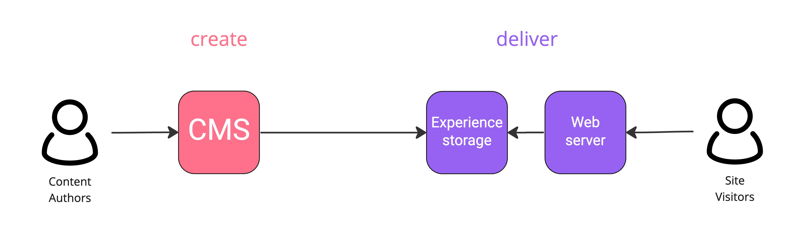
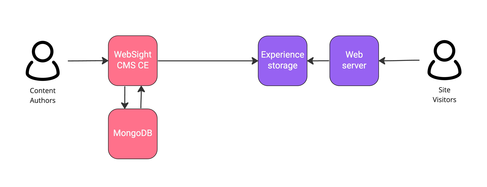
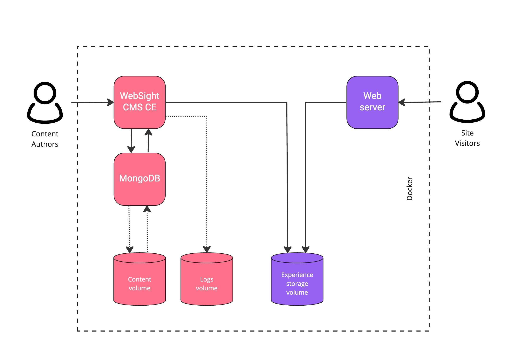

# Deployment
The diagram below shows the WebSight CMS Community Edition high-level logical architecture. 

From the left, **site visitors** call the **HTTP server** for pages. The **HTTP server** gets static HTMLs / assets / JS / CSS scripts from the **pages storage**.

!!! Info "Note" 
        The pages storage has no access to CMS. If there is no page in the storage, then site visitor gets `404`.

**Content authors** use **CMS** to manage pages and publish them (push) to the **pages storage**. Once your page is ready to go public, it is saved in the page storage and can be served immediately with easy-to-scale HTTP servers.

The above description is called a *push model* and assumes that the pages are prepared for the user in advance. Note that within this architecture, it is possible to switch off the CMS part, which has no impact on delivering pages.

Our CMS is a `Java`-based `OSGi` application (**WebSight CMS CE**) with a `NoSQL` database (**MongoDB**). WebSight CMS CE allows content management and generating static HTML pages. MongoDB database stores content and assets. 

!!! Info "Note"
        Multiple instances of WebSight CMS CE can connect to MongoDB which supports online deployments and CMS scalability.

## Containers
We use containers to ship WebSight CMS on multiple environments, from the developer's local computers to clouds. Read our ["Why we decided to ship and develop the OSGi application in containers"](https://www.websight.io/blog/2022/shipping-and-developing-osgi-application-in-container/) article to understand benefits of containers in our stack.

Once developers [create a WebSight project from the Maven archetype](https://www.websight.io/docs/developers/create-and-develop-project/), they produce the following Docker images:

- `NGINX` image (HTTP server) with addtional project-specific configurations
- customized CMS image with core WebSight CE / project-specific modules and configurations

## Docker Compose
With more than one container in the platform, we need a tool for defining and running multi-container Docker applications. With Compose, we can use the `Compose YAML` file model to:

- configure all platform components (`services`)
- enable communication between them
- handle data persistancy with `volumes`

The following diagram presents all WebSight CMS CE containers and volumes togehter.

The diagram above reflects the containers logical architecture. Docker Compose configuration specifies the following services:

- `nginx` service (pages delivery)
- `cms` service (content management and pages generation)
- `mongo` service (content database)

Services use volumes to save durable data outside the container (when container is destroyed and reloaded, all data on the container is lost). We specify the following  volumes:

- `pages storage` volume is shared by NGINX (read) and WebSight CMS CE (write) containers
- `content` volume keeps content and assets
- `logs` volume keeps all WebSight CMS CE application logs

## Environments

Working with containers is a standard. With Docker, we can use the same tooling to work locally as well as deploy environments to the cloud.

For example:

When using Docker Compose, the same command is responsible for creating local and cloud instances (`docker compose up`). 

Read more about [Docker Compose Amazon Elastic Container Service integration](./aws/).