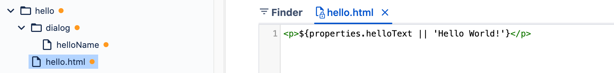
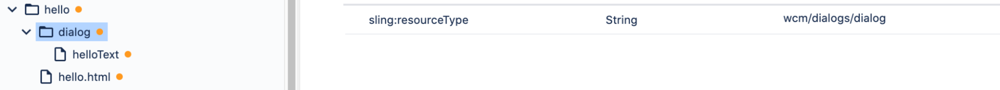
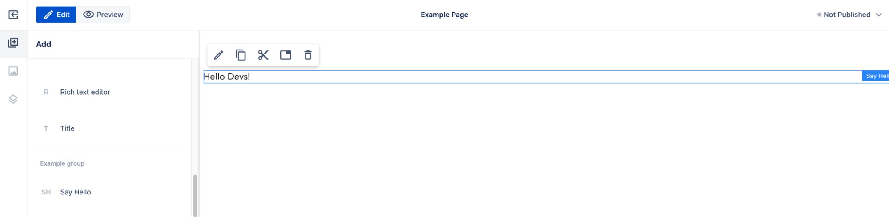

# Component definition

Components are implemented by developers and delivered as resources following a defined structure. The resources should be provided in the OSGi bundle. See the project setup documentation for more details.

In this section we will see how the component definition resources structure should look.

## Simple component definition example
Let's see what a simple component definition looks like.

We see a component named _Say Hello_. It provides dialog with one text field, which can be used in the authoring interface to set the hello text rendered on the page using the `
` HTML tag. If the property is not set, `Hello World!` text will be used. 

The example application delivers the resource `/apps/example-site/components/hello`, which is a component definition. It contains just three properties:

- `sling:resourceType` = `ws:Component` which makes this resource the component definition
- `title` = `Say Hello` which is the title of the component visible in the authoring UI
- `group` = `Example group` which is a group name visible in the authoring UI

Example component definition in WebSight Resource Browser

The component is visible in the WebSight CMS page editor. After adding it to the page, it renders ‘Hello World!’ text.

Because the Say Hello component was added to the edited page, the corresponding node was created in the page content:

The `Hello World!` text is rendered in the view because of the `hello.html` resource defined under the component definition resource that contains the script used to render the content node. The script renders the `helloText` property value -- or `Hello World!`, if the property value is empty (it's empty for now, so we see the fallback text).

Example component renderer in WebSight Resource Browser.

The second resource under the component definition is the `dialog` resource. This is the dialog definition resource. It contains a`sling:resourceType` = `wcm/dialogs/dialog` property, which defines how the dialog should be displayed (see more details in below) and it has sub-node called `helloText` that defines the text field (`sling:resourceType` = `wcm/dialogs/textfield`) input with the label `Hello Text`.

Example component dialog resources in WebSight Resource Browser.

Because the dialog is defined, the edit action in the editor allows you to open the dialog as a set value of the text field.

The property value is set on the content node of this _Say Hello_ component instance at the `helloText` property (according to the `name` property value at the text field node in the dialog definition):

And now the component renderer script will display the property value instead of fallback text:

Let's explore all the options and details of the component definition.

## Component definition properties

The component definition is a Sling Resource with resource type `ws:Component`. 
Use the following resource properties to define the component:

<table>
    <tr>
        <th>Component property</th>
        <th>Required</th>
        <th>Value</th>
        <th>Description</th>
   </tr>
   <tr>
        <td>sling:resourceType</td>
        <td>Yes</td>
        <td>ws:Component</td>
        <td>Defines that this resource is a component definition.</td>
    </tr>
    <tr>
        <td>sling:resourceSuperType</td>
        <td>No</td>
        <td>super resource type</td>
        <td>Set this property to make your component extend another component. That way, the extended component elements can be reused in the extending components. Example value: "wcm/core/components/page"</td>
    </tr>
    <tr>
        <td>title</td>
        <td>Yes</td>
        <td>string</td>
        <td>Component name visible in UI. Example value: ‘Title’</td>
    </tr>
    <tr>
        <td>group</td>
        <td>Yes</td>
        <td>string</td>
        <td>Component group name. Allows us to present related components in the UI. Used while defining allowedComponents. Use the value ‘.hidden’ to make the component definition not visible in the UI. Example value: ‘General’ </td>
    </tr>
    <tr>
        <td>isContainer</td>
        <td>No</td>
        <td>boolean, false by default</td>
        <td>Defines the component as a container. Containers are components that contain child components that can be added, removed and reordered using the authoring interface. If true, the allowedComponents property is required too.</td>
    </tr>
    <tr>        
        <td>allowedComponents</td>
        <td>No*</td>
        <td>array of strings. Values are absolute component paths and group names. No default value; by default nothing is allowed.</td>
        <td>*required if isContainer=”true”; Array listing allowed child component absolute paths or groups that can be added to the container. Example value: [ "/apps/my-app/components/component1", "/apps/my-app/components/component2", "Content", "Blog" ] </td>
    </tr>
    <tr>
        <td>isLayout</td>
        <td>No</td>
        <td>boolean, false by default</td>
        <td>Defines the component as a layout component.
            Layout components are displayed in a separate section in the WebSight CMS pages editor from components that are not layout components.    

            It’s up to the component developer to set isLayout=true, but the guideline is to use it for components that:   
            - are used to define page layout  
            - must contain other components to be usable   
            - contain no logic (other than logic related to layout calculation)   
            - interact only on page resize (no other “user actions” allowed)   
            - have no visible UI elements (like texts)   

            Examples of Layouts:  
            - 2-column container  
            - 1-column container  
            - Section with title, image, text and CTA (container including components)    

            Example of components that are not Layouts:  
            - image, title or CTA, all of which have visible UI elements (like texts)  
            - logo cloud, which contain very specific CSS logic and should not be used to create generic page layouts)  
            - Accordion, which contains logic not related to layout calculation  
            - Image gallery, which contains logic not related to layout calculation
        </td>
   </tr>
   <tr>
        <td>instanceResourceType</td>
        <td>No</td>
        <td>resource type that will be set on created component instance </td>
        <td>If this property is not set, the resource type of every created component instance node will be set to a value resolved from the component definition resource path. If set, then this property value will be used instead.    

        This allows multiple components definitions, which will result with the same resource type used for created component instances. It could be used to deliver components (or layout components) with different initial content.    

        For example:  

        ‘Section’ layout component contains an embedded Title component and is a container that renders child components below the Title. If the authoring section with four columns needs to be created, then the ‘Section’ component needs to be added with four containers inside that are configured to be displayed as columns.   

        If this page layout is commonly used during content authoring then a new layout component could be implemented to simplify the process.  

        The ‘section with four columns’ layout component could be added. The instanceResourceType property should be set to the ‘Section’ component resource type and initial content should provide the same structure as was created manually before (a section plus four configured child containers). This way, after dropping ‘Section with four columns’ on the page, the commonly used content structure will be ready to use immediately.  

        Example value: "my-app/components/section"

   </td>
</table>

## Dialog

Dialog is the form with inputs that allows you to set data on component instances in content.
The form layout, fields and behavior are described by resources starting at a resource named `dialog` defined under the component definition resource. If the `dialog` resource is not defined, then the edit component properties action is not available in the editor.

This is what the dialog definition structure looks like with the same dialog displayed in the editor:

Component dialog resources structure in Resource Browser tool

Component dialog displayed after edit component action in pages editor

<!-- -->
Read more in the Dialogs documentation.

## Rendering script

To render components, the rendering script file resource is needed. The file resource name should be the same as the component name with the `.html` extension (the recommended and supported scripting language in WebSight CMS is the HTML Templating Language, or HTL). See the HTL specification [here](https://github.com/adobe/htl-spec/blob/master/SPECIFICATION.md)

If Java support is needed in the HTL, the recommended solution is to use ot Models and the HTL Use-API. See details:

- [_use_ block statement](https://github.com/adobe/htl-spec/blob/master/SPECIFICATION.md#221-use)
- [Use-API](https://github.com/adobe/htl-spec/blob/master/SPECIFICATION.md#4-use-api)
- [Sling Models](https://sling.apache.org/documentation/bundles/models.html)

Component renderer script in the WebSight Resource Browser.

## Template

Component template is a resource that gets copied when creating a new component instance and adding it to a page. In other words, it is the initial content of the component. It is used to set default values or prepare necessary content structure. It could also be used to save work during content authoring.

The component template resource is a component definition sub-node with the name `template`.
The template resource is optional. If it's not present, a new empty node will be created.

Component template resources structure (view from the WebSight Resource Browser tool).

Component instance added to the page content initialized from template (view from the WebSight Resource Browser tool).
