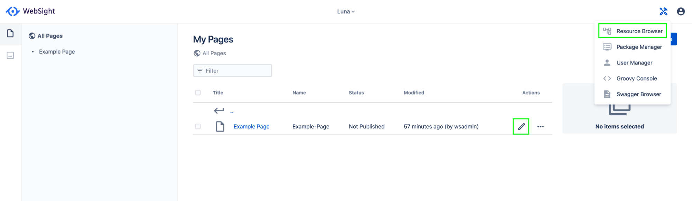
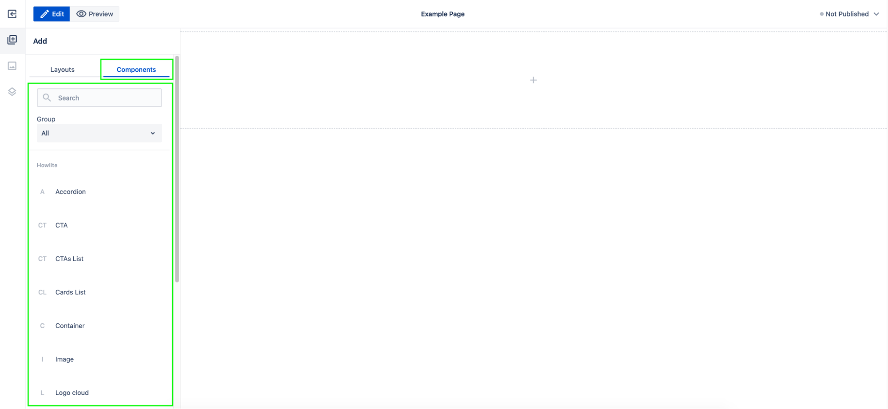

# Components

## Overview

This document describes the components concept. It also shows how to use components in the WebSight CMS authoring interface.

In this documentation we use the follow terms:

- WebSight CMS pages editor: Refers to the UI for authoring page content
- WebSight Resource Browse: Refers to the administration tool that allows users to see the resources (data and application) that are available on the WebSight CMS instance

Both views can be opened from the WebSight UI:

Check the WebSight project setup documentation to see more details about:

- what WebSight CMS is, and what it gives you
- implementing applications for WebSight CMS Community Edition
- the role of OSGi, OSGi bundles, Sling Resources, JCR and more in WebSight CMS

## What is component

Components are:

- elements that render parts of content according to implemented functionality
- used to assemble content (like pages)
- available in the WebSight CMS authoring interface
- reusable
- configurable by editing properties on created components instances
- implemented by developers
- shipped in OSGi bundles that are deployed to a WebSight CMS instance

Components can:

- include (embed) other components
- extend other components
- deliver initial content
- define dialogs, which are used to edit properties on component instances
- be containers (allowing you to add child components during authoring)
- define allowed child components (in the case of containers)

## Using components

To provide more context on components, let's look at the authoring interface and content data structure.

The WebSight CMS page editor lists all available components that can be used to build pages on a given WebSight instance. Available components depend on the OSGi bundles that delivering components installed on the instance. Those components can be added to the page by dragging them to the page content view at the center of the screen.

Components definitions listed in the WebSight CMS page editor

You can check the page content structure in the page editor content tree tab. This view presents the components tree under page content.
This example page contains just the _Page Section_ component, which is the only component present currently in the page content of this example page.

{: style="width:350px"}

Page content tree in editor

The _Page Section_ component is a container. It allows you to add other components via the authoring interface. The page editor content section displays an empty _Page Section_ component as a box containing the placeholder text "Drag components here."

After dragging and dropping the _Title_ and _Rich Text_ components, the page content tree is updated with new nodes. The nodes visible in the content tree are the instances of components.

_Title_ and _Rich Text_ components are not containers, so other components cannot be added as their child components. While dragging other components from the components list, the new items can be added next to those components as other children on the _Page Section_ component.

After adding a component to the page, the edit action can be used to edit the selected component instance. The dialog that is displayed is a part of the component definition. It is defined by the developer implementing a given component by setting the proper dialog fields (see more in the [Dialogs](../dialogs/) documentation). Properties set via the dialog are saved at edited component instances, and are used by the component to render the appropriate part of content based on the implemented functionality. For example, the _Title_ component renders the `Heading text` field value in the HTML `<h>` tag and allows you to set `<h>` tag level and styling.

Components are reusable. Another _Title_ component can be added to the page and configured with its own data.

After the second title, the _Cards List_ component is added now. This component is a container but implemented to work with specific type of child components: Only _Card Item_ components can be added inside (this behavior is part of the _Cards List_ component definition).

The _Cards List_ component defines initial content that is added to the page when adding a component. The initial content contains 3 child _Card Item_ components (to save work during authoring and present the component in an initialized state).

In the content tree , you can see that the _Card Item_ components are child components of the _Cards List_ component.

You can continue with assembling and configuring page content based on the available components.
