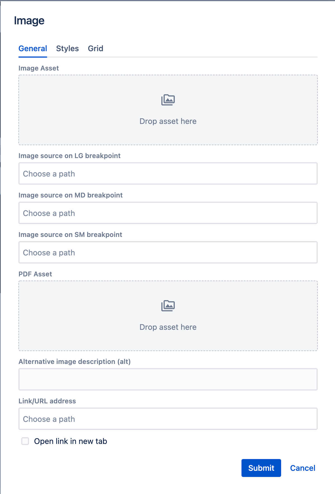

# Asset Reference

**wcm/dialogs/components/assetreference**

## Description

The Asset Reference component is an input that allows the user to pick an asset from the space by dragging it from the assets tab on the left sidebar. It will only allow for dropping assets that match the MIME type of the field's configuration



## Properties

- **name** -  `string` (required)  
    Form field name

- **label** - `string`  
    Display label value

- **required** - `string`  
    Indicates if field value is mandatory

- **mimeTypes** - `string[]`  
    List of allowed MIME Types that can be dropped on the field - it supports simple wildcards like `image/*` or `*`

- **emptyText** - `string` (if not defined, `"Drop asset here"`)  
    Text that will be displayed in the drop area when an asset is not selected

## Example

```json
"imageAsset": {
  "sling:resourceType": "wcm/dialogs/components/assetreference",
  "mimeTypes": ["image/*"],
  "name": "imageAsset",
  "label": "Image Asset"
}
```
