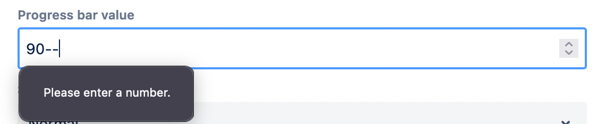

# Dialogs

Dialogs framework which is part of WebSight CMS allows to define dialog fields components used to build the dialog used to submit data saved in content resources.

WebSight CMS delivers set of ready to use components, see subsections of this documentation for details.

## Dialog structure
Each dialog can be build out of two element types:

- containers - used to achieve proper structure of fields in dialog, examples: container, tab, tabs, include
- fields - used to input values via dialog, examples: textfield, numberfield, pathPicker

Example dialog structure definition can look like this:
```json
{
  "sling:resourceType": "wcm/dialogs/dialog",
  "tabs": {
    "sling:resourceType": "wcm/dialogs/components/tabs",
    "properties": {
      "sling:resourceType": "wcm/dialogs/components/tab",
      "label": "Properties",
      "title": {
        "sling:resourceType": "wcm/dialogs/components/textfield",
        "label": "Title",
        "name": "title"
      },
      "description": {
        "sling:resourceType": "wcm/dialogs/components/richtext",
        "label": "Description",
        "name": "description"
      }
    },
    "advanced": {
      "sling:resourceType": "wcm/dialogs/components/tab",
      "label": "Advanced",
      "shadows": {
        "sling:resourceType": "wcm/dialogs/components/toggle",
        "name": "shadows",
        "label": "Use shadows"
      },
      "style": {
        "sling:resourceType": "wcm/dialogs/components/select",
        "label": "Style",
        "name": "style",
        "primary": {
          "sling:resourceType": "wcm/dialogs/components/select/selectitem",
          "label": "Primary",
          "value": "primary"
        },
        "secondary": {
          "sling:resourceType": "wcm/dialogs/components/select/selectitem",
          "label": "Secondary",
          "selected": true,
          "value": "secondary"
        },
        "link": {
          "sling:resourceType": "wcm/dialogs/components/select/selectitem",
          "label": "Link",
          "value": "link"
        }
      }
    }
  }
}
```

It will result with following in UI dialog: 


## Data structure
All fields within the dialog have the `name` property, which defines the property’s name, under which values are saved in JCR. What is significant, the data is flattened, which means it does not matter if a particular field is in a nested structure (like tabs) or not. Properties are always saved under the same node.

## Validation
Validation in dialog fields is used to verify if the value meets the criteria of the particular field. There are two levels:

### FrontEnd validation
Front End validation is done by Atlaskit by default, if the submitted value is obviously incorrect, like a non-number value in NumberField. You can find more details [here](https://atlassian.design/components).


### BackEnd validation
WebSight supports the validation of dialog values on BackEnd side. If the value is incorrect, then it won’t be saved and the dialog can’t be submitted. The author will see a proper error message.


## Show/hide dialog fields
By default, all dialog components are visible, but there is a possibility to hide them.

### Context
To show or hide a particular field depending on dialog context you can use a `ws:disallowedContext` parameter.

```json
"ws:disallowedContext": ["edit"]
```

To hide an element in dialog, the request from Front-End which fetches it has to contain the additional parameter `context`. If the context value matches one of `ws:dissallowedContext` values, then the field won’t be rendered.

### Conditions
To show or hide a particular field depends on other fields’ state you can use a `ws:display` node.
This node should contain children defining conditions to show the element. If the component has such a child node it’s hidden by default. It’s required to fulfill at least one condition to show the component.

Each condition should have two properties:

- sourceName - with the name of the component whose value would be checked
- values - with one or more values. At least one of them should match the source field value to fulfill the condition.

Example conditions configurations:
- with single value:
```json
"ws:display": {
  "condition": {
    "sourceName": "fieldName",
    "values": "option1"
  }
}
```
- with multiple values:
```json
"ws:display": {
  "condition": {
    "sourceName": "fieldName",
    "values": ["option1", "option2", "option3"]
  }
}
```

Example dialog definition:

```json
{
  "sling:resourceType": "wcm/dialogs/dialog",
  "hideall": {
    "sling:resourceType": "wcm/dialogs/components/toggle",
    "name": "hideall",
    "label": "Hide all other elements"
  },
  "container": {
    "sling:resourceType": "wcm/dialogs/components/container",
    "showrequiredfield": {
      "sling:resourceType": "wcm/dialogs/components/toggle",
      "name": "showrequiredfield",
      "label": "Show required field"
    },
    "requiredfield": {
      "sling:resourceType": "wcm/dialogs/components/textfield",
      "name": "requiredfield",
      "label": "Required field",
      "required": true,
      "ws:display": {
        "condition": {
          "sourceName": "showrequiredfield",
          "values": "true"
        }
      }
    },
    "ws:display": {
      "condition": {
        "sourceName": "hideall",
        "values": "false"
      }
    }
  }
}
```


## Default state
Some components allow defining a default state. E.g. checkbox can be checked by default, and select can have the default option. It is significant to keep using those components with the same default state used in backend models.

To achieve a similar effect you can use initial content if you add a new component. There is no easy solution to update all existing resources, so the initial content is useless if you extend the existing component. In that case, you need to use default states.