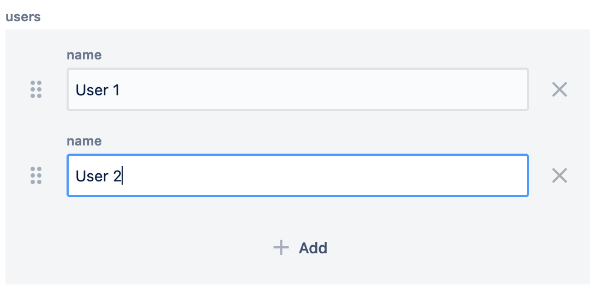

# Multifield

**wcm/dialogs/components/textfield**

## Description

The Multifield component allows users to add, reorder or remove multiple instances of a field.

In a simple case, this creates a basic form input field (e.g., TextField, TextArea). However, it can also create a complex component that acts as an aggregate of multiple subcomponents (such as address entries).

The field used in Multifield components behaves the same as it does within a plain dialog (e.g., when hiding labels).

## Properties

- **name** - `string` (required)  
    Form field name

- **label** - `string`  
    Display label value

- **required**  
    Indicates if field value is mandatory

## Example

Multifield with TextField:

```json
"users": {
  "sling:resourceType": "wcm/dialogs/components/multifield",
  "name": "users",
  "label": "users",
  "name": {
    "sling:resourceType": "wcm/dialogs/components/textfield",
    "name": "name",
    "label": "name"
  }
}
```



Multifield with nested Multiefield

```json
"users": {
  "sling:resourceType": "wcm/dialogs/components/multifield",
  "name": "users",
  "label": "Users",
  "namefield": {
    "sling:resourceType": "wcm/dialogs/components/textfield",
    "name": "name",
    "label": "Name"
  },
  "addresses": {
    "sling:resourceType": "wcm/dialogs/components/multifield",
    "name": "addresses",
    "label": "Addresses",
    "street": {
      "sling:resourceType": "wcm/dialogs/components/textfield",
      "name": "street",
      "label": "Street"
    }
  }
}
```
