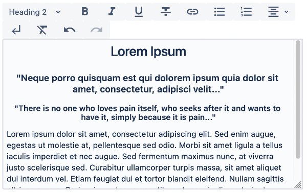

# Rich Text Editor

**wcm/dialogs/components/richtext**

## Description


The Rich Text Editor dialog field provides many features that allow authors to edit text content.  

This dialog field requires a [configuration](./richtext-editor-configuration.md/), which defines which features should be available and how the menu bar be displayed.

## Properties

- **name** -  `string` (required)  
    Form field name

- **label** - `string` (optional)  
    Display label value

- **required** - `string` (optional, default `false`)  
    Indicates if field value is mandatory

- **removeIfEmpty** - `string` (optional, default `false`)  
    Indicates if property in JCR will be removed if it contains empty String, or will be retained with that value

- **description** - `string` (optional)  
    Display description value as tooltip

- **configuration** - `string` (optional, default `/libs/wcm/dialogs/components/richtext/configuration`)  
    Absolute path to configuration node. The configuration can be also defined inline; see [RichText Editor - configuration](./configuration) for details

Example:

```json
"content": {
  "sling:resourceType": "wcm/dialogs/components/richtext",
  "name": "content",
  "label": "Content"
}
```


