# Development

This document describes application development for WebSight CMS. It assumes you have completed the [project setup guide](../setup/) and generated a new project from the Maven archetype. All the screens and examples presented below refer to the project prepared in these previous steps.

!!! Info "Note"
    You don’t need to read and understand all of the linked content; the basic concepts will be explained here.

WebSight CMS is based on [Apache Sling](https://sling.apache.org/), which is “a framework for RESTful web-applications based on an extensible content tree”​​ and the [OSGi specification](https://www.osgi.org/) - a “Java framework specification that supports the deployment of extensible and downloadable applications known as bundles”.

What does this mean?  Let's explore by discussing the two most important aspects of the technologies WebSight CMS is based on: OSGi bundles and Resources.

## OSGi bundle

An OSGi bundle is a unit of modularization in the OSGi specification. It's a bundle comprised of Java classes and other resources, which together can provide functions to end users.

Open [http://localhost:8080/system/console/bundles](http://localhost:8080/system/console/bundles) to see all the Bundles on the WebSight CMS instance and use the filter bar at the top to filter the list.

Some of the bundles deliver the OSGi specification implementation (note that the list is filtered by org.apache.felix and that Apache Felix is an implementation of the OSGi specification):


Some of the bundles deliver Apache Sling functionality (list filtered by org.apache.sling):
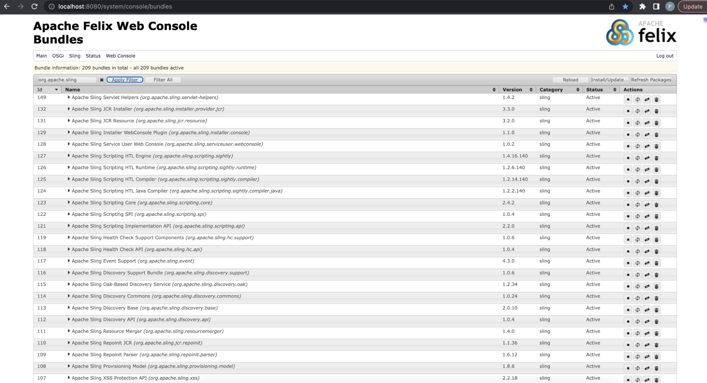

Some of the bundles deliver WebSight CMS functionality (list filtered by WebSight):


And finally, some of the bundles deliver the functionality of the application which was just generated from the archetype (list filtered by my-artifactId which was used in example project generation at the beginning of our tutorial guide):
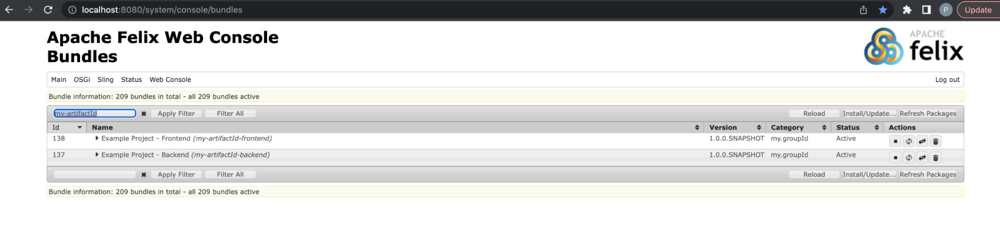

Click on `my-artifactId-backend` bundle to open details. 
At the beginning the bundle definitions were mentioned: 
OSGi bundle is a unit of modularization in the OSGi specification. Again, a bundle is comprised of Java classes and other resources, which together can provide functions to end users.

The screen below highlights that the `my-artifactId-backend` is exporting (in other words, making available to other bundles) some Java packages (with use of the `Export-Package` standard OSGi bundle header provided by `bnd-maven-plugin` in `pom.xml` and `package-info.java` files in the code base) and is providing some resources (with use of `Sling-Bundle-Resources` bundle header handled by Bundle Resources Provider).


## Resources

As we mentioned, WebSight CMS is based on [Apache Sling](https://sling.apache.org/), which “is a framework for RESTful web applications based on an extensible content tree”.

It is important to understand the concept of an “extensible content tree,” so let's discuss in a bit more detail.

The WebSight CMS Resource Browser admin tool allows developers to browse all Resources available on the instance. Resources are organized in the tree and every resource has a path and properties. Resources are abstractions that represent objects that might come from different sources.
The Resource Browser provides an option to select ‘Providers’ (sources of Resources available in the instance) used to display the presented Resources tree. We will focus on JCR and Bundle resources. 

[http://localhost:8080/apps/browser#/](http://localhost:8080/apps/browser#/)


JCR (Java Content Repository) is a database with a tree structure consisting of nodes with properties. Nodes in JCR are reflected by the JCR Resource in the Resources tree.

JCR is based on the Java specification and implemented by Apache Jackrabbit, which is also part of Sling and WebSight CMS (check the bundles list mentioned in the previous chapter and filter by org.apache.jackrabbit to see related bundles).

For additional technical details refer to these links (which may be interesting but are not necessary for following this guide, because we explain within the guide everything you need to know for our purposes):

- [https://sling.apache.org/documentation/the-sling-engine/resources.html](https://sling.apache.org/documentation/the-sling-engine/resources.html)
- [https://jackrabbit.apache.org/jcr/jcr-api.html](https://jackrabbit.apache.org/jcr/jcr-api.html)
- [https://developer.adobe.com/experience-manager/reference-materials/spec/jsr170/javadocs/jcr-1.0/](https://developer.adobe.com/experience-manager/reference-materials/spec/jsr170/javadocs/jcr-1.0/)

Content stored in JCR is represented by JCR Resources (provided to the Resources tree by the JCR Resource provider). WebSight CMS stores JCR content in MongoDB by default (other setups are possible, but we won't cover them here). JCR is used for all the content created during content authoring. Every created page and every added component are represented by nodes (with properties containing data) in the JCR and Resources tree.

Resources could also be provided by OSGi Bundles. From the perspective of the Resources tree and Resource abstraction, there is no difference between resources provided by bundles and JCR. However, the bundle resources are read-only, so they would not be suitable for authorable content, but they are great for providing applications. The application resources provided by bundles are available as long as the bundle is available, and they are not stored in JCR. This means application data is not mixed with content data, making it easy to implement blue-green deployments, CI/CD and separation of concerns.

For additional technical details check out this link:
[https://sling.apache.org/documentation/bundles/bundle-resources-extensions-bundleresource.html](https://sling.apache.org/documentation/bundles/bundle-resources-extensions-bundleresource.html)

This is how bundle resources are provided in the generated project:
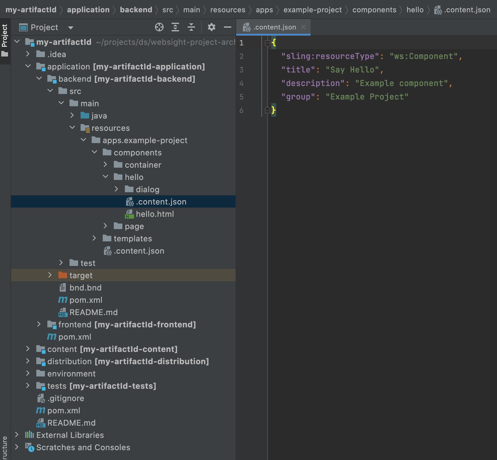

And the same resource in the resource browser:
[http://localhost:8080/apps/browser#/apps/example-project/components/hello](http://localhost:8080/apps/browser#/apps/example-project/components/hello)
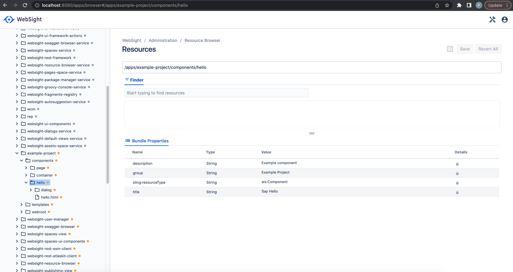

This is how JCR resources are defined in the codebase in the content module:
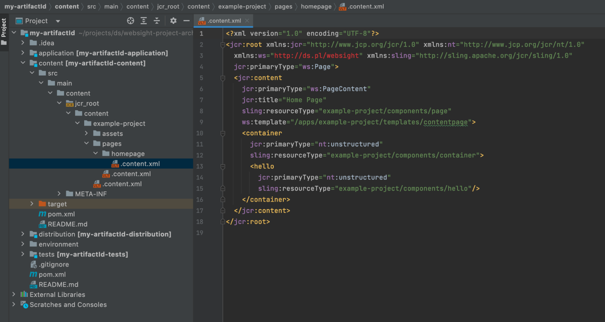

And in the Resources tree:
[http://localhost:8080/apps/browser#/content/example-project/pages/homepage/jcr:content](http://localhost:8080/apps/browser#/content/example-project/pages/homepage/jcr:content)


## Backend Resources

The generated application/backend module contains (in the src/main/resources folder) some example application resources needed to work with Pages in WebSight CMS.

The resources structure starts at the /apps/example-project path. This path is set in the proper OSGi bundle header to provide information about resources delivered by the bundle.

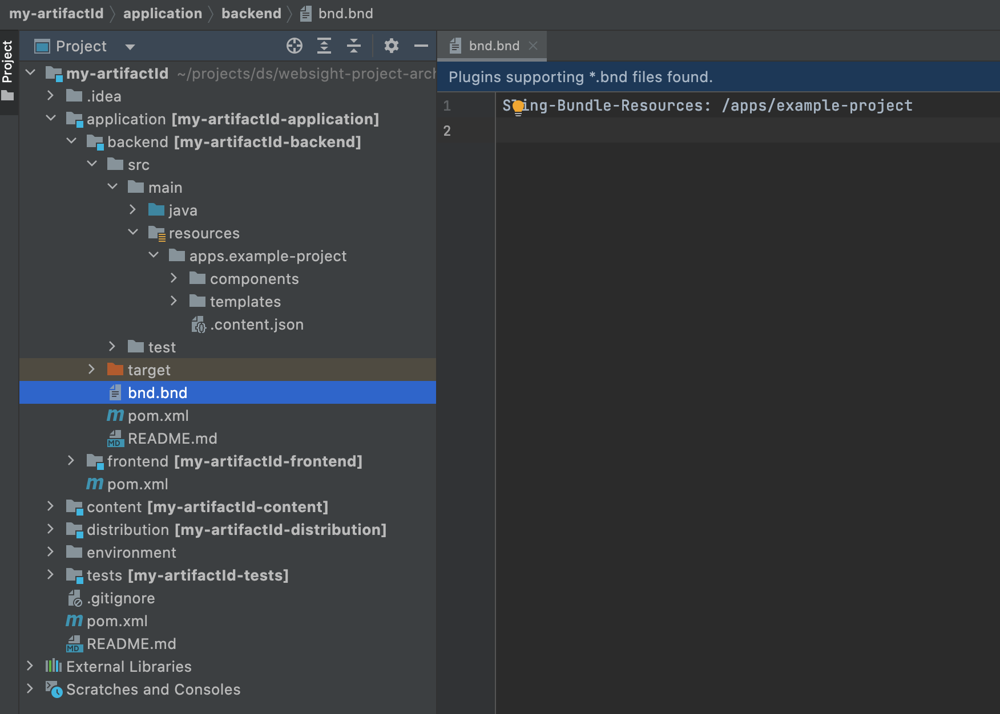

The following resources are defined:

``` script
.
└── apps
    └── example-project             - application root "sling:resourceType": "ws:Application"
        ├── components              - folder containing components
        │   ├── container           - example container component
        │   ├── hello               - example component
        │   └── page                - example page component
        └── templates               - templates folder
            ├── contentpage         - example page template
            └── pagesspace          - example pages space template
```

The application root should be under the /apps resource and must contain the property `sling:resourceType" = "ws:Application`.
Folders containing components and templates must be named ‘components’ and ‘templates’ and be under the application root resource. Different relative paths could be set by providing ‘components’ or ‘templates’ properties with relative paths to components or templates folders located under the application root resource. Otherwise, components and templates will not be available in the authoring UI.

## Pages Space template

In WebSight CMS, content is organized in Spaces. Spaces are areas where dedicated teams can work on content. WebSight CMS allows the creation of two types of spaces:

- Assets (Digital Assets Manager) - allows managing assets
- Pages - allows managing pages and assets (includes the same functionality as Assets Space and more)

The content module in the project generated from the archetype contains the Pages Space instance ‘Example project’, which is visible in the All Spaces view.

A new Space can be created from the UI:


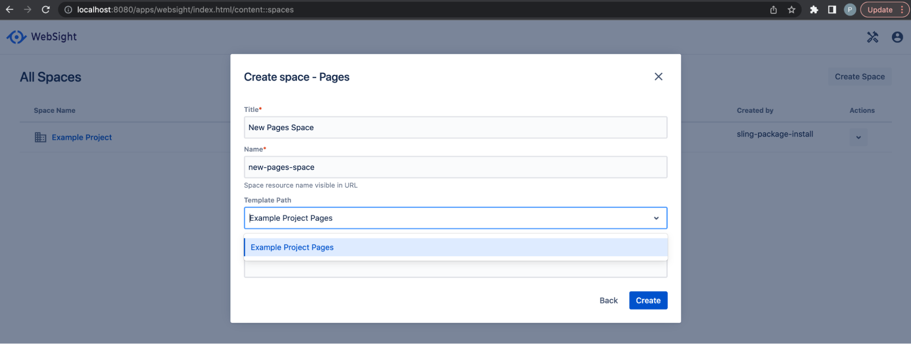

In the second step, the Space template needs to be selected for Pages Space creation. 
The list contains the ‘Example Project Pages’ template defined using the `/apps/example-project/templates/pagesspace` resource.
The Pages Space template resource must have `sling:resourceType` set to `ws:PagesTemplate` and should provide the allowedChildren property (which defines the list of allowed pages templates to create).

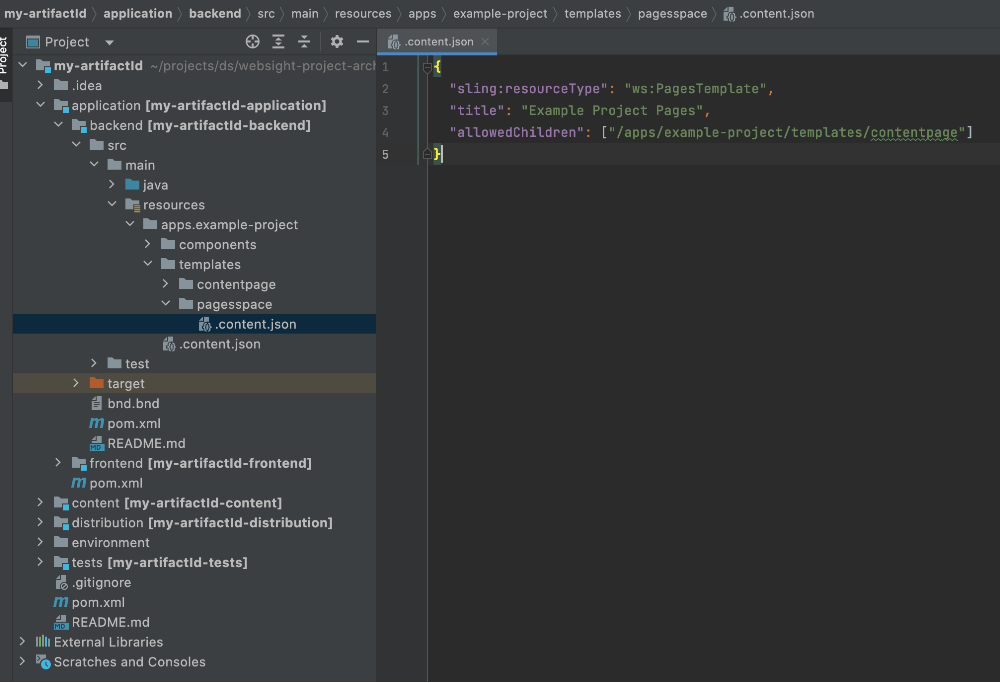

Another Pages Space template could be defined in the application if needed. For example:

``` json title="/apps/example-project/templates/anotherpagesspace"
{
 "sling:resourceType": "ws:PagesTemplate",
 "title": "Another Example Project Pages",
 "allowedChildren": ["/apps/example-project/templates/contentpage"]
}
```

To deploy the updated bundle to the running instance, use the command from the backend module folder:
``` script
mvn clean install -P autoInstallBundle
```


A new Pages Space template will be available:


##  Page template

Pages spaces are for page management. To create a new page, a page template is needed. The generated backend module provides an example page template resource `/apps/example-project/templates/contentpage`

- `sling:resourceType` property of the page template must be ws:PageTemplate.
- title and description properties are used in UI.
- the allowedChildren property contains an array of page templates that can be created under pages created from this template. The content Page template allows for the creation of subpages of the same type.


The `/apps/example-project/templates/contentpage` was listed in _allowedChildren_ property in the Pages Space template (`/apps/example-project/templates/pagesspace`). This is a templates of the Example Project space:
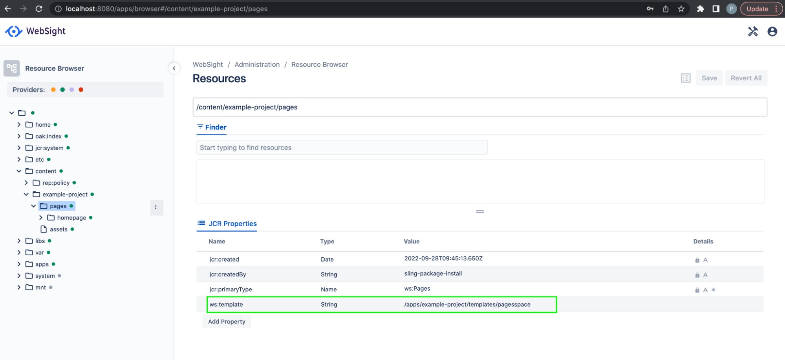

This means that the page template /apps/example-project/templates/contentpage can be created under the page's root in the space:
[http://localhost:8080/apps/websight/index.html/content/example-project/pages](http://localhost:8080/apps/websight/index.html/content/example-project/pages ) (click Create Page button)
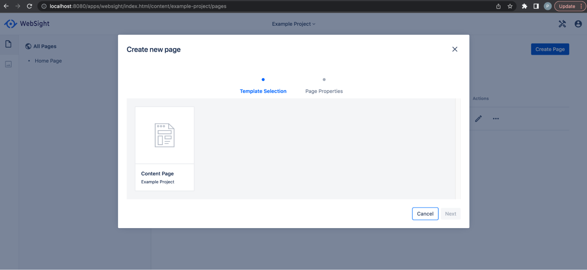

In the second step, page properties can be set:


The dialog displayed at this step is a dialog of the component defined in the initial content of the page template (`sling:resourceType": "example-project/components/page`). Read more about components and dialogs in the [Components section](/docs/developers/components/) of the WebSight CMS documentation.

The initial content of the page template is defined in a resource named ‘initial’, which is located under the page template resource. The initial content is copied to initialize the created page. Properties are set via a dialog on the copied page content.

Page is a node of type ws:Page. It contains a page content sub-node named jcr:content of the type ws:PageContent. The nodes located under the page content node can be modified via the authoring UI. All the Page properties (including properties set via the page dialog) are set on the page content node.

This is the initial content of the `/apps/example-project/templates/contentpage` page template:


This is how the content node of the newly created page appears:


New page templates can be created in the application.
`/apps/example-project/templates/examplpage` is a copy of  `/apps/example-project/templates/contentpage` with changed title, allowedChildren

``` json title="/apps/example-project/templates/examplpage"
{
 "sling:resourceType": "ws:PageTemplate",
 "title": "Example Page",
 "description": "Example Project",
 "allowedChildren": ["/apps/example-project/templates/examplpage"]
}
```

and initial content:
``` json
{
 "jcr:primaryType": "ws:Page",
 "jcr:content": {
   "jcr:primaryType": "ws:PageContent",
   "sling:resourceType": "example-project/components/page",
   "container": {
     "sling:resourceType": "example-project/components/container",
     "hello": {
       "sling:resourceType": "example-project/components/hello"
     },
     "hello1": {
       "sling:resourceType": "example-project/components/hello",
       "helloName": "Example"
     }
   }
 }
}
```


To make it possible to create under the pages' root in the space, you must add it to allowedChildren in the pages space template `/apps/example-project/templates/pagesspace`:


Deploy changes again with: `mvn clean install -P autoInstallBundle`

The new template is available to create in the pages' root:


Page created from this template contains defined initial content:


## Components

Content is assembled from components. Components are elements that render parts of content according to implemented functionality. To understand the components concept see the [Components section](/docs/developers/components/) of the WebSight CMS documentation.

The generated backend module contains three example components, located under `/apps/example-project/components`

- page - component used to render page content node
- container - container component, which allows adding child components via the authoring UI
- hello - component that displays hello text

In the editor components list, only the hello component is visible because other components are hidden via the group property value.


[http://localhost:8080/apps/websight/index.html/content/example-project/pages/new-page::editor](http://localhost:8080/apps/websight/index.html/content/example-project/pages/new-page::editor)


New components can be defined to deliver application functionality. 

As an example, we will add a new component named Rich Text, which allows for advanced text editing.

First, create new folder under `/apps/example-project/components` named richtext with content:
``` json
{
 "sling:resourceType": "ws:Component",
 "title": "Rich Text",
 "description": "Allows advanced text edition",
 "group": "Example Project"
}
```

Then, define the dialog resource:
``` json
{
 "sling:resourceType": "wcm/dialogs/dialog",
 "richtext": {
   "sling:resourceType": "wcm/dialogs/components/richtext",
   "label": "Text",
   "name": "text"
 }
}
```

Define also the rendering script richtext.html (name must be matching component resource name + .html):
``` html
<sly data-sly-test="${properties.text && properties.text != '<p></p>'}">${properties.text @ context='html'}</sly>
```

See the [Components documentation](/docs/developers/components/) for more details.

This is how the new component definition looks in the codebase. Deploy the change with the command from the backend module: `mvn clean install -P autoInstallBundle`


The new component is available now in the editor and can be added to the page. If text is not configured via dialog, nothing is rendered because of the data-sly-test statement in the component renderer. If nothing is rendered by the component the placeholder is displayed automatically in the editor. The edit action can be used to open dialog, and you can use the rich text dialog input to configure the text.


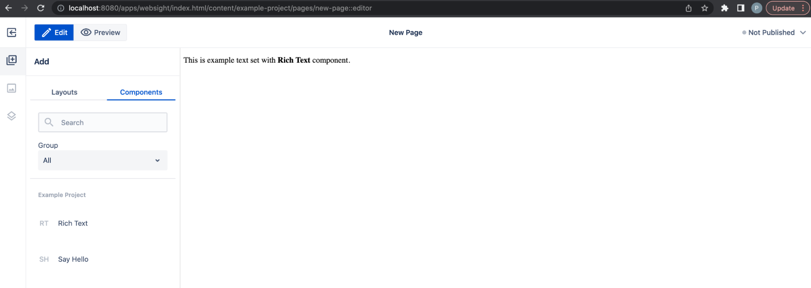

## Frontend

Frontend scripts and resources are provided by the frontend module, which is a webpack project containing the application frontend. During the build, the resources are embedded into a bundle, which is then deployed to the instance.

The generated module contains a simple CSS class to center the text used in the hello component.

The CSS files are built into the main.css file by webpack and embedded into the OSGi bundle installed on the instance, which makes the files available as resources (because of the Sling-Bundle-Resources header in the bundle header).

Frontend resources are published automatically via the WebSight-Apps-WebRoot bundle header (see next chapter about publishing).
The CSS file is included in the page component renderer to load the CSS.


[http://localhost:8080/apps/browser#/apps/example-project/webroot/main.css](http://localhost:8080/apps/browser#/apps/example-project/webroot/main.css)


Add the `hello` component to the page to see the centered hello text
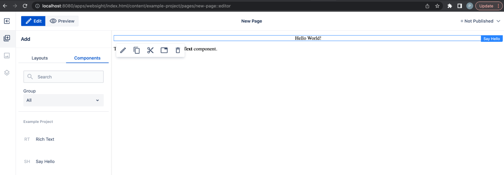

## Publishing

Assembled content can be previewed in the editor and published to make it available for end users.

[http://localhost:8080/apps/websight/index.html/content/example-project/pages/new-page::editor](http://localhost:8080/apps/websight/index.html/content/example-project/pages/new-page::editor )


The published page is served by an NGINX Web server container:

[http://localhost/new-page.html](http://localhost/new-page.html)


## End-to-end tests

The `test` module contains content used during end-to-end test execution to validate the application. See the example test content and test script for the hello component:


## Next steps

Congratulations! You've learned the application development process for WebSight CMS. Now, we recommend exploring details about deployment:

- [Deployment in AWS](../deployment/aws-ecs/)
