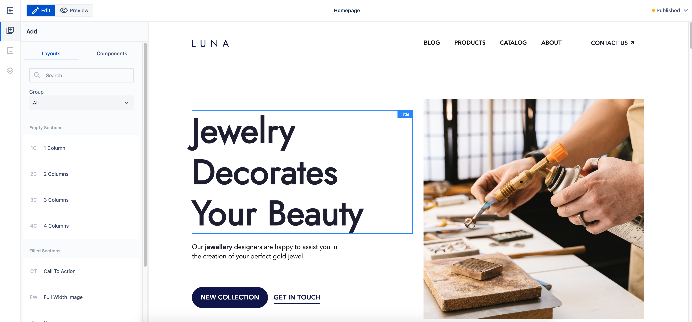

# Page Editor

## Overview

Page Editor is a core part of WebSight CMS and one of the main tools the content authors use.
It allows content authors to build Pages using [Components](../components) in a WYSIWYG way.
They can work with Components on a Page using intuitive Drag&Drop functionality and provide
content and configuration to the Components.

## Technical details

### Edit Mode

Edit mode is used for editing of page content.

#### Workspace content presentation

Edit Mode displays the edited page inside an iframe stretched to match content height.
The iframe is stretched vertically to match the content height in order to 
provide canvas-like experience to content authors. It is accomplished by reacting to content height changes and fixing issues that result from displaying and iframe in this way (like using vh unit).
It means the edited page itself is not scrollable, so the content author will not see any changes to the edited page that happen on scroll (e.g. sticky positioning
will not work).

#### Workspace Overlays

The edited page is (mostly) not altered, all UI is displayed in Edit Mode directly.
All the UI elements of the Edit Mode are displayed outside the iframe in order to increase separation of the two. We wanted to achieve the highest level of sandboxing the edited page as possible.

Especially important and technically complex part of Edit Mode UI are Overlays, like:

- Component Selectors - 'borders' marking the content of given component instance
- Selected Component Toolbar - toolbar with actions allowed for selected component
- Placeholders - placeholders generated for components without content

Alle those items are displayed on top of the iframe containing the edited page.
The content author is actually interacting with Overlays, not the elements of the edited page.

The iframe with Overlays on top of it is called Workspace.

#### Areas

Overlays locations are based on Areas, the representation of size and position of the Components in the edited page. The Areas are calculated based on the edited page elements. Each Component has a corresponding Area, covering all it’s DOM elements.

In order to display Overlays that are up do date with what is happening on the edited page, it is not enough to calculate Areas once, on the iframe load, nor it is enough to recalculate them on Actions (like adding/deleting/editing Component). We are observing on all DOM elements inside the iframe in order to react on size and positions changes of Components, and recalculating the Areas every time. It causes the Overlays to display correctly in cases like:
- asynchronous loading of resources (like images, videos),
- dynamic changes using JavaScript scripts,
- dynamic changes using css animations.

### Preview mode

The Preview Mode displays the edited page inside an iframe as well, but this time the iframe’s height adjusts to available space in the Page Editor. This way the iframe is displayed in a more “natural” way, similar to how the published Page is displayed in browser window. The iframe is scrollable, meaning it will react to scroll events (e.g. support sticky elements). It is also handling vh unit properly.
