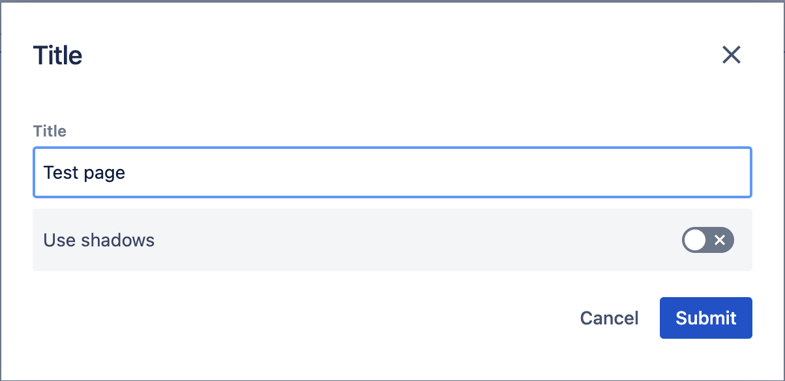
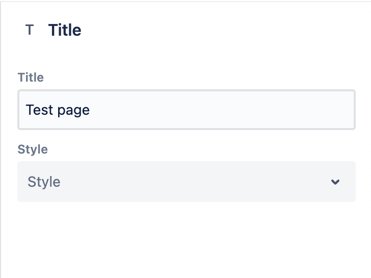
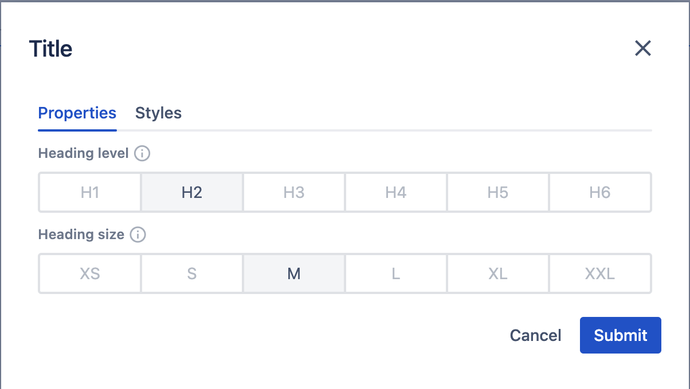
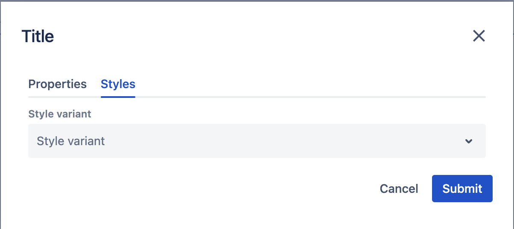

# Side Panel

## Overview

The _Side Panel_ is a part of the _Page editor_ and allows editing the properties of the selected component.
It is displayed on the right side of the _Page editor_. Its purpose is slightly different from the full-blown modal.
The _Side Panel_ is more suitable for quick edits to be previewed right away on the page content, such as changing
a font size, button variant, or card style, unlike the _modal_ where the focus is on editing the complete configuration
of the component at once.

## Configuration

By default, the component's dialog configuration will be used for both the side panel and the dialog.
It means that all components support the side panel right away. Since their purposes are different,
it is possible to differentiate between the fields & layout for the regular modal and the side panel.
The configuration allows developers to decide field-by-field if it should appear in both
or only in one of the two contexts.

The mechanism used to achieve that is the `ws:disallowedContext` parameter (see more details about the mechanism [here](../../../development/dialogs/#context)).
The two contexts that can be disabled are `edit:dialog` and `edit:panel`.

### Example 1
In this example, we're showcasing how to hide a field on dialog and another one on the side panel.

```json
{
  "sling:resourceType": "wcm/dialogs/dialog",
  "title": {
    "sling:resourceType": "wcm/dialogs/components/textfield",
    "name": "title",
    "label": "Title"
  },
  "shadows": {
    "sling:resourceType": "wcm/dialogs/components/toggle",
    "name": "shadows",
    "label": "Use shadows",
    "ws:disallowedContext": ["edit:panel"]
  },
  "style": {
    "sling:resourceType": "wcm/dialogs/components/select",
    "label": "Style",
    "name": "style",
    "ws:disallowedContext": ["edit:dialog"],
    "primary": {
      "sling:resourceType": "wcm/dialogs/components/select/selectitem",
      "label": "Primary",
      "value": "primary"
    },
    "secondary": {
      "sling:resourceType": "wcm/dialogs/components/select/selectitem",
      "label": "Secondary",
      "selected": true,
      "value": "secondary"
    }
  }
}
```

#### Result



### Example 2
In this example, we're defining a completely separate layout and order for the two ways of editing to achieve an even better authoring experience.

```json
{
  "sling:resourceType": "wcm/dialogs/dialog",
  "tabs": {
    "sling:resourceType": "wcm/dialogs/components/tabs",
    "properties": {
      "sling:resourceType": "wcm/dialogs/components/tab",
      "label": "Properties",
      "ws:disallowedContext": ["edit:panel"],
      "headingLevel": {
        "sling:resourceType": "wcm/dialogs/components/include",
        "path": "/libs/howlite/components/common/headinglevel"
      },
      "headingSize": {
        "sling:resourceType": "wcm/dialogs/components/include",
        "path": "/libs/howlite/components/common/headingsize"
      }
    },
    "styles": {
      "sling:resourceType": "wcm/dialogs/components/tab",
      "label": "Styles",
      "ws:disallowedContext": ["edit:panel"],
      "styleVariant": {
        "sling:resourceType": "wcm/dialogs/components/include",
        "path": "/libs/howlite/components/common/stylevariant"
      }
    },
    "sidepanel": {
      "sling:resourceType": "wcm/dialogs/components/tab",
      "label": "Properties",
      "ws:disallowedContext": ["edit:dialog"],
      "headingLevel": {
        "sling:resourceType": "wcm/dialogs/components/include",
        "path": "/libs/howlite/components/common/headinglevel"
      },
      "headingSize": {
        "sling:resourceType": "wcm/dialogs/components/include",
        "path": "/libs/howlite/components/common/headingsize"
      },
      "styleVariant": {
        "sling:resourceType": "wcm/dialogs/components/include",
        "path": "/libs/howlite/components/common/stylevariant"
      }
    }
  }
}
```

In the example above, we create a configuration of three tabs. The first two will only appear on the modal,
while the third will only appear on the side panel. The third tab includes all three fields that are available
on the other two tabs. It allows the author to edit all the properties in the side panel in one tab
but defines separation for the fields on the modal.

#### Result




## Saving and error handling

The saving of the fields works automatically, without pressing a submit button.
Field types that can be edited with a mouse click are saved right away after the change,
so the updated page content can be checked almost instantly.
Other field types where the value is changed via typing are saved in a debounced manner.
It means that the value is saved at the moment when the author stops for a bit during typing.
This reduces the number of content updates that would cause noticeable jumps on the page during editing.

No matter if errors happen during the regular editing experience (e.g. validations) or are caused by technical problems,
they need to be handled. In case of any errors during saving, the side panel resets the modified field to the
latest stable state (either the initial one or the last successfully saved one). This is to ensure that
the author always sees valid and up-to-date information on the side panel.

## Validations

Since the purpose of the side panel is to provide a lightweight solution for simple editing, it has some limitations compared to the regular modal.
Fields that are validated are not recommended to be displayed and edited on the side panel.
Editing such fields with a value that breaks a validation rule will result in an error message and the field will be reset (as described above).
