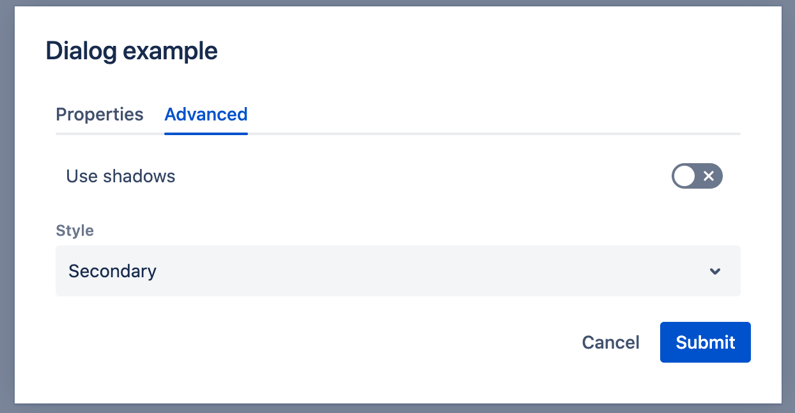

# Dialogs

Dialogs framework which is part of WebSight CMS allows to define dialog fields components used to build the dialog used to submit data saved in content resources.

WebSight CMS delivers set of ready to use components, see subsections of this documentation for details.

Example dialog structure definition can look like this:
```json
{
  "sling:resourceType": "wcm/dialogs/dialog",
  "tabs": {
    "sling:resourceType": "wcm/dialogs/components/tabs",
    "properties": {
      "sling:resourceType": "wcm/dialogs/components/tab",
      "label": "Properties",
      "title": {
        "sling:resourceType": "wcm/dialogs/components/textfield",
        "label": "Title",
        "name": "title"
      },
      "description": {
        "sling:resourceType": "wcm/dialogs/components/richtext",
        "label": "Description",
        "name": "description"
      }
    },
    "advanced": {
      "sling:resourceType": "wcm/dialogs/components/tab",
      "label": "Advanced",
      "shadows": {
        "sling:resourceType": "wcm/dialogs/components/toggle",
        "name": "shadows",
        "label": "Use shadows"
      },
      "style": {
        "sling:resourceType": "wcm/dialogs/components/select",
        "label": "Style",
        "name": "style",
        "primary": {
          "sling:resourceType": "wcm/dialogs/components/select/selectitem",
          "label": "Primary",
          "value": "primary"
        },
        "secondary": {
          "sling:resourceType": "wcm/dialogs/components/select/selectitem",
          "label": "Secondary",
          "selected": true,
          "value": "secondary"
        },
        "link": {
          "sling:resourceType": "wcm/dialogs/components/select/selectitem",
          "label": "Link",
          "value": "link"
        }
      }
    }
  }
}
```

It will result with following in UI dialog: 



Component renderer script in WebSight Resource Browser.

Explore available fields and options.