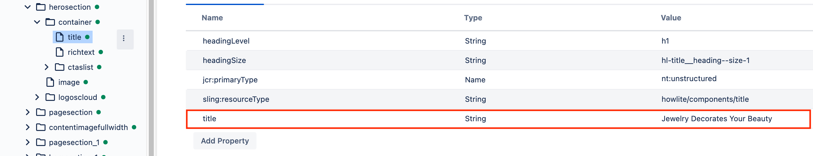
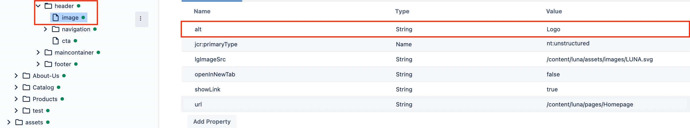
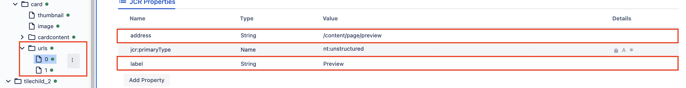
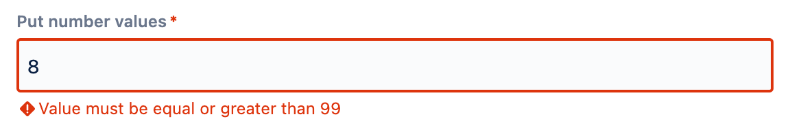
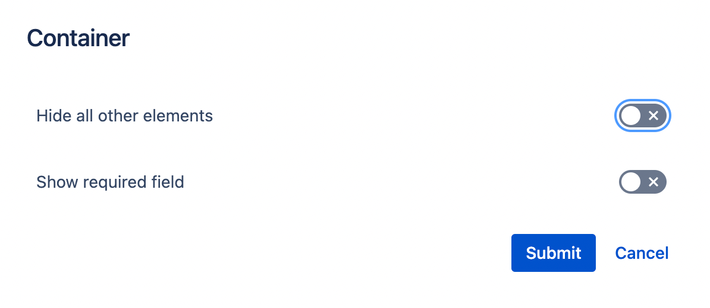
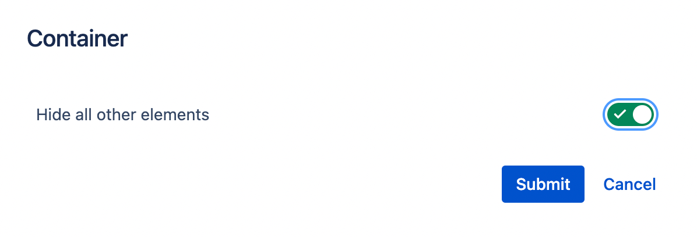
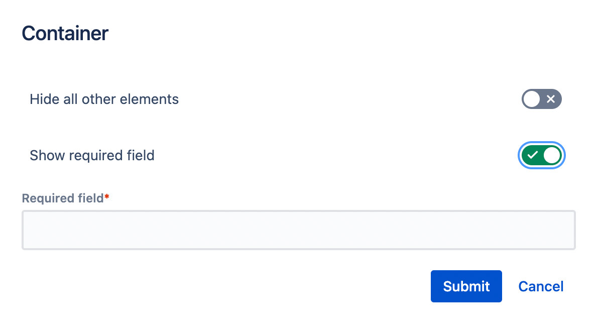

# Dialogs

The Dialogs framework in WebSight CMS allows users to define dialog field components. They can use these components to build dialogs for submitting the data that is saved in content resources.

WebSight CMS delivers a set of ready-to-use components. These are detailed in the subsections of this documentation page.

## Dialog structure
Each dialog can be build out of two element types:

- containers - used to achieve proper structure of fields in dialog, examples: container, tab, tabs
- fields - used to input values via dialog, examples: textfield, numberfield, pathPicker

An example dialog structure definition:
```json
{
  "sling:resourceType": "wcm/dialogs/dialog",
  "tabs": {
    "sling:resourceType": "wcm/dialogs/components/tabs",
    "properties": {
      "sling:resourceType": "wcm/dialogs/components/tab",
      "label": "Properties",
      "title": {
        "sling:resourceType": "wcm/dialogs/components/textfield",
        "label": "Title",
        "name": "title"
      },
      "description": {
        "sling:resourceType": "wcm/dialogs/components/richtext",
        "label": "Description",
        "name": "description"
      }
    },
    "advanced": {
      "sling:resourceType": "wcm/dialogs/components/tab",
      "label": "Advanced",
      "shadows": {
        "sling:resourceType": "wcm/dialogs/components/toggle",
        "name": "shadows",
        "label": "Use shadows"
      },
      "style": {
        "sling:resourceType": "wcm/dialogs/components/select",
        "label": "Style",
        "name": "style",
        "primary": {
          "sling:resourceType": "wcm/dialogs/components/select/selectitem",
          "label": "Primary",
          "value": "primary"
        },
        "secondary": {
          "sling:resourceType": "wcm/dialogs/components/select/selectitem",
          "label": "Secondary",
          "selected": true,
          "value": "secondary"
        },
        "link": {
          "sling:resourceType": "wcm/dialogs/components/select/selectitem",
          "label": "Link",
          "value": "link"
        }
      }
    }
  }
}
```

This will result with following in UI dialog: 


## Data structure
The data structure depends on the `name` property. 

- In the simplest example property value is saved directly as a resource property. 
```json
"title": {
  "sling:resourceType": "wcm/dialogs/components/textfield",
  "label": "Title",
  "name": "title"
}
```
In above example, the `title` is added directly as a resource property.


- There is also a possibility to manipulate data from other resources by using a path in the `name` property:
```json
"alt": {
  "sling:resourceType": "wcm/dialogs/components/textfield",
  "name": "image/alt",
  "label": "Alt text"
}
```
In above example, the `alt` property is saved as an image property from the header context.


- Another example of manipulating data from other resources is using a multifield. This dialog field `name` property defines a node under which are created other resources with properties defined in the multifield.
```json
"urls": {
  "sling:resourceType": "wcm/dialogs/components/multifield",
  "name": "urls",
  "label": "Footer URLs",
  "labelField": {
    "sling:resourceType": "wcm/dialogs/components/textfield",
    "name": "label",
    "label": "Label"
  },
  "addressField": {
    "sling:resourceType": "wcm/dialogs/components/pathpicker",
    "name": "address",
    "label": "URL"
  }
}
```


## Validation
WebSight supports the validation of dialog values on BackEnd side. If the value is incorrect, then it won’t be saved and the dialog can’t be submitted. The author will see a proper error message.


### Custom validator
To prepare a custom validator you have to extend an `pl.ds.websight.dialog.spi.DialogValidator` form `pl.ds.websight:websight-dialogs-service` as an OSGi `@Component(service = DialogValidator.class)`. 
You have to implement the following methods:

- `boolean supports(Resource resource)` - should return whether the dialog resource is supported by this validator - this check will be done for each resource representing dialog fields
- `String validate(Resource resource, Map<String, Object> propertiesToSave)` - should return a validation result. In the case of:
    - `success` - return null
    - `error` - return String with a proper message, which will be displayed in Dialog

## Show/hide dialog fields
By default, all dialog components are visible, but there is a possibility to hide them.

### Context
To show or hide a particular field depending on dialog context you can use a `ws:disallowedContext` parameter.
The default `context` value used for dialogs is `edit`. Depending on dialog usage different contexts might be used. For example during creating a page 'create' context is being used - this way some fields might be disabled during the page creation process.

```json
"ws:disallowedContext": ["create"]
```

To hide an element in dialog, the request from Front-End which fetches it has to contain the additional parameter `context`. If the context value matches one of `ws:dissallowedContext` values, then the field won’t be rendered. To check request details, go to the [Swagger documentation](http://localhost:8080/apps/apidocs#/apps/websight-dialogs-service/docs/api.html).

### Conditions
To show or hide a particular field depends on other fields’ state you can use a `ws:display` node.
This node should contain children defining conditions to show the element. If the component has such a child node it’s hidden by default. It’s required to fulfill at least one condition to show the component.

Each condition should have two properties:

- sourceName - with the name of the component whose value would be checked
- values - with one or more values. At least one of them should match the source field value to fulfill the condition.

Example conditions configurations:

- with single value:
```json
"ws:display": {
  "condition": {
    "sourceName": "fieldName",
    "values": "option1"
  }
}
```
- with multiple values:
```json
"ws:display": {
  "condition": {
    "sourceName": "fieldName",
    "values": ["option1", "option2", "option3"]
  }
}
```

Example dialog definition:

```json
{
  "sling:resourceType": "wcm/dialogs/dialog",
  "hideall": {
    "sling:resourceType": "wcm/dialogs/components/toggle",
    "name": "hideall",
    "label": "Hide all other elements"
  },
  "container": {
    "sling:resourceType": "wcm/dialogs/components/container",
    "showrequiredfield": {
      "sling:resourceType": "wcm/dialogs/components/toggle",
      "name": "showrequiredfield",
      "label": "Show required field"
    },
    "requiredfield": {
      "sling:resourceType": "wcm/dialogs/components/textfield",
      "name": "requiredfield",
      "label": "Required field",
      "required": true,
      "ws:display": {
        "condition": {
          "sourceName": "showrequiredfield",
          "values": "true"
        }
      }
    },
    "ws:display": {
      "condition": {
        "sourceName": "hideall",
        "values": "false"
      }
    }
  }
}
```


- Initial dialog state:



- Checking "Hide all other elements" hides the second field.



- Checking "Show required field" shows another field.


## Default state
Some components allow defining a default state. E.g. checkbox can be checked by default, and select can have the default option. It is significant to keep using those components with the same default state used in backend models.
Example:

- dialog field definition with h2 selected by default:
```json
{
  "sling:resourceType": "wcm/dialogs/components/radio",
  "name": "headingLevel",
  "label": "Heading level",
  "h1": {
    "sling:resourceType": "wcm/dialogs/components/radio/option",
    "label": "H1",
    "value": "h1"
  },
  "h2": {
    "sling:resourceType": "wcm/dialogs/components/radio/option",
    "label": "H2",
    "selected": true,
    "value": "h2"
  },
  "h3": {
    "sling:resourceType": "wcm/dialogs/components/radio/option",
    "label": "H3",
    "value": "h3"
  }
}
```
- model class:
```java 
@Model(adaptables = Resource.class)
public class TitleComponent {

  @Inject
  @Default(values = "h2")
  private String headingLevel;

}
```

You can use [Component template](../components/definition/#template) to achieve a similar effect, but only if you add a new component. There is no easy solution to update all existing resources, so the initial content is useless if you extend the existing component. In that case, you need to use default states.
