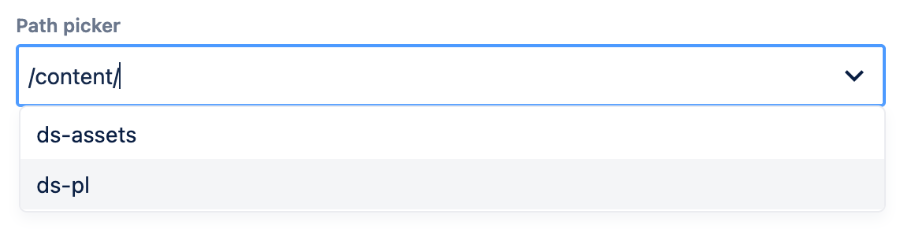

# PathPicker

**wcm/dialogs/components/pathpicker**

## Description

Path picker is an input that allows the user pick path of resource from repository or to introduce external links. If the value starts with `/` the path picker will autosuggest possible values.



## Properties

- **name** -  `string` (required)  
    Form field name

- **label** - `string`  
    Display label value

- **required** - `string`  
    Indicates if field value is mandatory

- **rootPath** - `string`  
    Root path of pathpicker

- **forceRootPath** - `string` (if not defined `false`)  
    Indicates whether the input value should start with the value defined in `rootPath` property

- **removeIfEmpty** - `string` (if not defined `false`)  
    Indicates if property in JCR will be removed, if contains empty String, or will be kept with that value

- **description** - `string`  
    Display description value as a tooltip

## Example

```
1<pathPicker 
2 jcr:primaryType="nt:unstructured" 
3 sling:resourceType="wcm/dialogs/components/pathPicker" 
4 name="pathToSomething" 
5 label="Path Picker" 
6 rootPath="/content" 
7 forceRootPath="true" 
8 required="true"/>
```
