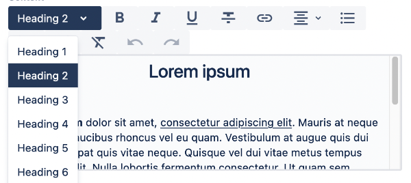
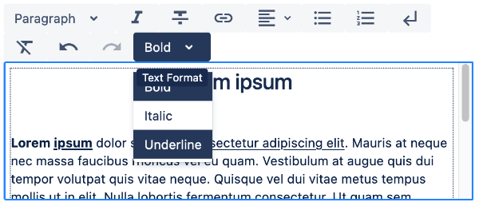

# Dropdown

**wcm/dialogs/components/richtext/ui/dropdown**





## Description

Component allows to add actions group to menu bar. Each action should be defined as a DropdownItem child.

### Configuration

- **title** -  `string` (required)  
    Group title. It’s displayed as a tooltip.

### Children

- DropdownItem - Nodes defining available actions.

# DropdownItem

**wcm/dialogs/components/richtext/ui/dropdown/dropdownitem**

## Description

Component allows to add action to dropdown.

### Configuration

- **title** -  `string` (required)  
    Action title. It’s displayed in a dropdown.

### State

- **isActive** - `boolean`  
    Defines if item should be checked as active.

### Children

- plugin - node defines edit action caused by an item.

## Example

```json
"textstyle": {
  "sling:resourceType": "wcm/dialogs/components/richtext/ui/dropdown",
  "title": "Text Style",
  "h1": {
    "sling:resourceType": "wcm/dialogs/components/richtext/ui/dropdown/dropdownitem",
    "title": "Heading 1",
    "plugin": {
      "sling:resourceType": "wcm/dialogs/components/richtext/plugin/heading",
      "level": 1
    }
  },
  "h2": {
    "sling:resourceType": "wcm/dialogs/components/richtext/ui/dropdown/dropdownitem",
    "title": "Heading 2",
    "plugin": {
      "sling:resourceType": "wcm/dialogs/components/richtext/plugin/heading",
      "level": 2
    }
  },
  "h3": {
    "sling:resourceType": "wcm/dialogs/components/richtext/ui/dropdown/dropdownitem",
    "title": "Heading 3",
    "plugin": {
      "sling:resourceType": "wcm/dialogs/components/richtext/plugin/heading",
      "level": 3
    }
  },
  "h4": {
    "sling:resourceType": "wcm/dialogs/components/richtext/ui/dropdown/dropdownitem",
    "title": "Heading 4",
    "plugin": {
      "sling:resourceType": "wcm/dialogs/components/richtext/plugin/heading",
      "level": 4
    }
  },
  "h5": {
    "sling:resourceType": "wcm/dialogs/components/richtext/ui/dropdown/dropdownitem",
    "title": "Heading 5",
    "plugin": {
      "sling:resourceType": "wcm/dialogs/components/richtext/plugin/heading",
      "level": 5
    }
  },
  "h6": {
    "sling:resourceType": "wcm/dialogs/components/richtext/ui/dropdown/dropdownitem",
    "title": "Heading 6",
    "plugin": {
      "sling:resourceType": "wcm/dialogs/components/richtext/plugin/heading",
      "level": 6
    }
  },
  "paragraph": {
    "sling:resourceType": "wcm/dialogs/components/richtext/ui/dropdown/dropdownitem",
    "title": "Paragraph",
    "plugin": {
      "sling:resourceType": "wcm/dialogs/components/richtext/plugin/paragraph"
    }
  }
}
```
