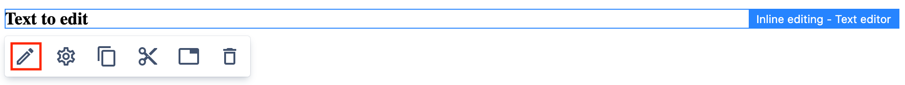
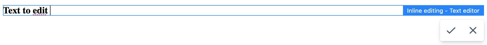

# Inline editing

## Overview

Inline editing allows updating components directly in page content while using [Page Editor](../page-editor).

Currently, inline editing supports editing of single component properties. When inline editing is enabled 
for the component then action triggering the editing is available.





## Enabling inline editing for component

Inline editing can be enabled for a component by the update of the [Edit configuration](../components/#edit-configuration).

To enable the inline editing add `inlineEditing` and `config` nodes to the component edit config.
`config` node contains configuration related to editing of single component property.

```json title="Example component edit config enabling inline editing"
{
  "inlineEditing": {
    "config": {
      "property": "title",
      "domSelectors": ["h1", "h2", "h3", "h4"],
      "editor": "text"
    }
  }
}
```

### Property

`property` contains the relative path of the component property where the edited value will be saved in the content.
The values can be just a property name which will be saved on the component content nod, for example `"property": "title"` or
may contain sub-nodes on the component node, for example `"property": "node1/node2/title"`.

The value of property must correspond to a field defined in the component dialog - if the field is
not needed in the dialog it can be disabled using dialogs _context_, see [component dialog documentation](/docs/developers/components/#dialog).

It is recommended to avoid inline editing of fields using [validation](/docs/developers/dialogs/#validation) for better content 
authoring experience - the validation error will be reported as notification and value will not be updated.

### DOM selectors

The `domSelectors` are used to find DOM element the inline editing should be done on.
Selectors will be evaluated in order on all Component DOM nodes till finding the first result.
If not provided or empty, then the first Component DOM node is used.

### Inline editor

The `editor` property contains the ID of the inline editor implementation which will be used for editing.
See the provided editors below.

Depending on the editor implementation additional `editorConfiguration` object can be provided.

```json title="Example component edit config using inline editor configuration"
{
  "inlineEditing": {
    "config": {
      "property": "text",
      "editor": "some-editor-id",
      "editorConfiguration": {
        "someEditorRelatedProperty": "value"
      }
    }
  }
}
```

## Provided inline editors

WebSight CMS provides inline editors available to use only by updating component edit configuration as described.

### Text editor

The WebSight text editor allows single line, plain text editing. The ID of the editor is `text`.

```json title="Example component edit config enabling text inline editing"
{
  "inlineEditing": {
    "config": {
      "property": "title",
      "editor": "text"
    }
  }
}
```


### Rich text editor

The WebSight rich text editor allows rich text editing in the same way as the [dialogs rich text](/docs/developers/dialogs/richtext-editor).
The ID of the editor is `rich-text`.

```json title="Example component edit config enabling rich text inline editing"
{
  "inlineEditing": {
    "config": {
      "property": "text",
      "editor": "rich-text"
    }
  }
}
```


To specify the [rich text configuration](/docs/developers/dialogs/richtext-editor/configuration) add
`editorConfiguration` with the `rteConfiguration` property of containing path to the configuration.

```json title="Example component edit config enabling rich text inline editing and specified configuration"
{
  "inlineEditing": {
    "config": {
      "property": "text",
      "editor": "rich-text",
      "editorConfiguration": {
        "rteConfiguration": "/libs/wcm/dialogs/components/richtext/configurations/compact"
      }
    }
  }
}
```


