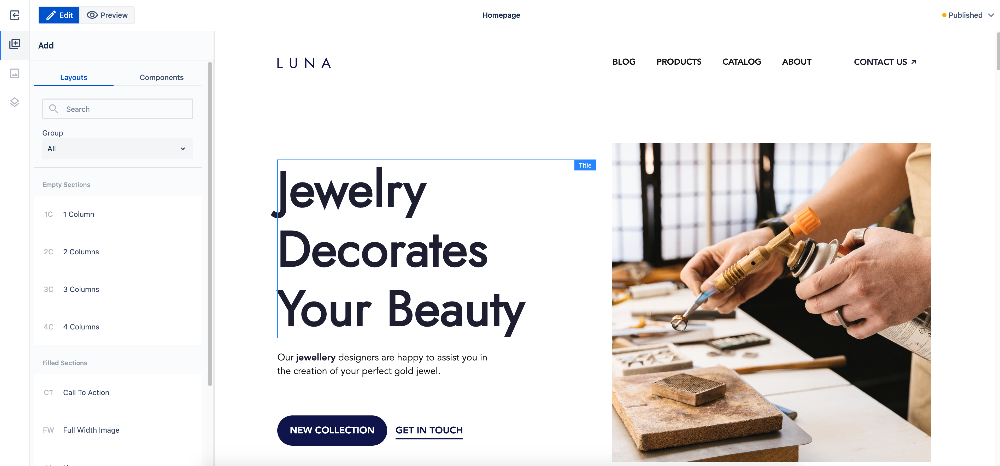

# Page Editor

## Overview

_Page Editor_ is a core part of WebSight CMS and an essential tool for content authors.
It allows the content authors to build pages using [_components_](../components) in a WYSIWYG way.
They can work with _components_ on a page using intuitive drag-and-drop functionality and provide
content and configuration to the _components_.

## Component actions

When a component is selected the list of available actions is presented in the toolbar.
Available actions list:

<table>
     <tr>
        <th>Title</th>
        <th>Name - technical id</th>
        <th>Description</th>
    </tr>
    <tr>
        <td>Properties</td>
        <td>edit-component-properties</td>
        <td>Opens dialog to edit properties</td>
    </tr>
    <tr>
        <td>Copy</td>
        <td>copy</td>
        <td>Copy component</td>
    </tr>
    <tr>
        <td>Cut</td>
        <td>cut</td>
        <td>Cut component</td>
    </tr>
    <tr>
        <td>Paste</td>
        <td>paste</td>
        <td>Paste component after copy or cut</td>
    </tr>
    <tr>
        <td>Select parent</td>
        <td>select-parent</td>
        <td>Change active component to parent component</td>
    </tr>
    <tr>
        <td>Delete</td>
        <td>delete</td>
        <td>Removes the component</td>
   </tr>
</table>

## Technical details

### Edit Mode

_Edit mode_ is used for editing page content.

#### Workspace content presentation

_Edit mode_ displays the edited page inside an iframe stretched to match the content height. The iframe is stretched vertically to match the content height to provide a canvas-like experience to content authors. It is accomplished by reacting to content height changes and fixing issues that result from displaying an iframe in this way (like using `vh` unit).
It means the edited page itself is not scrollable, so the content author will not see any changes to the edited page that happen on scroll (e.g. sticky positioning will not work).

#### Workspace Overlays

The edited page is (mostly) not altered, all UI is displayed in _edit mode_ directly. All the UI elements of the mode are displayed outside the iframe to increase the separation of the two. We wanted to achieve the highest possible level of sandboxing the edited page.

The especially important and technically complex parts of _edit mode_ UI are _overlays_, like:

- Component selectors - "borders" marking the content of a given component instance,
- Selected component toolbar - toolbar with actions allowed for a selected component,
- Placeholders - placeholders generated for components without content.

All those items are displayed on top of the iframe containing the edited page. The content author interacts with _overlays_, not the elements of the edited page.

The iframe with _overlays_ on top of it is called _workspace_.

#### Areas

_Overlays_ locations are based on _areas_, the representation of size and position of the [_components_](../components) in the edited page. The _areas_ are calculated based on the edited page elements. Each _component_ has a corresponding _area_, covering all its DOM elements.

To display _overlays_ that are up to date with what is happening on the edited page, it is not enough to calculate _areas_ once, on the iframe load, nor it is enough to recalculate them on _actions_ (like adding, deleting and editing _component_). We are observing all DOM elements inside the iframe to react to size and position changes of _components_ and recalculating the _areas_ every time. It causes the _overlays_ to display correctly in cases like:

- asynchronous loading of resources (like images and videos),
- dynamic changes using JavaScript scripts,
- dynamic changes using CSS animations.

### Preview mode

_Preview mode_ displays the edited page inside an iframe as well, but this time the iframe’s height adjusts to available space in the _page editor_. This way the iframe is displayed in a more "natural" way, similar to how the published page is displayed in browser window. The iframe is scrollable, meaning it will react to scroll events (e.g. support sticky elements). It is also handling vh unit properly.
