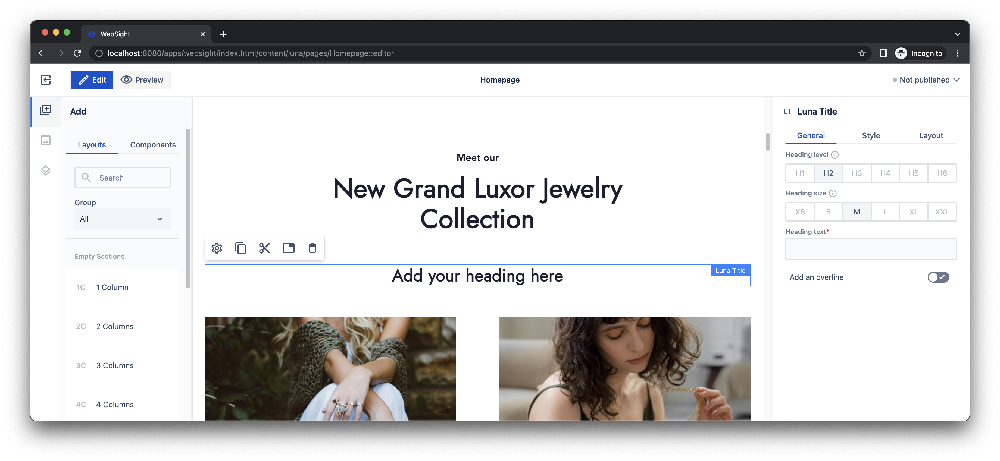
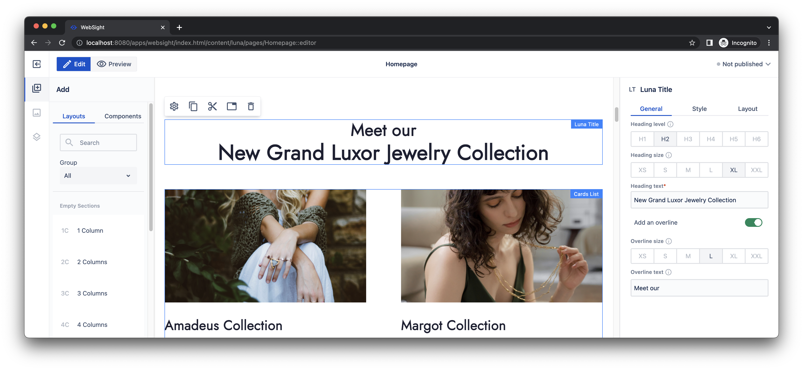

# Developers Quick Start Guide

## Introduction

Use this guide to learn how to update a simple Howlite component. We recommend completing the general [quick start guide](/docs/quick-start/) first to get familiar with basic concepts.

The scenario utilizes a sample component library [Howlite](https://github.com/websight-io/howlite) and a demo site project _Luna_. For simplicity, we overrode the _Title_ component included in the [Howlite](https://github.com/websight-io/howlite) collection in advance and prepared the _Luna Title_ component inside the demo project. 

Your task is to update the _Luna Title_ component and extend existing functionality and tests. See more details in the sections below.

!!! info "Important notice"

    All scripts presented below are designed for Linux-based platforms. If you are a Windows user, please install and configure [Windows Subsystem for Linux](https://learn.microsoft.com/en-us/windows/wsl/install) (WSL).

## Part A: Prerequisites

1. Install [AdoptOpenJDK 17](https://adoptium.net/) with 'x64/aarch64' architecture (on mac use `brew install openjdk@17`):
1. Install Node.js and NPM
1. Install [Docker Desktop](https://www.docker.com/products/docker-desktop/).
1. Install [Git]

## Part B: Setup local environment

Clone _Luna_ repository and build it.

```shell
git clone https://github.com/websight-io/starter.git
cd starter
./mvnw clean install -P e2e
```

Run docker environment.
```shell
docker compose -f environment/local/docker-compose.yml up -d
```

Congratulations! Your local environment is ready. Open [http://localhost:8080/](http://localhost:8080/) and log in using `wsadmin`/`wsadmin` credentials.

## Part C: Changing component

!!! info "Hint"
    If you need help to navigate inside WebSight, see the general [getting started](/docs/quick-start/) for details.

### Business requirement

Let's imagine the following scenario. Page owner wants to update the title of the new Grand Luxor Jewelry Collection.


The ask is to keep the collection name in one line and decrease the font size for the text `Meet our`. The expected result is presented below.


### Technical scope

You need to extend the _Title_ component included in the [Howlite](https://github.com/websight-io/howlite) to implement the above requirement. However, let's check the orginal component first to identify the scope of changes. 

Run WebSight, open _Luna_ space and edit home page. Find the _Title_ having text `Meet our New Grand Luxor Jewelry Collection` and edit its properties. 


Enable `Overline text` option, move `Meet our` from `Heading text` to `Overline text` and submit changes.


The result is close to the expectation, but the font size of the overline text is too small. You could prepare a new version of the _Title_ component having a different font size for the overline text. However, this is not a flexible solution. An additional input field to define the font size for the overline text is a better option. 


!!! info
    For simplicity, we overrode the original component in advance and prepared the _Luna Title_. It is a part of the demo site project, but it is just a placeholder. It works exactly as the _Title_. The following sections guide you on how to implement the change.

### Component update

Your task is to enable the setting of the overline font size. 

Firstly, you need to add a new field `overlineSize` in the model class `LunaTitleComponent.java`. Let's define a default size `hl-title__heading--size-5` according to the received design too.

```java title="application/backend/src/main/java/pl/ds/luna/compoennts/models/LunaTitleComponent.java"
package pl.ds.luna.components.models;

import javax.inject.Inject;
import org.apache.sling.api.resource.Resource;
import org.apache.sling.models.annotations.Default;
import org.apache.sling.models.annotations.Model;
import pl.ds.howlite.components.models.TitleComponent;

@Model(adaptables = Resource.class)
public class LunaTitleComponent extends TitleComponent {
  
  @Inject
  @Default(values = {"hl-title__heading--size-5"})
  private String overlineSize;
  
  public String getOverlineSize(){
    return overlineSize;
  }

}
```


Next, you need to update the component HTML template. The original one defines the CSS class determining the font size as `hl-title__heading--size-6`.

```html
<h6 class="hl-title__heading hl-title__heading--size-6" 
    data-testid="overline">${model.subtitle}</h6>
```
As you updated the model class, you can use its property now.

```html title="application/backend/src/main/resources/apps/luna/components/lunatitle/lunatitle.html"
<h6 class="hl-title__heading ${model.overlineSize}" 
    data-testid="overline">${model.subtitle}</h6>
```

The last step is to add the field to the dialog used by authors. They need it to define component properties in the page editor. You have to override the dialog definition from Howlite. Create a new `dialog` directory and put `.content.json` file inside.

```json title="application/backend/src/main/resources/apps/luna/components/lunatitle/dialog/.content.json"
{
  "tabs": {
    "generalTab": {
      "container": {
        "overlineSize": {
          "sling:resourceType": "wcm/dialogs/components/include",
          "sling:orderBefore": "overline",
          "path": "/libs/howlite/components/common/headingsize",
          "include": {
            "sling:resourceSuperType": "/libs/howlite/components/common/headingsize",
            "label": "Overline size",
            "name": "overlineSize",
            "description": "Changes font size",
            "s": {
              "selected": true
            },
            "m": {
              "selected": false
            }
          }
        }
      }
    }
  }
}
```

The above definition specifies the new `overlineSize` field. It is placed before `overline` field and uses heading size definition from Howlite, but with _small_ size selected by default.

### Install changes 
Run the following command to install the changes on your local environment.
```shell
./mvnw -f application/backend/pom.xml clean install -P autoInstallBundle
```

## Part D: Functional tests

### Run functional tests

We enhance WebSight CMS by adding new features, improving UX, and fixing bugs. Thus, we need confidence that implemented changes don't lead to any regression. We use [Cypress](https://www.cypress.io/) for automated testing to ensure it. Moreover, this approach enables us to spend less time on manual testing and regression fixes. We can focus on developing new features and improvements as a result.

We prepared two sample functional tests for the _Luna Title_ component. They are executed during maven build. You can run them using `npm` on your local environment too. However, you have to add a test content before. Use the following script to install it.
```shell
./mvnw -f tests/content/pom.xml clean install -P autoInstallPackage
```

Now, you can run the tests using the following command.
```shell
npm run-script test --prefix tests/end-to-end
```

If you execute them, they detect your changes for the _Luna Title_ and fail. You should get the following results.
```
Running:  lunatitle.cy.ts                                                                 (1 of 1)


Luna Title component
  1) renders correctly in preview mode
  2) renders correctly in edit mode


0 passing (8s)
2 failing

1) Luna Title component
     renders correctly in preview mode:

    AssertionError: expected '<h6.hl-title__heading.hl-title__heading--size-5>' to have CSS property 'font-size' with the value '20px', but the value was '25.008px'
    + expected - actual

    -'25.008px'
    +'20px'
    
    ...

2) Luna Title component
     renders correctly in edit mode:

    Timed out retrying after 4000ms
    + expected - actual

    { 'sling:resourceType': 'luna/components/lunatitle',
       title: 'New heading',
       showSubtitle: 'true',
    -  overlineSize: 'hl-title__heading--size-5',
       subtitle: 'New overline text',
       'jcr:primaryType': 'nt:unstructured',
       headingLevel: 'h1',
       headingSize: 'hl-title__heading--size-2' }
```

When a functional test fails, you should check why. It is expected in this case, as you implemented the new requirements. Firstly, you updated the default font size of the overline (to ensure consistency with the design). Secondly, you added a new property to the dialog for the component. The tests recognized both changes, and you should adjust them as well. The following section presents how to complete it.


!!! info "Hint"
    Even better is to start by changing a test, so it fails and then adjusting the implementation so that the test passes.


### Update functional tests
As functional tests fail due to the changes, you should adjust them. They are placed in file `tests/end-to-end/tests/lunatitle.cy.ts`. 

The first test checks the font size for the overline text. There are two component instances validated. Thus, you need to update assertions for both of them as follows.

```typescript
    cy.getByTestId('component_title1')
      .findByTestId('overline')
      .should('have.css', "font-size", "25.008px")
      .should('have.text', 'Additional overline text filled')
```

```typescript
    cy.getByTestId('component_title2')
      .findByTestId('overline')
      .should('have.css', "font-size", "25.008px")
      .should('have.text', 'Resized to 6 cols on L breakpoint')
```

The second test validates the dialog for the component. Update the test to recognize the new input field.

```typescript
    cy.request(
      '/content/luna-test/pages/LunaTitle/jcr:content/rootcontainer/maincontainer/pagesection/title.json'
    )
      .its('body')
      .should('deep.eq', {
        'sling:resourceType': 'luna/components/lunatitle',
        title: 'New heading',
        showSubtitle: 'true',
        overlineSize: 'hl-title__heading--size-5',
        subtitle: 'New overline text',
        'jcr:primaryType': 'nt:unstructured',
        headingLevel: 'h1',
        headingSize: 'hl-title__heading--size-2'
      });
```

### Run functional tests again

Now, you can execute the functional tests again.

```shell
./mvnw -f tests/content/pom.xml clean install -P autoInstallPackage
npm run-script test --prefix tests/end-to-end
```

Both tests should pass this time. You should get a report like the one below.
```
Running:  lunatitle.cy.ts                                                                 (1 of 1)
 
 
Luna Title component
  ✓ renders correctly in preview mode (1030ms)
  ✓ renders correctly in edit mode (2774ms)


2 passing (4s)

```

Congratulations! You updated the component, and it passed tests.

## Part E: Use the new component

!!! info "Hint"
    If you need help to navigate inside WebSight, see the general [getting started](/docs/quick-start/) for details.

The page owner can use the updated component now. Let's check it too.

Switch to WebSight CMS, open _Luna_ space, and edit the home page. Find the _Title_ with text `Meet our New Grand Luxor Jewelry Collection`. 

Find the _Luna Title_ in the component tree on the left. Drag and drop the component on the page just below the orginal one. 




Edit properties of the _Luna Title_:

1. set _Heading size_ to `XL`
1. set _Heading text_ to `New Grand Luxor Jewelry Collection`
1. enable overline text
1. set _Overline size_ to `L`
1. set _Overline text_ to `Meet our` 


Submit changes. The title should look like expected now. You can delete the original _Title_ component to finalize the change.



## Part F: Clean-up

### Stop the environment

After all, you can stop your environment.

```shell
docker compose -f environment/local/docker-compose.yml down
```

### Delete environment

If you don't need your environment anymore, you can delete it using a script.

```shell
sh environment/local/delete.sh
```

## The next steps

You learned the foundation of components development for WebSight CMS. Now, we encourage you to explore more details on:

- [Project setup](../setup/)
- [Application development](../development/)
- [Components development](../development/components/)
- [Dialogs](../development/dialogs/)
