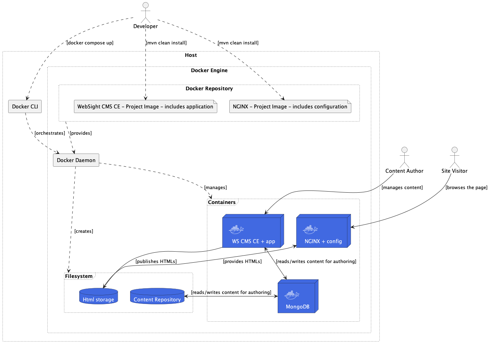
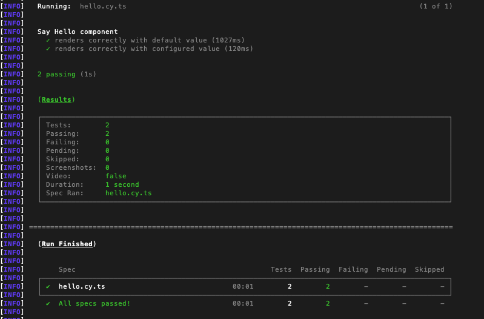
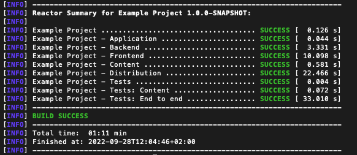
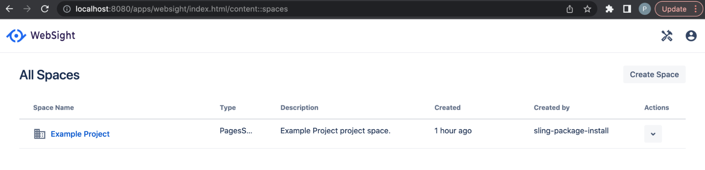
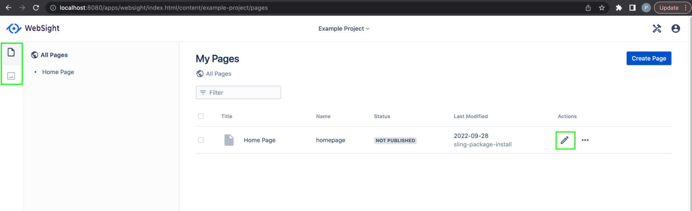

# Project setup

This document describes the WebSight project’s initial setup and instance overview. We will generate a new project from the Maven archetype and check what it contains. The generated structure is an example starting point for projects which is recommended and suitable for a typical web application based on WebSight CMS Community edition.

## Generate project

To initialize the project Maven archetype will be used. To continue you should have Maven installed. Check your Maven version. 

``` script
mvn --version
Apache Maven 3.8.5 (3599d3414f046de2324203b78ddcf9b5e4388aa0)
...
```

System requirements: Java 17, Maven 3.8.5 +

Open the command line at an empty folder and generate a project.

Use _groupId_, _artifactId_, and version params to declare Maven artifacts for your project.
Use _projectName_, _projectId_ and package to define your project name used in UI, id used for technical needs (application resources paths, Docker images names), and root package for Java code.

Use _archetypeVersion_ parameter to set the archetype version you want to use.
You can check the latest version [here](https://search.maven.org/search?q=g:pl.ds.websight%20a:websight-cms-ce-project-archetype).

Use _cmsVersion_ parameter to set WebSight CMS version used by the generated project.
You can check the latest version in the [Release Notes](../../release-notes).

Example command:
``` script
mvn archetype:generate                                     \
  -DarchetypeGroupId=pl.ds.websight                        \
  -DarchetypeArtifactId=websight-cms-ce-project-archetype  \
  -DarchetypeVersion=1.3                                   \
  -DgroupId=my.groupId                                     \
  -DartifactId=my-artifactId                               \
  -Dversion=1.0.0-SNAPSHOT                                 \
  -DprojectName="Example Project"                          \
  -DprojectId=example-project                              \
  -Dpackage=com.example.project                            \
  -DcmsVersion=1.3.0
```

The following structure should be created:
```
.
└── my-artifactId
    ├── README.md
    ├── application
    ├── content
    ├── distribution
    ├── environment
    ├── pom.xml
    └── tests
```

## Project structure
The generated project structure is an example starting point for projects which is recommended and suitable for a typical web application based on WebSight CMS Community edition.

Overview of the modules:

- `application` - components code and scripts delivered as OSGi bundles
    - `backend` - CMS elements (pages, templates, components etc.), Java models and services
    - `frontend` - frontend project bundled by webpack
- `content` - initial content as a JCR vault module (content_package)
- `distribution` - project distribution - Sling feature model and Docker images
- `environment` - scripts and files used to build environments
    - `local` - local environment managed by Docker Compose
- `tests` - tests used to validate the distribution
    - `content` - content for end-to-end tests
    - `end-to-end` - end-to-end tests

### Distribution and environment

The important note is that the project comes with servers definitions and configurations. `distribution` module is responsible for bundling the application with configurations and WebSight CMS modules using `Sling Feature Model`. 
On top of that, it prepares the required Docker images the run the complete stack. Final project build artifacts are immutable Docker images that can be run on local, test, and production environments. 
Environment-specific configurations can be handled by system variables injection.

!!! Info "Note"
     It is possible to deploy application modules to running containers without rebuilding the Docker images, but the changes will be lost after first container restart can be used only for local development.


The `distribution` delivers two Docker images:

- CMS - image with WebSight CMS bundled with your application
- Nginx - HTTP server with the project-related configuration

A third container runs MongoDB as a default data store for Jackrabbit OAK (persistence layer used by WebSight CMS). It's used to store content like pages or assets managed by the CMS.

We use Docker compose to orchestrate containers in the local setup. See environment/local module for details.

This illustration shows the runtime environment and roles:



## Build and Run the instance

To build the project use the Maven command:

``` script
mvn clean install
```

Add e2e profile to execute end-to-end tests:

``` script
mvn clean install -P e2e
``` 

You should see successful end-to-end test execution in the log:


Execution should end with a successful build:


To run the instance Docker is needed. 
Check Docker installation by running in command line

``` script
docker --version
Docker version 20.10.14
```

If you need you can download the Docker Desktop [here](https://www.docker.com/)

See README.md in `environment` and `environment/local` folders for the details about the running environment.

After building the project to start a local instance go to the `environment/local` folder and run:
```docker compose up```

Local WebSight CMS with your application installed is running at [http://localhost:8080/](http://localhost:8080/) (login with wsadmin/wsadmin)
Published content is available locally at [http://localhost/](http://localhost)

!!! info "Building docker image fails with `/var/run/docker.sock` (issue on Mac)"
    The issue leads to the following error message

    ```bash
    [ERROR] Failed to execute goal io.fabric8:docker-maven-plugin:0.40.1:build (build-docker-image) on project ws-linux-box-distribution: Execution build-docker-image of goal io.fabric8:docker-maven-plugin:0.40.1:build failed: No <dockerHost> given, no DOCKER_HOST environment variable, no read/writable '/var/run/docker.sock' or '//./pipe/docker_engine' and no external provider like Docker machine configured -> [Help 1]
    ```

    Follow the Docker Maven Plugin [issue](https://github.com/fabric8io/docker-maven-plugin/issues/1616) to check the current status and available workarounds.

## Instance overview

After login, you will be redirected to the Spaces list. In WebSight CMS content is organized in Spaces. More details are in the next sections.
On the list, you can see the Space created with the use of the generated application and delivered in the ‘content’ module containing initial project content. 

[http://localhost:8080/apps/websight/index.html/content::spaces](http://localhost:8080/apps/websight/index.html/content::spaces )


After clicking on the space name Pages dashboard is open with 1 page delivered in initial content. You can manage your pages here and navigate to the Assets dashboard (to manage assets) or open the Page editor to edit page content.

[http://localhost:8080/apps/websight/index.html/content/example-project/pages](http://localhost:8080/apps/websight/index.html/content/example-project/pages)


In the Right top corner, there is the Admin tools menu with links for administration tools. Administrator dashboard can be accessed using the following link:

[http://localhost:8080/apps/admin](http://localhost:8080/apps/admin)


## The next steps

You learned how to set up a new project for WebSight CMS. Now, we recommend exploring more details:

- [Application development](../development/)
- [Components development](../development/components/)
- [Dialogs](../development/dialogs/)
