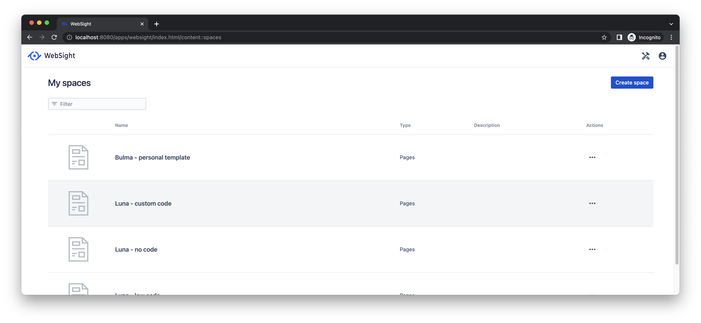
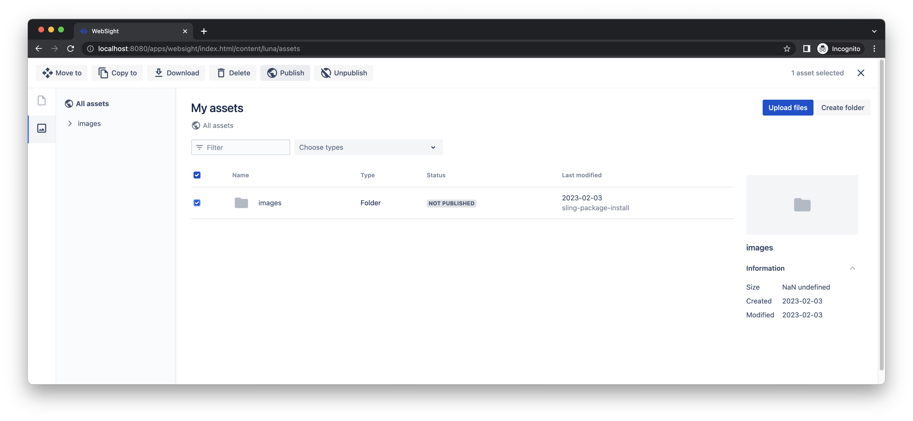

# Quick Start Guide

Follow this guide to run the WebSight CMS local instance using Docker. You can use it to review our demo site _Luna_. You can use [Howlite](../authors/component-libs/howlite/index.md), our example components library, to create or update pages too. 

If you want to develop custom components for WebSight CMS, complete this guide to learn foundations first. Then, read more details in [quick start for developers](../developers/quick-start/index.md).

!!! info "Prerequisites"

    Before going any further, please make sure you have [Docker Desktop](https://www.docker.com/products/docker-desktop/) installed on your machine and running. 

## Part A: Run local instance using Docker

!!! hint "Quick setup with `curl`"
    If you have `curl` installed, you can set up the local environment using the following command. Then, you can go directly to Part B below.

    `curl https://www.websight.io/scripts/get.sh | sh`

### 1. Create Docker Compose manifest

Create `docker-compose.yml` file. Paste the content presented below and save the file on your hard drive.

``` yaml title="docker-compose.yml"

```

!!! hint "Tip"

    Default passwords are stored in secret files. You can find details how to change them [here](https://github.com/websight-io/starter/tree/main/environment#secret-files).

---

### 2. Run the local instance

Open the terminal next to the `docker-compose.yml` file and run the following command:

```
docker compose up
```

The fresh WebSight instance will start in a couple of seconds. Now, you may enter [http://localhost:8080/](http://localhost:8080/) to open the WebSight admin panel.
Log in with `wsadmin` username and `wsadmin` as a password.

!!! hint "Tip"
  
    To stop the environment use `ctrl + c`. You may run it later exactly the same as it was started for the first time.

---

## Part B: Publish demo site

Your local environment is running now. The next step is to publish a demo site included in the distribution. 

### 1. Open the Websight admin panel

The WebSight admin panel runs at [http://localhost:8080/](http://localhost:8080/). Log in with `wsadmin` username and `wsadmin` as a password.

### 2. Select space for the demo site

We use _Spaces_ to organise content. Please open the space for the demo site _Luna_.



### 3. Publish assets and the demo site

Open list of _Assets_ using the left sidebar. Go to folder _images_, select all subfolders and use action _Publish_.



Open list of _Pages_ using the left sidebar. Select all pages and use action _Publish_.


### 4. See the demo site

Congratulations! The demo site is available at [http://luna.127.0.0.1.nip.io/](http://luna.127.0.0.1.nip.io/).


## Part C: Update a page

Now that your local demo site is published, we would like to guide you through basic page amendments. You will update the home page for the demo site delivered together with the WebSight.

### 1. Open the Websight admin panel

The WebSight admin panel runs at [http://localhost:8080/](http://localhost:8080/). Log in with `wsadmin` username and `wsadmin` as a password.

### 2. Select space for the demo site

We use _Spaces_ to organise content. Please open the space for the demo site _Luna_.


### 3. Edit the home page

Use _Pencil_ icon to open _Page editor_ for the home page. 


Scroll down the content to section _Custom Made Engagement Rings_.


Find _Rich text editor_ on tab _Components_ and use drag & drop to place it just below the section title. 


Click on the new component to open available actions. Select _Pencil_ icon to edit properties.


Copy & paste the following text on _General_ tab of the modal.

```
Every couple is unique and we want to deliver an engagement ring that is unique too – taking the tastes of the couple into account. We love having couples visit the store and work with them to create a unique custom engagement ring according to their tastes.
```


### 4. Publish changes

You updated the page. However, unpublished changes are not visible on the site yet. In the top right corner, open the dropdown and select action _Publish_.


### 5. See the updated page

Congratulations! Your changes should be visible now at [http://luna.127.0.0.1.nip.io/](http://luna.127.0.0.1.nip.io/). 


## The next steps

You learned the foundation of page editing with WebSight CMS. Now, we encourage you to explore more details:

- [Howlite](../authors/component-libs/howlite/) library documentation to browse other components available in the distribution;
- [Quick start tutorial for developers](../developers/quick-start/) to check how to implement custom components.
