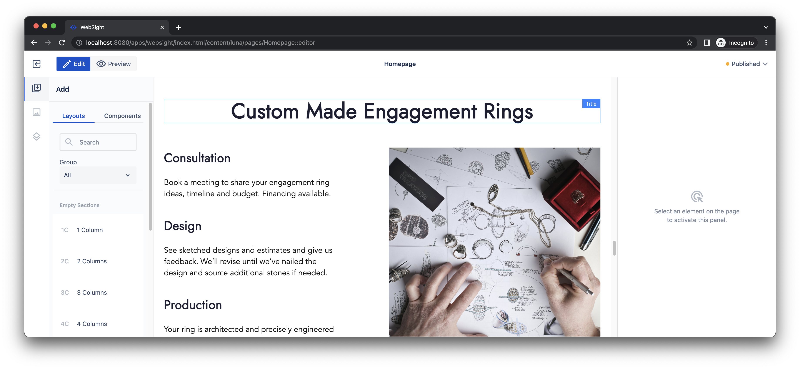
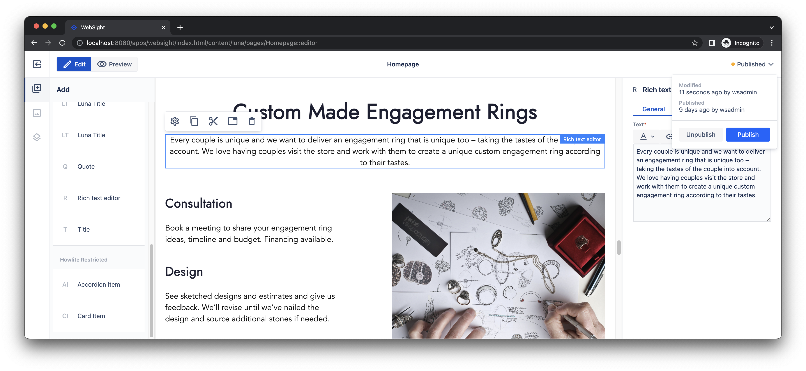
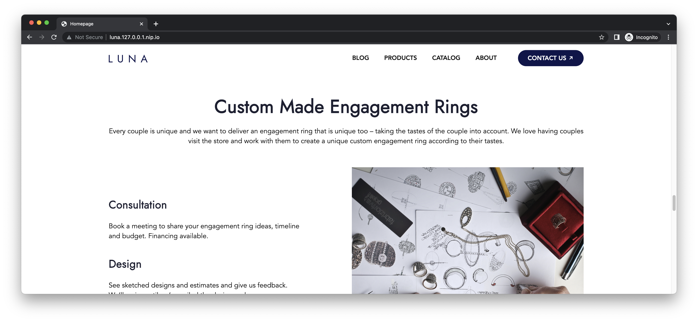

# Quick Start Guide

Follow this guide to run a local instance of WebSight CMS using Docker. The local instance serves as a testing instance where you can check out our demo site _Luna_. You can also use [Howlite](../authors/component-libs/howlite/index.md), our example components library, to create or update pages within the local instance. 

This guide is a starting-point for developing custom components for WebSight CMS. After you've mastered the concepts explained on this page, you can move onto our [quick start for developers](../developers/quick-start/index.md) for a deeper dive into components development for WebSight CMS.

!!! info "Prerequisites"

    Before going any further, please make sure you have [Docker Desktop](https://www.docker.com/products/docker-desktop/) installed on your machine. Docker Desktop supports Windows, macOS and Linux.

## Part A: Run a local instance using Docker

!!! hint "Quick setup with `curl`"
    If you have `curl` installed, you can set up the local environment using the following command. Then, you can go directly to Part B below.

    `curl https://www.websight.io/scripts/get.sh | sh`

If this method doesn't work for you, following steps 1 and 2 below to set up the Docker instance manually.

### 1. Create Docker Compose manifest

Paste the content below into a text editor and save it as a file on your hard drive. Name the file `docker-compose.yml`.

``` yaml title="docker-compose.yml"

```

!!! hint "Tip"

    Default passwords are stored in secret files. You can find details about how to change them [here](https://github.com/websight-io/starter/tree/main/environment#secret-files).

---

### 2. Run the local instance

Open the terminal, navigate to the location where you saved your `docker-compose.yml` file and run the following command:

```
docker compose up
```

A fresh WebSight instance will start within a couple of seconds. After it launches, you can open a Web browser to the URL [http://localhost:8080/](http://localhost:8080/) to view the WebSight admin panel.
Log in with `wsadmin` username and `wsadmin` as the password.

!!! hint "Tip"
  
    To turn off the local environment, use the `ctrl + c` key combination in the terminal that you used to launch your Docker instance. You can restart the instance by repeating the steps you used to launch it initially.

---

## Part B: Publish demo site

At this point, your local environment is running, but you still need to publish the demo site that is included in the distribution. Do this by following the steps below.

### 1. Open the Websight admin panel

In the local instance, the WebSight admin panel is accessible by navigating to [http://localhost:8080/](http://localhost:8080/) in a Web browser. Log in with `wsadmin` username and `wsadmin` as the password.

### 2. Select space for the demo site

We use _Spaces_ to organise content. In the WebSight admin panel, open the space for the demo site _Luna_.


### 3. Publish assets and the demo site

Open the list of _Assets_ using the left sidebar. Go to the folder _images_, select all subfolders and then click _Publish_.


Open the list of _Pages_ using the left sidebar. Select all pages and click _Publish_.


### 4. View the demo site

Congratulations! The demo site is now available by navigating to [http://luna.127.0.0.1.nip.io/](http://luna.127.0.0.1.nip.io/) in a Web browser.


## Part C: Update a page

Now that your local demo site is published, you can experiment with making basic changes to pages. As an example, the following steps show how to update the home page for the demo site that is built into WebSight.

### 1. Open the Websight admin panel

The WebSight admin panel runs at [http://localhost:8080/](http://localhost:8080/). Log in with `wsadmin` username and `wsadmin` as the password.

### 2. Select space for the demo site

We use _Spaces_ to organise content. Please open the space for the demo site _Luna_.


### 3. Edit the home page

Use the _Pencil_ icon to open the _Page editor_ for the home page. 


Scroll down the content to the section _Custom Made Engagement Rings_.



Find the _Rich text editor_ on the tab _Components_ and use the drag-and-drop feature to place it just below the section title. 


Click on the new component to open available actions. Select the _Pencil_ icon to edit properties.


Copy & paste the following text on the _General_ tab.

```
Every couple is unique and we want to deliver an engagement ring that is unique too – taking the tastes of the couple into account. We love having couples visit the store and work with them to create a unique custom engagement ring according to their tastes.
```


### 4. Publish changes

At this point, you've updated the page. However, unpublished changes are not visible on the site yet. To apply them, open the dropdown in the right corner of the admin interface and select action _Publish_.



### 5. View the updated page

Congratulations! Your changes should be visible now at [http://luna.127.0.0.1.nip.io/](http://luna.127.0.0.1.nip.io/). 



## Next steps

This page demonstrated the basics of editing pages with WebSight CMS. As a next step, we encourage you to explore more technical details about WebSight:

- [Howlite](../authors/component-libs/howlite/) library documentation to browse other components available in the distribution;
- [Quick start tutorial for developers](../developers/quick-start/) to check how to implement custom components.
