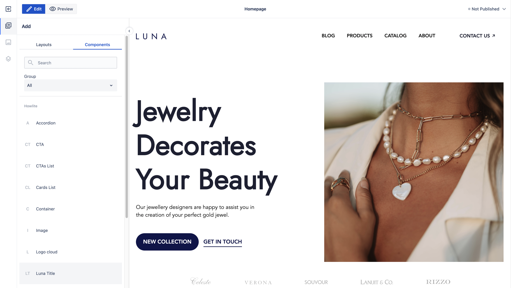
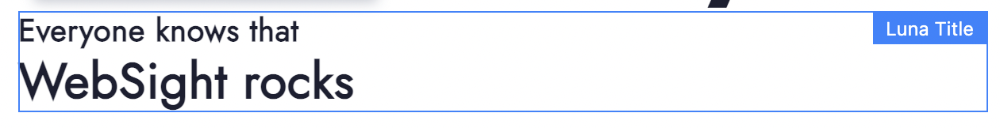
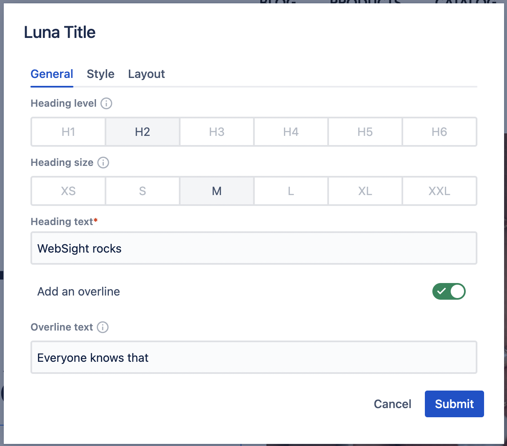
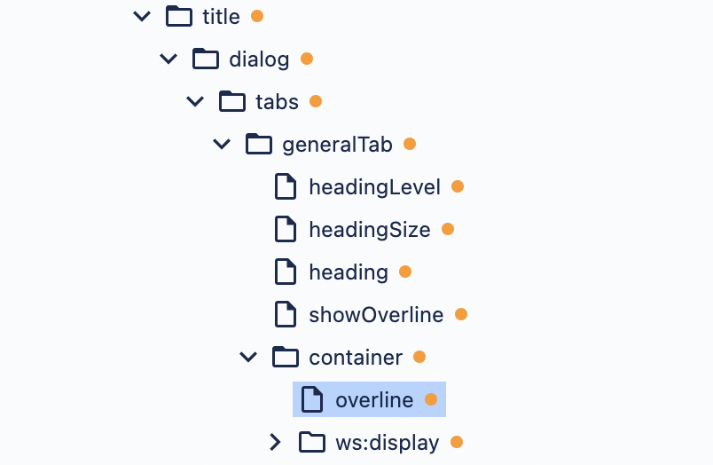
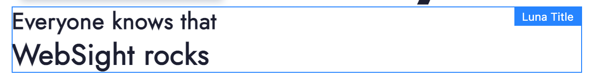
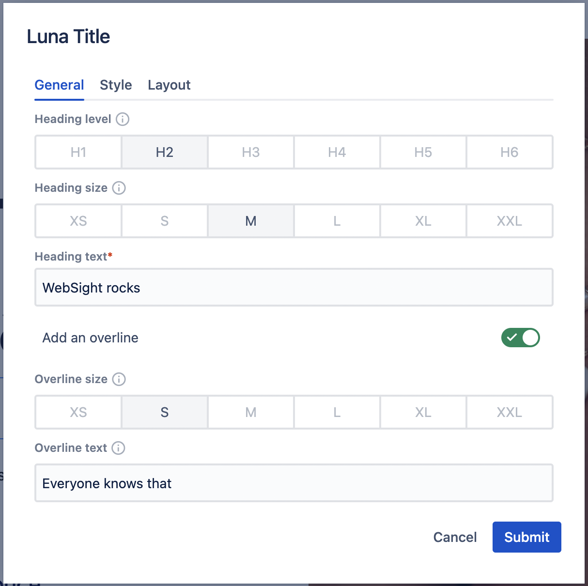

# Developers Quick Start Guide

Follow this guide to get know how to make changes in existing component.

### Pre requirements

> Before going any further, please make sure you have [Docker Desktop](https://www.docker.com/products/docker-desktop/) installed on your machine and running.


```shell
export CODEARTIFACT_AUTH_TOKEN=`aws codeartifact get-authorization-token --domain websight --domain-owner 299371835903 --query authorizationToken --output text`
```

#### Build Howlite

```shell
git clone git@github.com:websight-io/howlite.git
cd howlite
mvn clean install -P e2e
```

## Introduction

We are going to use sample project using [Howlite](https://github.com/websight-io/howlite) components and delivers sample content. This project contains also **Luna Title** component that override **Title** component from **Howlite**. You are going to change this component during this guide.

## Prepare environment

### Clone [repository](https://github.com/websight-io/luna-project)

```shell
git clone git@github.com:websight-io/luna-project.git
cd luna-project
```

### Build project
```shell
mvn clean install -P e2e
```

### Run docker environment
```shell
docker compose -f environment/docker-compose.yml up -d
```

### Take a tour on application with sample content
Open [http://localhost:8080/](http://localhost:8080/) and login using wsadmin/wsadmin credentials.

## Changing component

You should see a **Luna Title** component available on **Components** list in page editor. In this step we want to update this component.


This component allows to set title with optional overline. 


It allows to set level and size for main title.


We want to add a possibility to set also overline size and change its default value to bigger one.

You can find component template definition in file `luna/core/src/main/resources/apps/luna/components/title/template.html`

Our overline text has defined `hl-title__heading--size-6` class determining its size.
```html
<h6 class="hl-title__heading hl-title__heading--size-6" data-testid="overline">${model.subtitle}</h6>
```

Instead of using hardcoded value we can use value from model.

To do so you have to introduce a new field in model class placed in `luna/core/src/main/java/pl/ds/luna/compoennts/models/LunaTitleComponent.java`. The goal was to change the default size, so you can define its default value to `hl-title__heading--size-5`.

```java
package pl.ds.luna.components.models;

import javax.inject.Inject;
import org.apache.sling.api.resource.Resource;
import org.apache.sling.models.annotations.Default;
import org.apache.sling.models.annotations.Model;
import pl.ds.howlite.components.models.TitleComponent;

@Model(adaptables = Resource.class)
public class LunaTitleComponent extends TitleComponent {
  
  @Inject
  @Default(values = {"hl-title__heading--size-5"})
  private String overlineSize;
  
  public String getOverlineSize(){
    return overlineSize;
  }

}
```

Now you can change template definition to use value from model:
```html
<h6 class="hl-title__heading ${model.overlineSize}" data-testid="overline">${model.subtitle}</h6>
```

The last step is to add the field to the dialog. You have to add dialog definition that override dialog definition from Howlite.
You can check title dialog definition using Resource Browser:


Dialog definition should be placed in .content.json file added to dialog directory. 

So you have to add a new file `luna/core/src/main/resources/apps/luna/components/title/dialog/.content.json`:
```json
{
  "sling:resourceType": "wcm/dialogs/dialog",
  "tabs": {
    "sling:resourceType": "wcm/dialogs/components/tabs",
    "generalTab": {
      "sling:resourceType": "wcm/dialogs/components/tab",
      "container": {
        "sling:resourceType": "wcm/dialogs/components/container",
        "overlineSize": {
          "sling:resourceType": "wcm/dialogs/components/include",
          "sling:orderBefore": "overline",
          "path": "/libs/howlite/components/common/headingsize",
          "include": {
            "sling:resourceSuperType": "/libs/howlite/components/common/headingsize",
            "label": "Overline size",
            "name": "overlineSize",
            "description": "Changes font size",
            "s": {
              "selected": true
            },
            "m": {
              "selected": false
            }
          }
        }
      }
    }
  }
}
```

In this definition you are adding new `overlineSize` field. It is placed before `overline` field and uses heading size definition from Howlite, but with **small** size selected by default.

### Install changes 
Run:
```shell
mvn -f luna/core/pom.xml clean install -P autoInstallBundle
```
to install changes on local environment

Now our overline should be bigger then previously


> If there are no visual changes than probably HTL script was cached. You should go to [http://localhost:8080/system/console/scriptcache](http://localhost:8080/system/console/scriptcache) and clear cache

And you can change **Overline size**


## Running functional tests

Our functional tests are running during maven build 
```shell
mvn clean install -P e2e
```

but you cna also run them on your local environment. 
You have to add the test content and run functional tests:
```shell
mvn -f luna/tests/content/pom.xml clean install -P autoInstallPackage
npm run-script test --prefix luna/tests/end-to-end
```

Functional tests detect your changes, so they fail:
```
Running:  title.cy.ts                                                                     (1 of 1)


Title component
  1) renders correctly in preview mode
  2) renders correctly in edit mode


0 passing (8s)
2 failing

1) Title component
     renders correctly in preview mode:

    AssertionError: expected '<h6.hl-title__heading.hl-title__heading--size-5>' to have CSS property 'font-size' with the value '20px', but the value was '25.008px'
    + expected - actual

    -'25.008px'
    +'20px'
    
    ...

2) Title component
     renders correctly in edit mode:

    Timed out retrying after 4000ms
    + expected - actual

    { 'sling:resourceType': 'luna/components/title',
       title: 'New heading',
       showSubtitle: 'true',
    -  overlineSize: 'hl-title__heading--size-5',
       subtitle: 'New overline text',
       'jcr:primaryType': 'nt:unstructured',
       headingLevel: 'h1',
       headingSize: 'hl-title__heading--size-2' }
```

First test detects change in default font size, and the second one detects new property added to component.

### Update functional tests
As functional tests fail due to changes you expected, so you have to update those tests. They are placed in file `luna/tests/end-to-end/tests/title.cy.ts`. 
Let's change:

```typescript
    cy.getByTestId('component_title1')
      .findByTestId('overline')
      .should('have.css', "font-size", "25.008px")
      .should('have.text', 'Additional overline text filled')
```

```typescript
    cy.getByTestId('component_title2')
      .findByTestId('overline')
      .should('have.css', "font-size", "25.008px")
      .should('have.text', 'Resized to 6 cols on L breakpoint')
```

```typescript
    cy.request(
      '/content/luna-test/pages/Title/jcr:content/rootcontainer/maincontainer/pagesection/title.json'
    )
      .its('body')
      .should('deep.eq', {
        'sling:resourceType': 'luna/components/title',
        title: 'New heading',
        showSubtitle: 'true',
        overlineSize: 'hl-title__heading--size-5',
        subtitle: 'New overline text',
        'jcr:primaryType': 'nt:unstructured',
        headingLevel: 'h1',
        headingSize: 'hl-title__heading--size-2'
      });
```

### Running functional tests
You can run functional tests again by running maven build
```shell
mvn clean install -P e2e
```

or on local environment:
```shell
mvn -f luna/tests/content/pom.xml clean install -P autoInstallPackage
npm run-script test --prefix luna/tests/end-to-end
```

This time we expect passing tests:
```
Running:  title.cy.ts                                                                     (1 of 1)
 
 
Title component
  ✓ renders correctly in preview mode (1030ms)
  ✓ renders correctly in edit mode (2774ms)


2 passing (4s)

```

### Stop the environment

After all you can stop your environment by running:

```shell
docker compose -f environment/docker-compose.yml down
```

### Delete environment

If you don't want to work on your environment than you can delete it using script:

```shell
sh environment/delete.sh
```