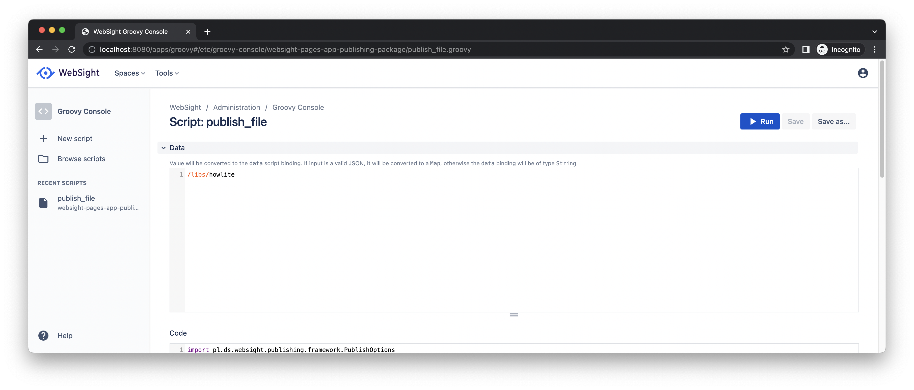
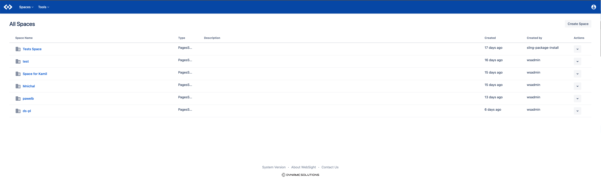
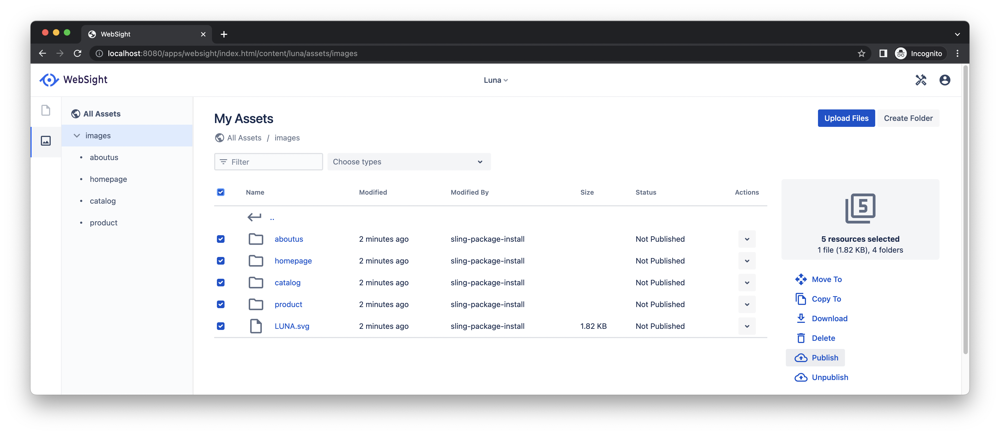
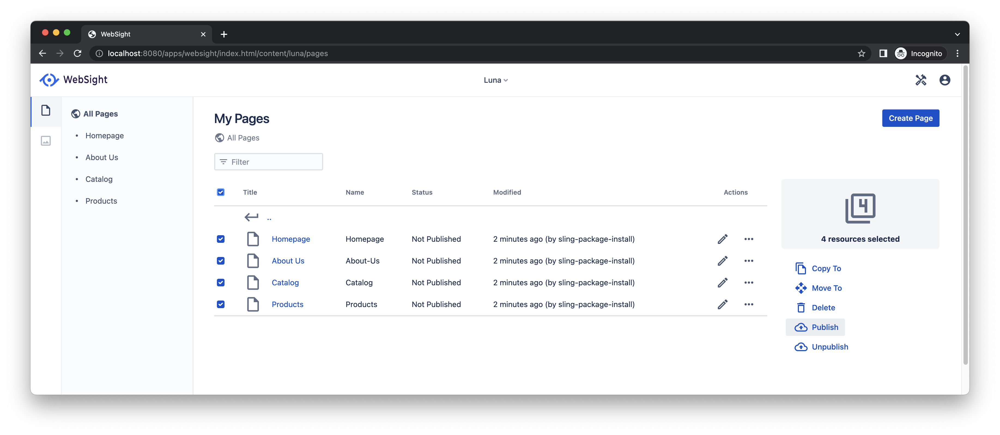
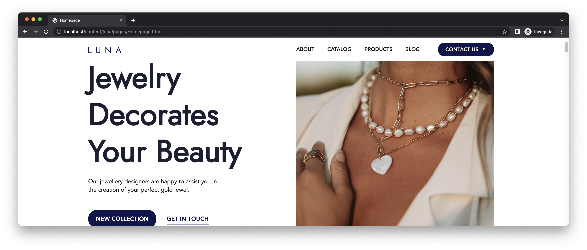
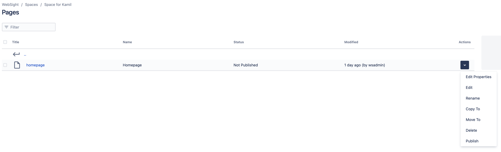
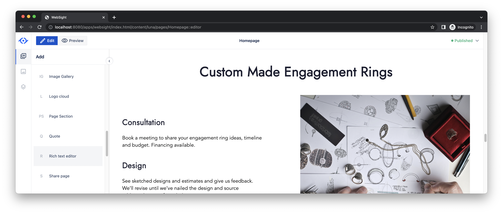
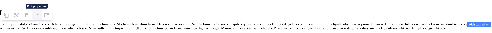
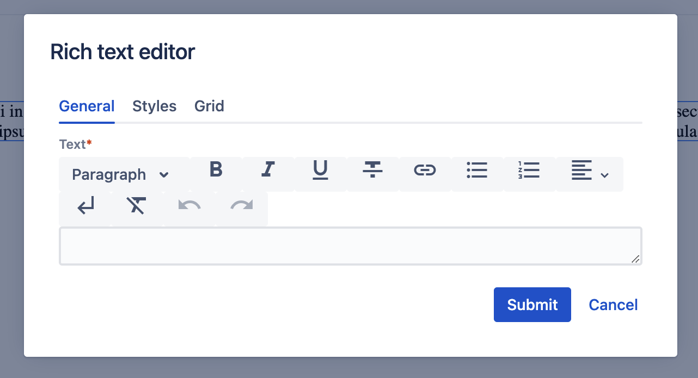
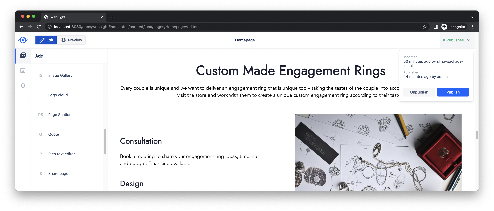

# Quick Start Guide

Follow this guide to quickly run the WebSight local instance using Docker.

## Part A: Run local instance using Docker

!!! info "Prerequisites"

    Before going any further, please make sure you have [Docker Desktop](https://www.docker.com/products/docker-desktop/) installed on your machine and running.

### 1. Join closed WebSight testers group

Currently we are running alpha tests. If you would like to join, please drop us an email. We will contact you and share the WebSight Docker image.

<figure markdown>
  [Ask to join WebSight closed early reviewers group :fontawesome-regular-paper-plane:](#){ .md-button }
</figure>

### 2. Create Docker Compose manifest

Create `docker-compose.yml` file. Paste the content presented below and save the file on your hard drive.

``` yaml title="docker-compose.yml"
version: "3.9"

services:
  ice:
    image: <image-you-will-receive-after-joining-reviewers-group>
    ports:
      - "8080:8080"
    volumes:
      - websight_repository:/websight/repository
      - websight_html:/websight/docroot
  nginx:
    image: nginx
    ports:
      - "80:80"
    volumes:
      - websight_html:/usr/share/nginx/html:ro

volumes:
  websight_repository:
  websight_html:
```

### 3. Run the local instance

Open the terminal next to the `docker-compose.yml` file and run the following command:

```
docker compose up
```

The fresh WebSight instance will start in a couple of seconds. Now, you may enter [http://localhost:8080/](http://localhost:8080/) to open the WebSight admin panel.
Log in with `admin` username and `admin` as a password.

!!! info "Tip"
  
    To stop the environment use `ctrl + c`. You may run it later exactly the same as it was started for the first time.

---

## Part B: Publish demo site

Your local environment is running now. The next step is to publish a demo site included in the distribution. 

### 1. Open the Websight admin panel

The WebSight admin panel runs at [http://localhost:8080/](http://localhost:8080/). Log in with `admin` username and `admin` as a password.

### 2. Run groovy script to publish theming

Open _Groovy Console_ in _Tools_.


Select _publish_file_ available in recent scripts to load it.


Expand _Data_ input field, paste `/libs/howlite` and run the script.



### 3. Select space for the demo site

We use _Spaces_ to organise content. Select _WebSight_ icon to see all of them. Then, open the space for the demo site _Luna_.



### 4. Publish assets and the demo site

Open list of _Assets_ using the left sidebar. Go to folder _images_, select all subfolders and use action _Publish_.



Open list of _Pages_ using the left sidebar. Select all pages and use action _Publish_.



### 6. See the demo site

Congratulations! The demo site is available at [http://localhost/content/luna/pages/Homepage.html](http://localhost/content/luna/pages/Homepage.html).



## Part C: Update a page

Now that your local demo site is published, we would like to guide you through basic page amendments. You will update the home page for the demo site delivered together with the WebSight.

### 1. Open the Websight admin panel

The WebSight admin panel runs at [http://localhost:8080/](http://localhost:8080/). Log in with `admin` username and `admin` as a password.

### 2. Select space for the demo site

We use _Spaces_ to organise content. Please open the space for the demo site _Luna_.


### 3. Edit the home page

Open _Actions_ dropdown for _Homepage_ and select _Edit_. This action runs _Page editor_. 



Scroll down the content to section _Custom Made Engagement Rings_.


Find _Rich text editor_ on tab _Components_ and use drag & drop to place it just below the section title. 



Click on the new component to open available actions. Select pencil icon to edit properties.



Copy & paste the following text on _General_ tab of the modal.

```
Every couple is unique and we want to deliver an engagement ring that is unique too – taking the tastes of the couple into account. We love having couples visit the store and work with them to create a unique custom engagement ring according to their tastes.
```



### 4. Publish changes

You need to publish the changes so they are visible on the site. Open the dropdown in the top right corner and select action _Publish_.



### 5. See the updated page

Congratulations! Your changes should be visible now at [http://localhost/content/luna/pages/Homepage.html](http://localhost/content/luna/pages/Homepage.html). 

