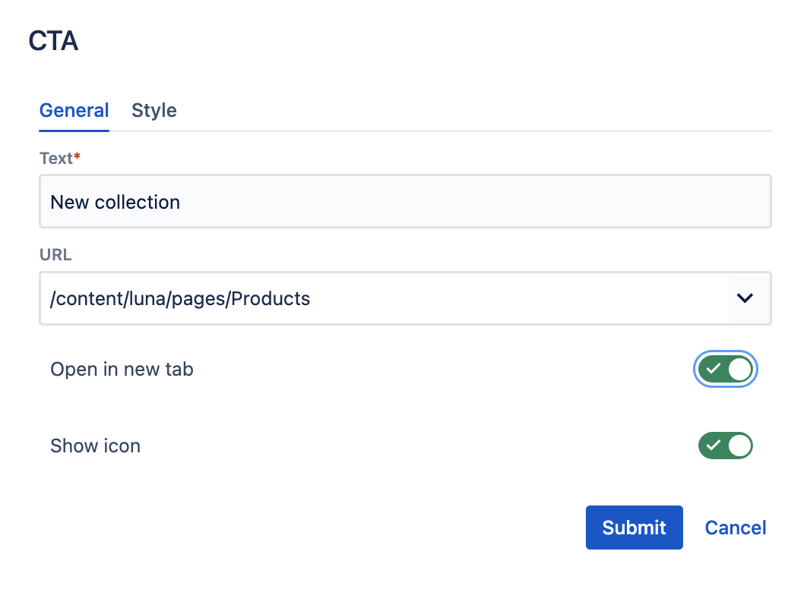
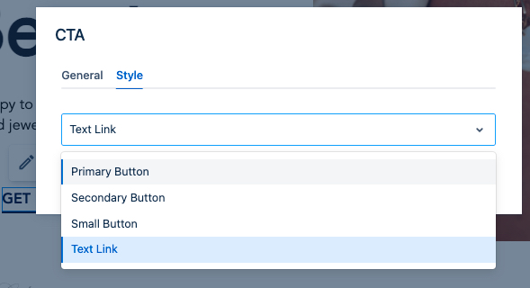

# CTA & CTAs List Components

## Usage
CTA component renders a single link (an anchor html tag) with look & feel of a button or text link (controlled by style variants).
If you need just a single CTA, you can add it directly to a page section or container. To render multiple CTAs in one row, use **CTAs List** component and add buttons there.

## Authorable properties
Click "Edit" icon to see all CTAs component's properties:

- You can provide a **Text** (label) for the CTA
- add an **URL**. It can be either an external link starting with http(s) or an internal link. Type **/** to enable auto suggestions of internal pages.
- optionally, you can select if the link should be **open in a new tab**, and if it should have an additional **Icon**.

    

## Rendered component
You can see an example of 2 CTA components inside a CTA list container below:

    

Please note that the CTA component does not have grid options. The width of CTA depends on its text width, and is not aligned to the grid.

If multiple CTAs are added directly to a page section, they will stack one below another.
(In order to align buttons in one row use the CTA list component.)

## CTA variants

Check the **Style** tab in the authoring dialog to see the available style variants for a CTA component.

    

