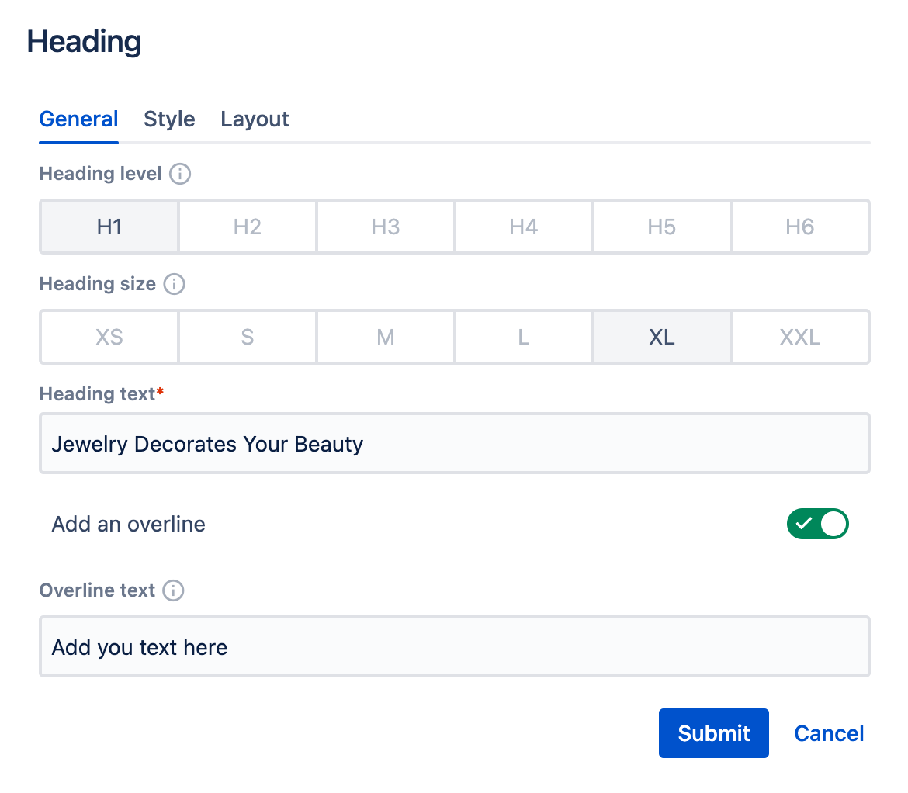

# Heading Component

Heading component can be used to add a page or section title.

Drag & drop heading component to a Page section.

Click "Edit" icon to see all heading properties:

- You can select **Heading level** that is most appropriate from SEO and accessibility perspective (options H1 - H6).
- You can select **Heading size** to increase or decrease font-size
- Insert **Heading text** 
- Optionally, you can add an **Overline** (kicker) above the main title

