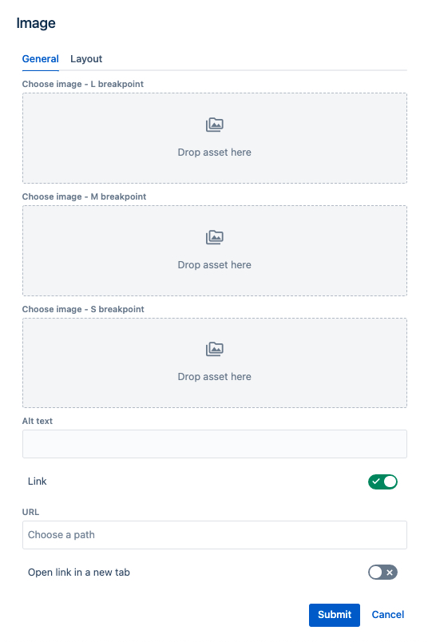

# Image Component

## Usage
Drag & drop image component to a Page section. You will see a default image placeholder. It is visible in edit mode only and will dissapear in preview and on published page.

## Authorable properties
Click "Edit" icon to see all image component's properties:

- You can open the left **assets panel** and drag&drop an image to the **L breakpoint** asset section. If only **L breakpoint** asset is provided, and __img__ html tag will be rendered with the provided image on all breakpoints
- If additionally **M breakpoint** asset is provided, a __picture__ html tag will be rendered and M asset will be used on M and S breakpoints.
- If additionally **S breakpoint** asset is provided, a __picture__ html tag will be rendered and S asset will be used on S breakpoint
- Please note that only **L breakpoint** is required for an image to be rendered on published page. M and S assets are optional.
- You can additionally provide an alternative text (alt) to describe image. Leave it blank only when image is purely decorative.
- Optionally you can wrap the image in a link

    

## Rendered component

