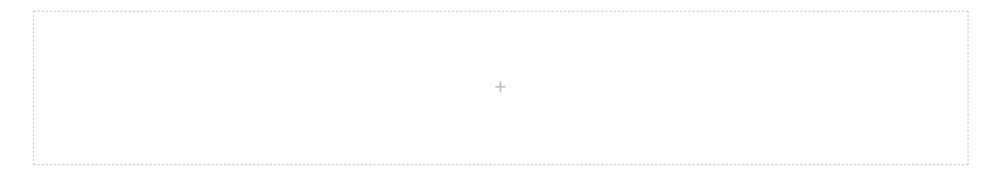

# Page Section

## Usage

Page Section component can only be added directly to the Main Content parsys. It renders a __section__ html tag with a top & bottom padding.

If you drag & drop a single Page Section to the page, you will see a default placeholder.

    

Page Section components in Howlite project always have 12 columns. The components added inside can be [resized](../grid) to 1-12 columns.

## Authorable properties

Click the "Edit" icon to see all page section's editable properties.

    

- you can drag & drop an image from the left assets panel, to add a background image (for each [breakpoint](../grid#breakpoints-definition separately).
- each breakpoint's asset will be rendered on this breakpoint only. For example, if you leave M breakpoint image blank, nothing will be rendered on tablet resolutions.

## Page Section Variants
Check the **Style** tab in the authoring dialog to see the available style variants for the Page Section component. 

    

Here is an example of a "Hero with mouse icon" page section (with some content inside):

    

