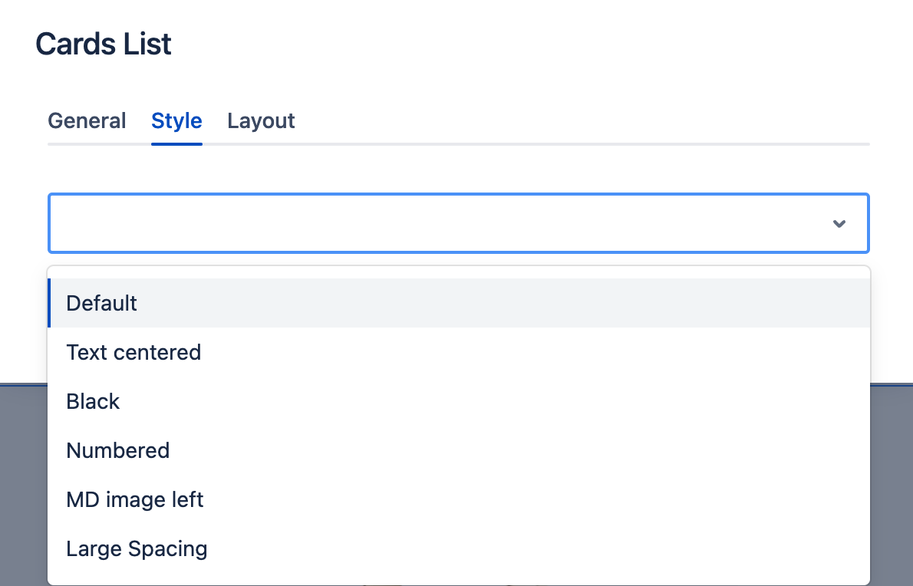
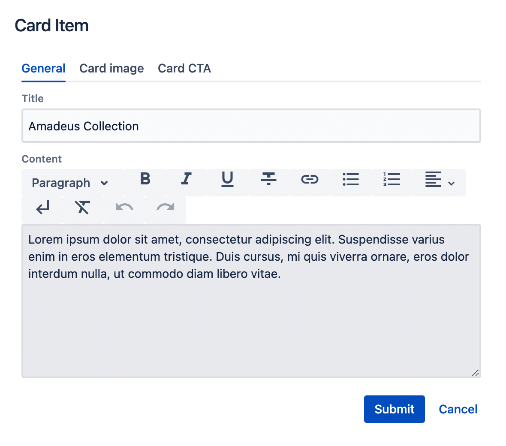
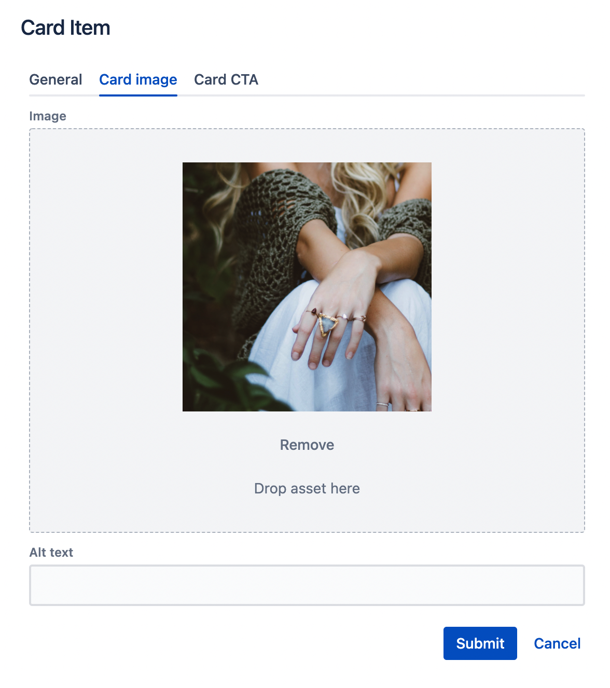
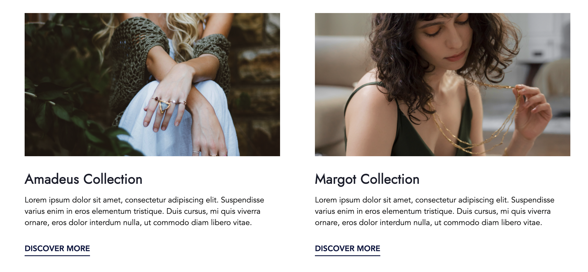
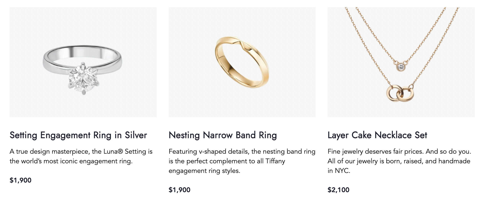
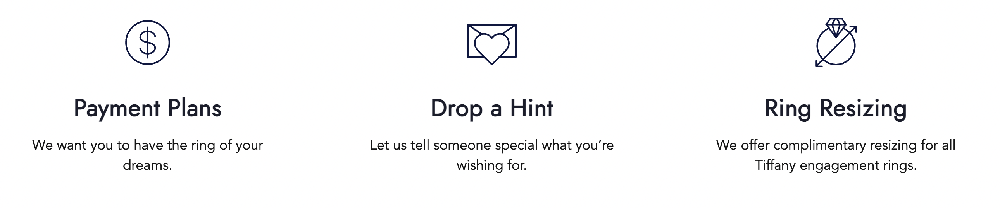

# Cards List & Card Item

## Usage
The Cards List component can be used to arrange multiple card components on a page. If you have 20 cards, you may want to display them in a grid with 4 items or 5 items per row or as a slider with 4 or 5 cards per slide. A Cards List component makes it easy to quickly switch between different layouts.

Cards may contain an image, text and a CTA.

Drag & drop the Card List component to a Page section. Cards List is prefilled with 3 initial Card Items. 

    

You can drag & drop additional Card Item to the Card List component, or delete uneeded Card Items.

    

## Authorable properties
Click the "Edit" icon to see all available **Cards List** properties:

- You can check an option **Display as a slider**  to switch on the slider mode. The slider is fully responsive and supports touch and swipe navigation as well as mouse drag for the desktop. 
- You can select the **Heading level** for the Cards headings. Choose the level that is most appropriate from SEO and accessibility perspective (options H1 - H6).
- You can select the **Heading size** to increase or decrease cards headings' font size.
- You can change **Items per row** for each [breakpoint](../grid#breakpoints-definition) separately. 
    - if the slider option is selected, this number will control how many Cards are visible at once (on each slide).

    

- You can set the Style for the Cards List using the **Style** tab.

    

Click the "Edit" icon on **Card's Item** to see its properties:

- On the **General** tab you can add:
    - Title - the Card's Item heading.
    - Content - the text to be displayed in the Card Item.

    

- On the **Image** tab you can add:
    - an Image - you can open the left assets panel and drag&drop an image to the asset section;
    - additionally, you can provide an alternative text (alt) to describe an image. Leave it blank only when the image is purely decorative.

    

- You can add CTA to the Card Item as any other CTA component using the **Card CTA** tab. (See [CTA](../cta/) description for details.)

## Rendered component

Here is an example of a Cards List component with 2 Card Items inside. 2 items per row are set. Each Card consists of an image, text and a text link:

    

A Cards List with 5 Card Items and 3 items per row set:

    

A Cards List with 5 Card Items, 3 items per row set and selected slider mode (user can drag cards left/right to see previous or next items):

    

Cards List with three Items with "Text Centered" Style variant selected (On Cards List level):

    

