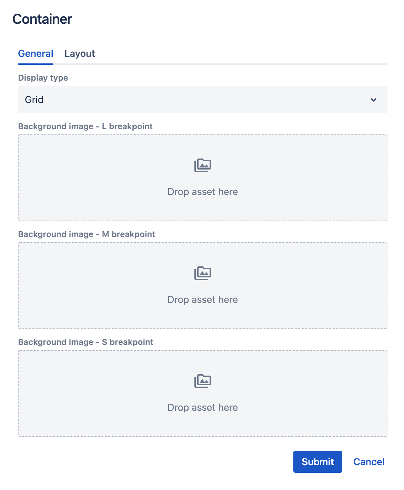

# Container component

## Usage

Container component is used to group content together (inside a [Page section component](../page-section)). Container renders a simple __div__ html tag without extra styling.

If you drag & drop a single Page Section to the page, you will see a default placeholder.

    

## Multiple columns layouts
By using containers inside a page section, you can achieve mutliple columns layouts. To see this in action, you can drag & drop the **4 Columns** predefined layout from the "Empty Sections" group.

This layout consists of a Page Section component with 4 container components inside. Each container is resized to use 3 out of 12 columns. For resize options description please see the [grid](../grid) page.

    

## Authorable properties

Click the "Edit" icon to see all editable properties.

    

- the **Display Type** controls children components' alignment
    - By default the **Grid** option is selected which means that all children components are aligned to the grid and their grid settings will be respected.
    - If you change the Display type to **Inline** grid settting of children components will be ignored, and all items will align in a row (using CSS flex property).
- you can drag & drop an image from the left assets panel, to add a background image (for each [breakpoint](../grid#breakpoints-definition) separately).
- each breakpoint's asset will be rendered on this breakpoint only. For example, if you leave M breakpoint image blank, nothing will be rendered on tablet resolutions.