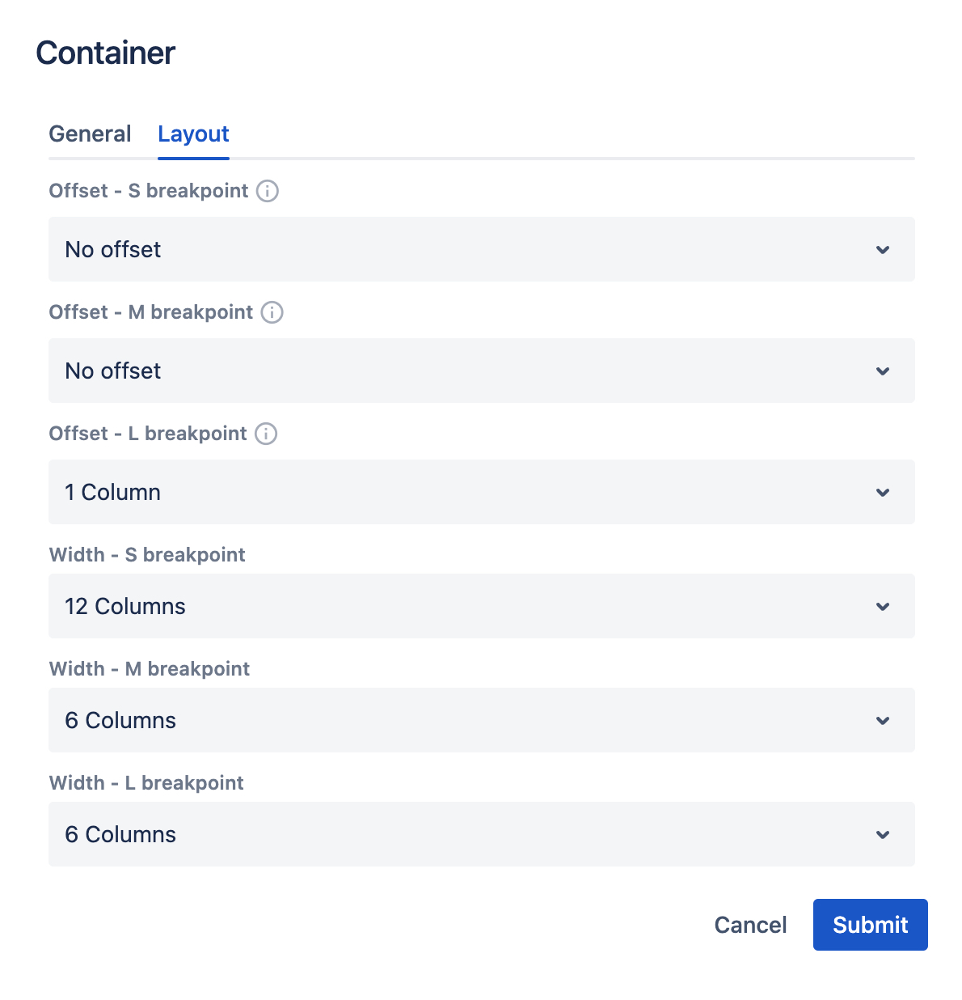

# Grid

## Containers
In order to align content into multiple columns you can use a **Container** component, that will wrap multiple items together.
Drag&drop a **Container** component into a page section to see the default 12-columns placeholder. 

    

Click edit icon, and open the **Layout** tab.

    

----

To see it in action, open a page editor and drag & drop a **4 Columns** Layout (From Layouts panel > __Empty Sections__ group).

    

## Breakpoints definition

- **L Breakpoint**: 970px and above
- **M Breakpoint**: 768px - 969px
- **S Breakpoint**: 0 - 767px
