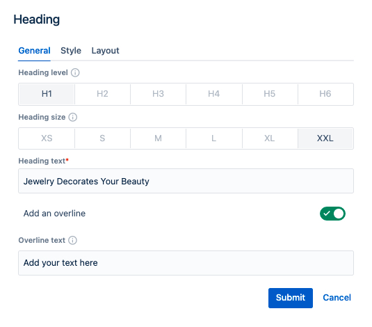

# Heading component
## Usage
Heading component can be used to add a page or section title.
Drag & drop heading component to a Page section.

## Authorable properties
Click "Edit" icon to see all **heading** component's properties:

- You can select **Heading level** that is most appropriate from SEO and accessibility perspective (options H1 - H6).
- You can select **Heading size** to increase or decrease font-size
- Insert **Heading text** 
- Optionally, you can add an **Overline** (kicker) above the main title
- You can resize the heading as any other component using the **Layout** tab. (See [grid](../grid) description for details.)

    

## Rendered component

    

