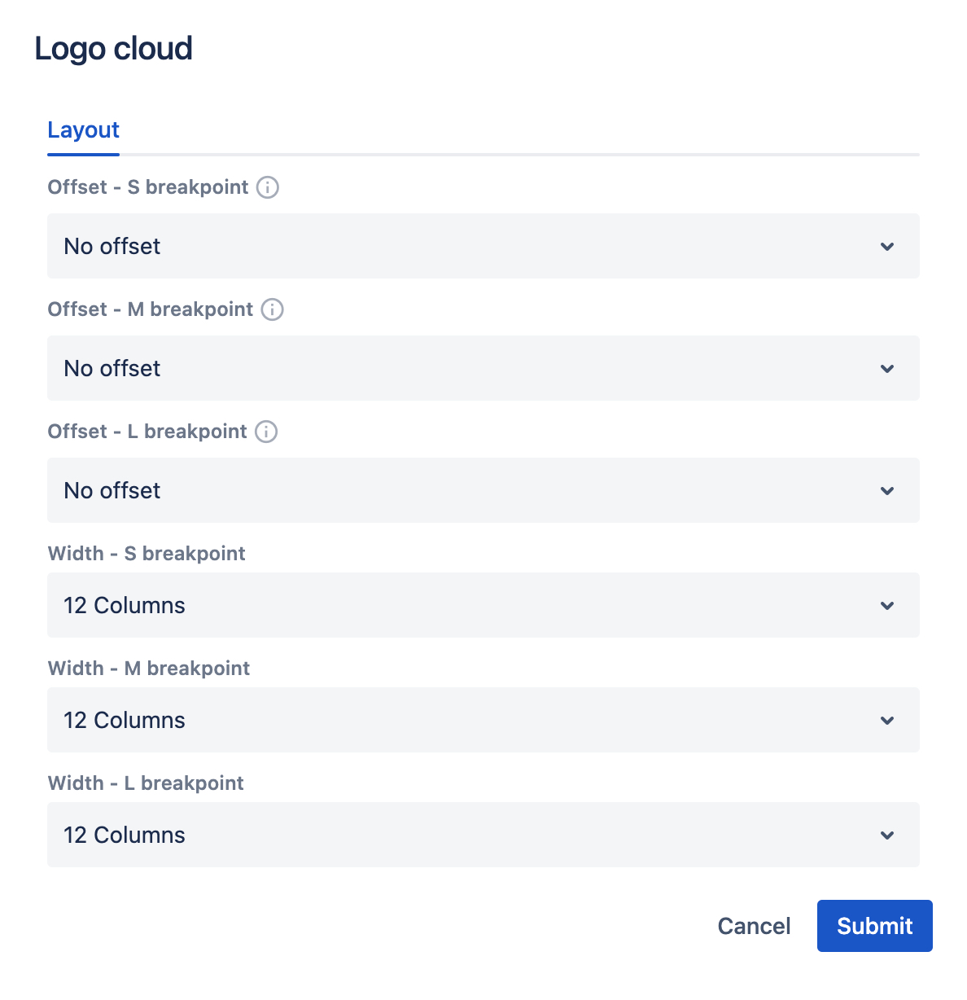

# Logo Cloud component

Logo Cloud is a container component that is used to display a row of small images (logos). You can add multiple images components inside it.

## Usage

Drag & drop a Logo Cloud component into a Page section. By default, 3 images placeholders will be rendered inside.

    

## Authorable properties

Click  ("Edit" icon) to see all **Logo Cloud** component's properties:

- You can resize the Logo Cloud as any other component using the **Layout** tab. (See [grid](../grid) description for details.)

    

## Rendered component

Logo Cloud with filled images:

    

