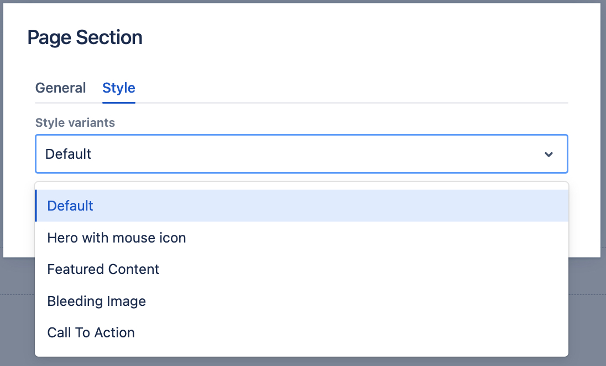

# Page Section component

The Page Section component renders a __section__ html tag with a top & bottom padding. It can only be added directly to the Main Content parsys.

## Usage

If you drag & drop a single Page Section to the page, you will see a default placeholder.

    

Page Section components in the Howlite project always have 12 columns. The components added inside can be [resized](../grid) to 1-12 columns.

If you need to resize or group content inside a page section use a [Container component](../container).

## Authorable properties

Click the "Edit" icon to see all **Page Section** component's editable properties.

    

- you can drag & drop an image from the left assets panel, to add a **background image** (for each [breakpoint](../grid#breakpoints-definition) separately).
    - each breakpoint's asset will be rendered on this breakpoint only. For example, if you leave M breakpoint image blank, nothing will be rendered on tablet resolutions.

## Page Section variants
Check the **Style** tab in the authoring dialog to see the available style variants for the Page Section component. 

    

Here is an example of a "Hero with mouse icon" page section (with some content inside):

    

Please note that Page Section's variants work only with properly structured content inside. 

In order to speed up the page assembly, Howlite project provides predefined page sections in the **Layouts** left side panel.

You can preview different types of Page Section variants with properly structured content, by drag & dropping one of the layouts below to any page.

    

