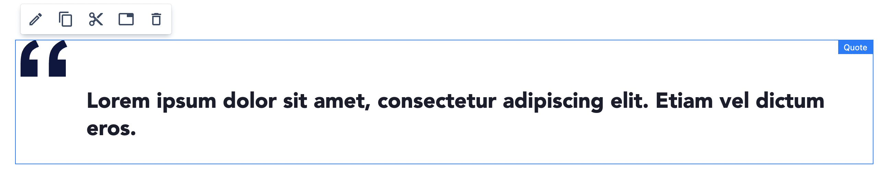

# Quote Component

## Usage
A Quote component displays a block quote with styled quotation marks, quote text, author's name & description. Additionally, it allows including the author's image.

Drag & drop Quote to a Page Section. By default a simple quote with "lorem ipsum" text is visible.

    

## Authorable properties
Click the "Edit" icon on the **Quote** component to see its properties

On the **General** tab you can add:

  - **Text** - the main content of the quote
  - **Author's Name**
  - **Author's Description**
  - **Author's Image** - if you switch on the toggle additional properties will be visible:
      - Asset section - from the left assets panel you can drag&drop an image to the asset section
      - Additionally, you can provide an alternative text (alt) to describe an image. Leave it blank only when the image is purely decorative.

    

You can change the Style for the Quote using the **Style** tab. Smaller variant will decrease the quote's font-size.

    

You can also resize the Quote as any other component using the **Layout** tab. (See [grid](../grid) description for details.)

## Rendered component

An example Quote:

    

