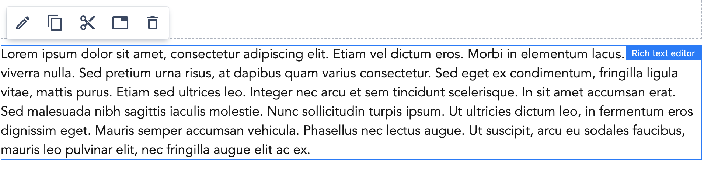
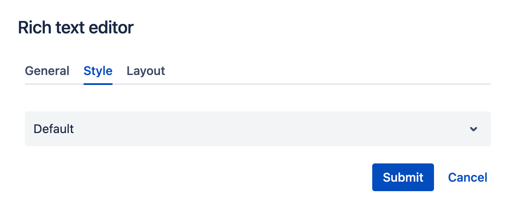

# RTE Component

## Usage
A Rich Text Editor allows editors to create short or long-form text content across pages.

To add drag & drop RTE component to a Page Section.

    

## Authorable properties
Click the "Edit" icon on the *RTE* component to see its properties:

- On the **General** tab, you can add:
    - Text - with a wide range of functionality for editing the text to make it bold, italics, listed, linked or using any other formatting.
    

    

- You can set the Style for the RTE using the **Style** tab:

    

- You can resize the RTE as any other component using the **Layout** tab. (See [grid](../grid) description for details.)

## Rendered component

RTE with customized style with **Default**:

    

RTE with customized style with **Checked bullet points**:

    

