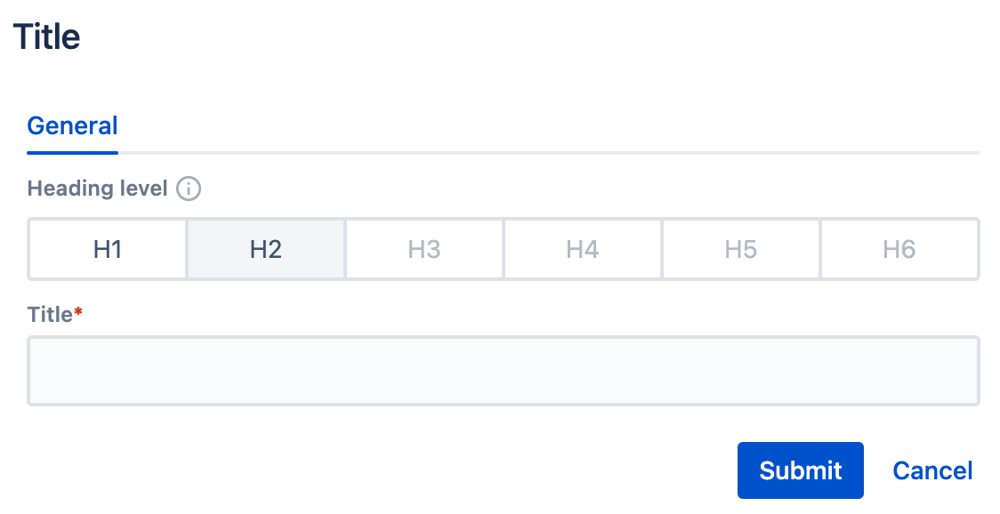

# Dialog

## Foundations

The dialog definition is an XML file included inside the subfolder `_ws_dialog`. The file name should be `.content.xml`. For the _Title_ component, the full path is 

```
ui.apps/src/main/jcr_root/apps/howlite/components/title/_ws_directory/.content.xml
```

The definition must contain the following information:

- xml version with encoding `<?xml version="1.0" encoding="UTF-8"?>`
- root node `<jcr:root>`
- namespaces
    - `xmlns:sling="http://sling.apache.org/jcr/sling/1.0"`
    - `xmlns:jcr="http://www.jcp.org/jcr/1.0"`
    - `xmlns:nt="http://www.jcp.org/jcr/nt/1.0"`
    - `xmlns:ws="http://ds.pl/websight"`
- root node properties indicating that the XML defines a dialog
    - `jcr:primaryType="nt:unstructured"`
    - `sling:resourceType="wcm/dialogs/dialog"`
- input field nodes with their properties


<table style="width:100%">
  <tr>
    <th>Dialog field property</th>
    <th>Required</th>
    <th>Value</th>
    <th>Comments</th>
  </tr>
  <tr>
    <td>jcr:primaryType</td>
    <td>Yes</td>
    <td>nt:unstructured</td>
    <td>fixed value for each dialog field</td>
  </tr>
  <tr>
   <td>sling:resourceType</td>
   <td>Yes</td>
   <td>a path defining field type</td>
   <td>available input field types are described here</td>
  </tr>
  <tr>
   <td>label</td>
   <td>Yes</td>
   <td>label name</td>
   <td>field name displayed in the dialog</td>
  </tr>
  <tr>
   <td>name</td>
   <td>Yes</td>
   <td>field name</td>
   <td>must be consistent with the field name in the model</td>
  </tr>
  <tr>
   <td>value</td>
   <td>No</td>
   <td>default value</td>
   <td>default value for the field</td>
  </tr>
  <tr>
   <td>required</td>
   <td>No</td>
   <td>true or false (default)</td>
   <td>user can’t close dialog if any required field is empty</td>
  </tr>
  <tr>
   <td>description</td>
   <td>No</td>
   <td></td>
   <td>if defined then an info icon is presented on the right of the label; the description is presented when the icon clicked</td>
  </tr> 
</table>

The dialog definition for the _Title_ component is presented below. The title field type is `wcm/dialogs/components/textfield`. Note that the definition of heading level is shared and included in the other file. The next section presents more details on how to implement it.

``` xml title="ui.apps/src/main/jcr_root/apps/howlite/components/title/_ws_dialog/.content.xml"
<?xml version="1.0" encoding="UTF-8"?>
<jcr:root xmlns:sling="http://sling.apache.org/jcr/sling/1.0"
          xmlns:jcr="http://www.jcp.org/jcr/1.0"
          xmlns:nt="http://www.jcp.org/jcr/nt/1.0"
          xmlns:ws="http://ds.pl/websight"
          jcr:primaryType="nt:unstructured"
          sling:resourceType="wcm/dialogs/dialog">
          <headingLevel
            jcr:primaryType="nt:unstructured"
            sling:resourceType="wcm/dialogs/components/include"
            path="/apps/template/components/common/headinglevel"/>
          <title
            jcr:primaryType="nt:unstructured"
            sling:resourceType="wcm/dialogs/components/textfield"
            name="title"
            label="Title"
            required="true"/>
</jcr:root>
```

## Sharing field definition

Many dialogs may use the same field. We can define it once and include it in many places to avoid duplication. The shared field definition requires its own folder and `.content.xml` file created according to the rules defined in the section above.

The dialog definition for the shared heading level is presented below. The field type is `wcm/dialogs/components/radio`. Please note that the field requires an additional definition for its options. They are defined as sub-nodes of type `wcm/dialogs/components/radio/option`.


``` xml title="ui.apps/src/main/jcr_root/apps/template/components/common/headinglevel/.content.xml"
<jcr:root xmlns:sling="http://sling.apache.org/jcr/sling/1.0"
          xmlns:jcr="http://www.jcp.org/jcr/1.0"
          xmlns:nt="http://www.jcp.org/jcr/nt/1.0"
          xmlns:ws="http://ds.pl/websight"
          jcr:primaryType="nt:unstructured"
          sling:resourceType="wcm/dialogs/components/radio"
          name="headingLevel"
          description="HTML heading level help to communicate the organization and hierarchy of the content (for SEO and accessibility)"
          label="Heading level">
          <h1
            jcr:primaryType="nt:unstructured"
            sling:resourceType="wcm/dialogs/components/radio/option"
            label="Heading 1"
            value="h1"/>
          <h2
            jcr:primaryType="nt:unstructured"
            sling:resourceType="wcm/dialogs/components/radio/option"
            label="Heading 2"
            value="h2"/>
...
</jcr:root>
```

Shared definitions can be stored in a dedicated folder. In the above case, it is

```
ui.apps/src/main/jcr_root/apps/howlite/components/common/
```

Directories are not components. However, they must have their own `.content.xml` files.

```xml title="ui.apps/src/main/jcr_root/apps/howlite/components/common/.content.xml"

<?xml version="1.0" encoding="UTF-8"?> 
<jcr:root xmlns:sling="http://sling.apache.org/jcr/sling/1.0" 
          xmlns:jcr="http://www.jcp.org/jcr/1.0" 
          jcr:primaryType="sling:Folder"> 
</jcr:root>

```

Finally, you need to include the shared field definition using the following properties. 

<table style="width:100%">
  <tr>
    <th>Dialog field property</th>
    <th>Required</th>
    <th>Value</th>
    <th>Comments</th>
  </tr>
  <tr>
    <td>jcr:primaryType</td>
    <td>Yes</td>
    <td>nt:unstructured</td>
    <td>fixed value for each dialog field</td>
  </tr>
  <tr>
   <td>sling:resourceType</td>
   <td>Yes</td>
   <td>wcm/dialogs/components/include</td>
   <td>fixed for included input field</td>
  </tr>
  <tr>
   <td>path</td>
   <td>Yes</td>
   <td>path</td>
   <td>a path to the included field definition </td>
  </tr>
</table>

The inclusion of a sample field is presented below.

``` xml title="ui.apps/src/main/jcr_root/apps/howlite/components/title/_ws_dialog/.content.xml"

<?xml version="1.0" encoding="UTF-8"?>
<jcr:root xmlns:sling="http://sling.apache.org/jcr/sling/1.0"
          xmlns:jcr="http://www.jcp.org/jcr/1.0"
          xmlns:nt="http://www.jcp.org/jcr/nt/1.0"
          xmlns:ws="http://ds.pl/websight"
          jcr:primaryType="nt:unstructured"
          sling:resourceType="wcm/dialogs/dialog">
          <headingLevel
            jcr:primaryType="nt:unstructured"
            sling:resourceType="wcm/dialogs/components/include"
            path="/apps/template/components/common/headinglevel"/>
          <title
            jcr:primaryType="nt:unstructured"
            sling:resourceType="wcm/dialogs/components/textfield"
            name="title"
            label="Title"
            required="true"/>
</jcr:root>

```

## Grouping fields into tabs

A complex component dialog may require many fields. You can group them on tabs. 

Tabs definition must contain the following information:

- node representing a collection of tabs having the following properties
    - `jcr:primaryType="nt:unstructured"`
    - `sling:resourceType="wcm/dialogs/components/tabs"`
- sub-nodes representing tabs having attributes as follows
    - `jcr:primaryType="nt:unstructured"`
    - `sling:resourceType="wcm/dialogs/components/tab"`
    - `label="sample tab name"`
- input field definitions (included in sub-nodes representing tabs).

A sample tabs definition is presented below.

``` xml title="ui.apps/src/main/jcr_root/apps/howlite/components/title/_ws_dialog/.content.xml"

<?xml version="1.0" encoding="UTF-8"?>
<jcr:root xmlns:sling="http://sling.apache.org/jcr/sling/1.0" xmlns:jcr="http://www.jcp.org/jcr/1.0"
          xmlns:nt="http://www.jcp.org/jcr/nt/1.0" xmlns:ws="http://ds.pl/websight"
          jcr:primaryType="nt:unstructured"
          sling:resourceType="wcm/dialogs/dialog">
          <tabs
            jcr:primaryType="nt:unstructured"
            sling:resourceType="wcm/dialogs/components/tabs">
            <generalTab
              jcr:primaryType="nt:unstructured"
              sling:resourceType="wcm/dialogs/components/tab"
              label="General">
              <headingLevel
                jcr:primaryType="nt:unstructured"
                sling:resourceType="wcm/dialogs/components/include"
                path="/apps/template/components/common/headinglevel"/>
              <title
                jcr:primaryType="nt:unstructured"
                sling:resourceType="wcm/dialogs/components/textfield"
                name="title"
                label="Title"
                required="true"/>
            </generalTab>
          </tabs>
</jcr:root>

```
The above tabs definition for the Title component generates the following dialog.
<p align="center" >
     <br>
</p>