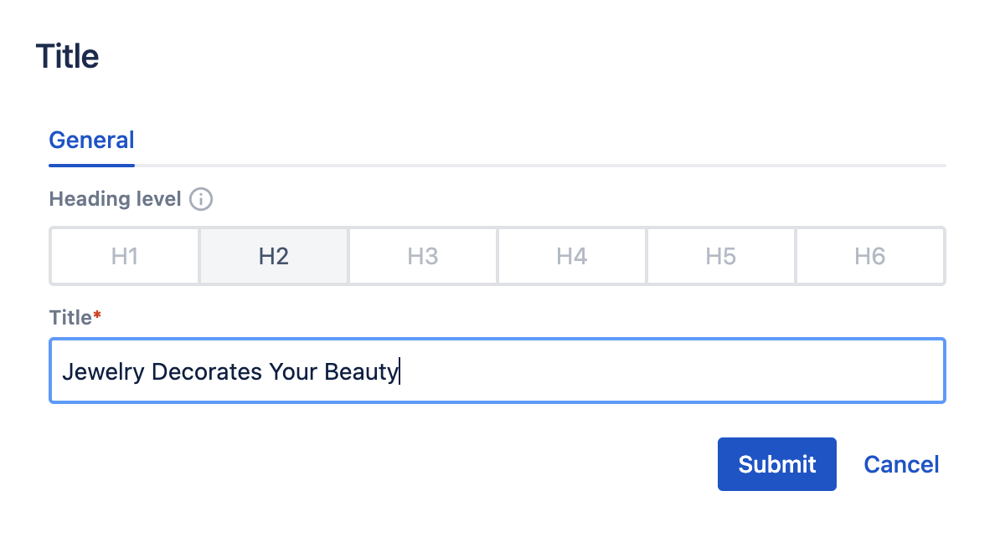
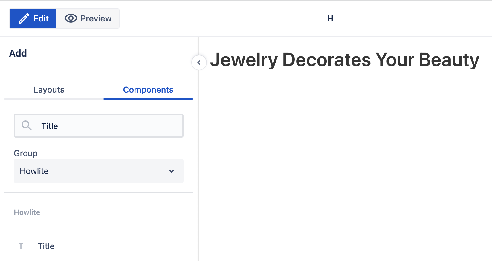
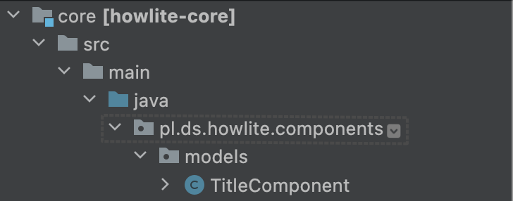
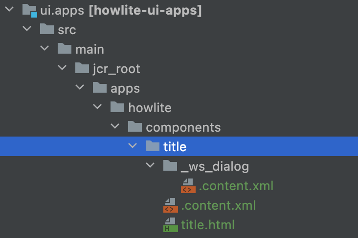

# Components development

## Introduction

Building a site is a challenge for users. They have no technical knowledge to implement the expected UI style. Moreover, there is a need to ensure a consistent look & feel for a given content type across the whole website. 

WebSight CMS solves the above issues by components. They are ready blocks (for example, a page title or image) that users can put on pages. Additionally, users can set some properties that impact their rendering.
 
As a developer, you have to implement a collection of components in advance. This guideline presents how to develop them for WebSight CMS.  

## Sample component

All the examples presented in this guide are related to a simple _Title_ component added to [Howlite](../../authoring/howlite/) collection. The component enables one to define the text of the title and its HTML tag representing the heading level (for example, H1 or H2). The images below present the final result available for the user.

<p align="center">
     <br>
    A dialog to set up the properties of the Title component.
</p>

<p align="center" >
     <br>
    The Title component rendered in the page editor.
</p>

The above component generates the following HTML. Note that the CSS class is skipped here for simplicity. More details on the CSS are available in the sections [Styling](./styling/index.md).


``` html
<h2>Jewelry Decorates Your Beauty</h2>
```

## Location and structure

Each site requires a collection of components. You should use a dedicated folder to store them.

```
ui.apps/src/main/jcr_root/apps/[my-collection]/components
```

For [Howlite](../../authoring/howlite/), the path is 
```
ui.apps/src/main/jcr_root/apps/howlite/components/
```

Each component requires a subfolder. For the _Title_ component, it is 

```
ui.apps/src/main/jcr_root/apps/howlite/components/title
```

There are two fundamental elements of each component. The first one is its [definition](./definition/index.md) stored inside a `.content.xml` file. The second is an [HTML](./html/index.md) file used for rendering.

Most components have some properties that impact their look or behaviour. Thus, they need a [dialog](./dialog/index.md) to collect values from users. The dialog structure and inputs are described in the `.content.xml` file placed inside the `_ws_dialog` subfolder. The path to its dialog definition for the _Title_ component is as follows.

```
ui.apps/src/main/jcr_root/apps/howlite/components/title/_ws_dialog/.content.xml
```

Finally, you need storage for the values provided by users. Its [model](./model/index.md) is defined in a java file.

The java file is included in the `howlite-core` module. Other files are stored in the `howlite-ui-apps` module. The overall file structure is presented below.

<p align="center" >
     <br>
</p>

<p align="center" >
     <br>
</p>
